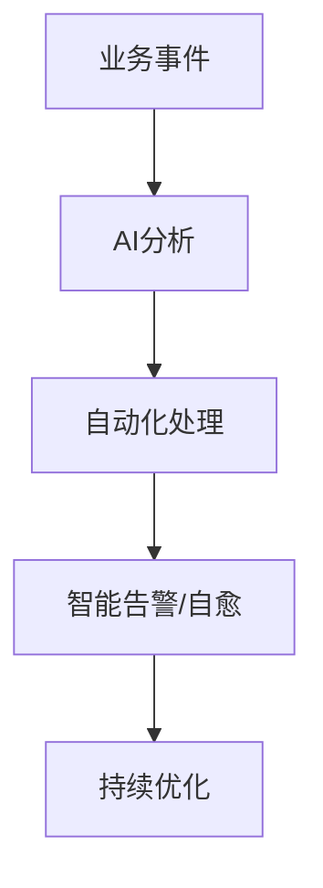

# 5.3 智能化工程创新案例

## 目录

1. 引言与创新场景
2. AI与自动化结合实践
3. 行业创新案例
4. 代码与配置示例
5. Mermaid创新流程图
6. 参考文献

---

## 1. 引言与创新场景

Golang结合AI与自动化工具，在微服务、DevOps、智能运维等领域推动工程创新，提升效率与智能化水平。

## 2. AI与自动化结合实践

- 智能代码生成、自动化测试、智能告警与自愈
- 智能API文档、架构推荐、异常检测与根因分析

## 3. 行业创新案例

- 金融：智能风控、自动化合规检测
- 电商：智能推荐、自动化营销
- 云原生：智能弹性伸缩、自动化运维

## 4. 代码与配置示例

### 智能告警与自愈脚本

```sh
#!/bin/bash
if grep -q 'ERROR' /var/log/myapp.log; then
  curl -X POST http://alert/api -d '{"msg": "error detected"}'
  systemctl restart myapp
fi
```

## 5. Mermaid创新流程图



## 6. 参考文献

- [智能运维最佳实践](https://cloudnative.to/docs/)
- [AI+DevOps案例](https://www.infoq.cn/article/ai-devops)

---
> 支持断点续写与递归细化，如需扩展某一小节请指定。
