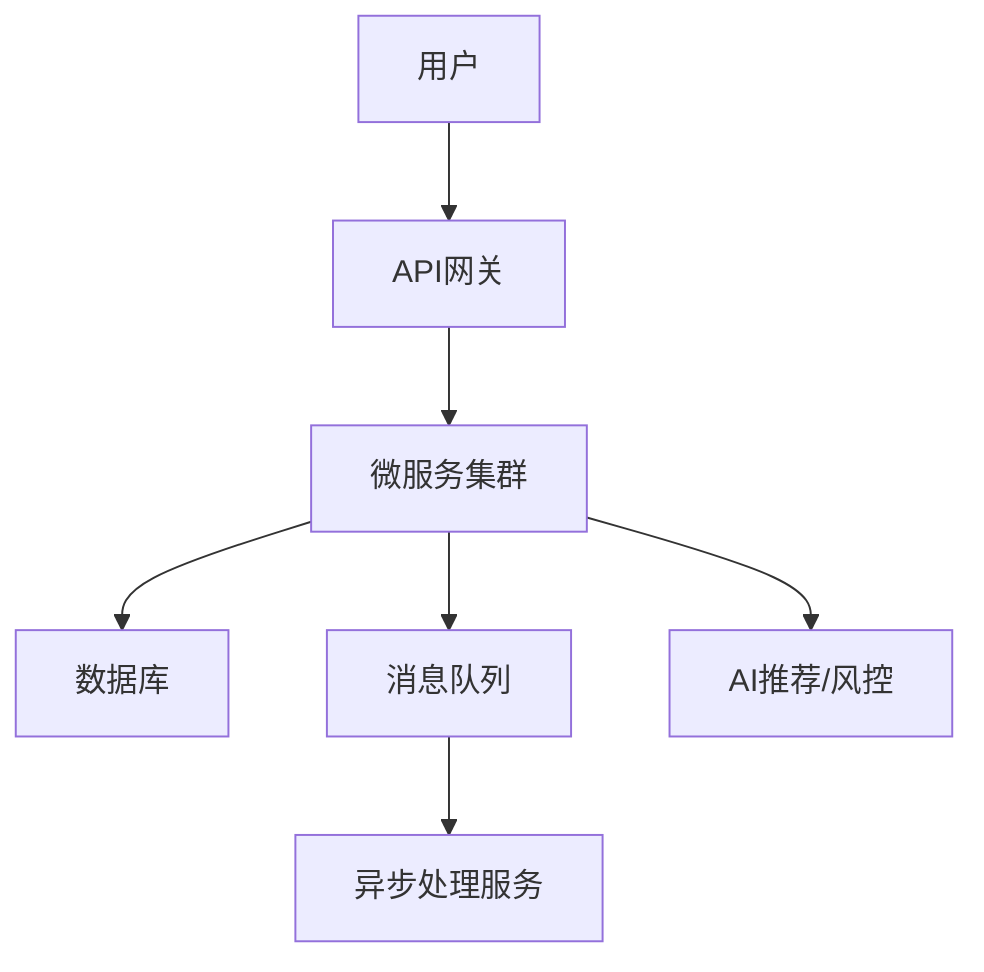

# 6.1 金融、电商、云原生等行业案例

## 目录
1. 行业背景与应用价值
2. 金融行业案例
3. 电商行业案例
4. 云原生与SaaS行业案例
5. 自动化与AI实践亮点
6. 代码与配置示例
7. Mermaid行业架构图
8. 参考文献

---

## 1. 行业背景与应用价值
Golang以高并发、易部署、生态丰富等优势，在金融、电商、云原生等行业广泛应用，推动自动化与智能化工程创新。

## 2. 金融行业案例
- 实时风控、自动化合规检测、微服务架构、统一观测体系
- 代码示例：高并发交易撮合、自动化风控脚本

## 3. 电商行业案例
- 智能推荐、自动化营销、弹性伸缩、事件驱动架构
- 代码示例：异步订单处理、自动化库存同步

## 4. 云原生与SaaS行业案例
- 多租户架构、自动化部署、服务网格、智能弹性伸缩
- 代码示例：K8s自动扩缩容、服务治理脚本

## 5. 自动化与AI实践亮点
- 自动化CI/CD、智能API文档、AI驱动测试与监控

## 6. 代码与配置示例
### 金融风控自动化脚本
```sh
#!/bin/bash
if grep -q 'RISK' /var/log/trade.log; then
  curl -X POST http://risk/api -d '{"msg": "risk detected"}'
fi
```

### 电商异步订单处理
```go
func ProcessOrderAsync(order Order) {
    go func() { /* ... */ }()
}
```

## 7. Mermaid行业架构图


## 8. 参考文献
- [Golang在金融行业的应用](https://www.infoq.cn/article/go-fintech)
- [云原生最佳实践](https://cloudnative.to/docs/)

---
> 支持断点续写与递归细化，如需扩展某一小节请指定。 