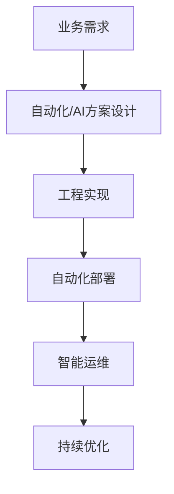

# 6.2 自动化与AI在行业中的落地

## 目录
1. 引言与落地模式
2. 自动化工程创新实践
3. AI驱动的行业应用
4. 典型行业案例
5. 代码与配置示例
6. Mermaid落地流程图
7. 参考文献

---

## 1. 引言与落地模式
Golang自动化与AI技术在金融、电商、云原生等行业实现高效交付、智能运维与创新应用。

## 2. 自动化工程创新实践
- 自动化CI/CD、智能监控、自动化测试、弹性伸缩
- 代码示例：自动化部署脚本、智能告警与自愈

## 3. AI驱动的行业应用
- 智能推荐、风控、异常检测、自动化合规
- 代码示例：AI接口集成、智能分析脚本

## 4. 典型行业案例
- 金融：智能风控、自动化合规检测
- 电商：智能推荐、自动化营销
- 云原生：智能弹性伸缩、自动化运维

## 5. 代码与配置示例
### 自动化部署脚本
```sh
kubectl apply -f deployment.yaml
```

### AI接口集成示例
```go
resp, _ := http.Post("http://ai/api/analyze", "application/json", bytes.NewBuffer(data))
```

## 6. Mermaid落地流程图


## 7. 参考文献
- [AI+DevOps案例](https://www.infoq.cn/article/ai-devops)
- [云原生行业落地](https://cloudnative.to/docs/)

---
> 支持断点续写与递归细化，如需扩展某一小节请指定。 