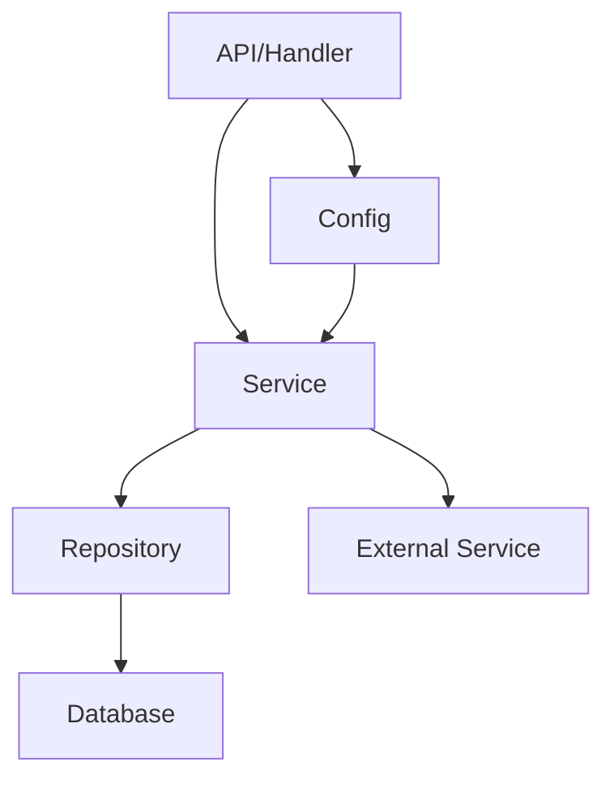

# 1.1 Rust工程体系结构与最佳实践

## 目录
1. 引言与定义
2. Rust工程结构标准
3. 依赖管理与模块化
4. 代码组织与分层架构
5. 配置管理与环境隔离
6. 测试与持续集成
7. 代码示例
8. 行业应用案例
9. Mermaid架构图
10. 参考文献

---

## 1. 引言与定义
Rust工程体系结构强调安全、性能、可维护性，适合高并发、系统级、微服务等现代后端场景。最佳实践包括合理的目录结构、模块化设计、自动化测试与持续集成、配置与环境隔离等。

## 2. Rust工程结构标准
典型Rust项目结构如下：

```text
myapp/
├── src/           # 源码目录
│   ├── main.rs    # 主程序入口
│   ├── lib.rs     # 库入口
│   └── ...        # 其他模块
├── tests/         # 集成测试
├── benches/       # 基准测试
├── examples/      # 示例代码
├── Cargo.toml     # 依赖与配置
├── Cargo.lock     # 依赖锁定
├── scripts/       # 自动化脚本
├── docs/          # 文档
└── target/        # 构建输出
```

## 3. 依赖管理与模块化
- 使用Cargo进行依赖管理，支持多包工作区（workspace）与版本控制。
- 推荐将核心业务逻辑与基础设施解耦，便于单元测试与复用。

## 4. 代码组织与分层架构
- 常见分层：handler（接口层）、service（业务层）、repository（数据访问层）、model（数据结构）。
- 采用trait抽象、依赖注入、模块分离，提升可测试性与可维护性。

## 5. 配置管理与环境隔离
- 使用环境变量、配置文件（TOML/YAML/JSON）实现多环境隔离。
- 推荐集成config、dotenv等库，支持热加载与安全管理。

## 6. 测试与持续集成
- 单元测试、集成测试、基准测试全覆盖。
- 集成CI/CD（如GitHub Actions、GitLab CI、Jenkins），实现自动化构建、测试与部署。

## 7. 代码示例
```rust
// src/main.rs
fn main() {
    println!("Rust工程最佳实践示例");
}
```

## 8. 行业应用案例
- 区块链、云原生、Web3、金融等领域广泛采用Rust工程标准结构，提升安全性与系统可维护性。

## 9. Mermaid架构图


## 10. 参考文献
- [Rust官方工程结构指南](https://doc.rust-lang.org/book/ch12-03-improving-our-io-project.html)
- [Cargo官方文档](https://doc.rust-lang.org/cargo/)
- [Rust模块化最佳实践](https://rust-lang-nursery.github.io/api-guidelines/)

---
> 支持断点续写与递归细化，如需扩展某一小节请指定。 