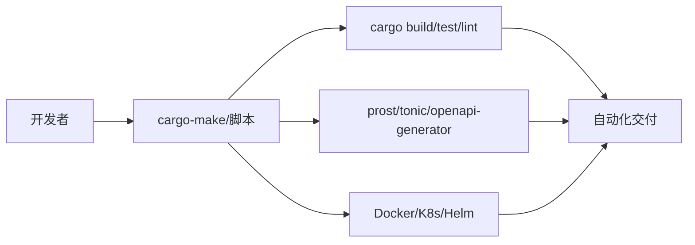

# 1.3 自动化工具链与脚本实践

## 目录

1. 引言与定义
2. Rust主流自动化工具链
3. 自动化脚本类型与场景
4. 常用自动化脚本与代码示例
5. 工程集成与最佳实践
6. 行业应用案例
7. Mermaid工具链关系图
8. 参考文献

---

## 1. 引言与定义

自动化工具链与脚本是提升Rust工程效率、质量与可维护性的关键。通过集成自动化构建、测试、部署、文档生成、代码检查等工具，实现端到端工程自动化。

## 2. Rust主流自动化工具链

- **构建与依赖管理**：cargo、cargo-make、cargo-edit
- **测试与覆盖率**：cargo test、tarpaulin、nextest
- **代码检查与格式化**：clippy、fmt、audit、rust-analyzer
- **文档生成**：rustdoc、mdBook
- **API协议工具**：prost（Protobuf）、tonic、openapi-generator
- **CI/CD集成**：GitHub Actions、GitLab CI、Jenkins、Drone
- **容器与部署**：Docker、docker-compose、Kubernetes、Helm

## 3. 自动化脚本类型与场景

- **构建脚本**：自动化编译、打包、依赖安装
- **测试脚本**：单元测试、集成测试、覆盖率统计
- **部署脚本**：自动化发布、回滚、环境切换
- **文档与API生成脚本**：自动生成接口文档、代码
- **代码质量检查脚本**：静态分析、格式化、lint
- **运维与监控脚本**：日志收集、健康检查、自动重启

## 4. 常用自动化脚本与代码示例

### cargo-make自动化脚本

```toml
[tasks.build]
command = "cargo"
args = ["build", "--release"]

[tasks.test]
command = "cargo"
args = ["test", "--all"]

[tasks.lint]
command = "cargo"
args = ["clippy", "--all", "--", "-D", "warnings"]
```

### Protobuf代码生成

```bash
protoc --rust_out=. --proto_path=proto proto/service.proto
```

### Docker Compose部署脚本

```yaml
version: '3'
services:
  app:
    build: .
    ports:
      - "8080:8080"
    environment:
      - ENV=production
    depends_on:
      - db
  db:
    image: postgres:14
    environment:
      - POSTGRES_PASSWORD=example
```

## 5. 工程集成与最佳实践

- 将cargo-make、CI/CD配置、API生成脚本等纳入版本控制，保证可复现性
- 自动化脚本参数化，支持多环境与多场景
- 结合CI/CD流水线自动触发各类脚本，提升工程一致性与效率

## 6. 行业应用案例

- 区块链、Web3、云原生等行业通过自动化工具链实现高效交付与持续创新

## 7. Mermaid工具链关系图



## 8. 参考文献

- [cargo-make](https://sagiegurari.github.io/cargo-make/)
- [tarpaulin](https://github.com/xd009642/tarpaulin)
- [clippy](https://github.com/rust-lang/rust-clippy)
- [prost](https://github.com/tokio-rs/prost)
- [tonic](https://github.com/hyperium/tonic)

---
> 支持断点续写与递归细化，如需扩展某一小节请指定。
