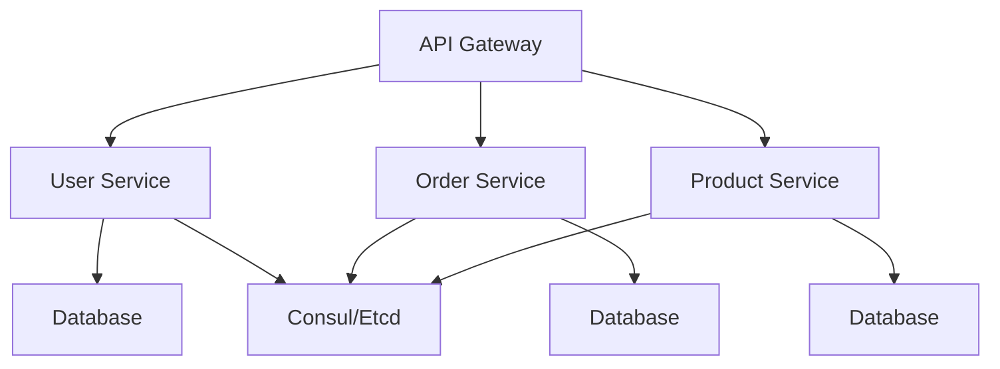

# 2.1 微服务架构设计与实现

## 目录

1. 引言与定义
2. 微服务架构核心原则
3. Rust微服务分层结构
4. 服务注册与发现机制
5. 通信协议与API设计（REST/gRPC）
6. 代码示例
7. 行业应用案例
8. Mermaid微服务架构图
9. 参考文献

---

## 1. 引言与定义

微服务架构是一种将应用拆分为一组小型、自治服务的设计方法。Rust以其高性能、安全、高并发等优势，成为微服务开发的重要选择，特别适合性能与安全敏感场景。

## 2. 微服务架构核心原则

- 单一职责、自治部署、去中心化治理
- 独立扩展、容错隔离、自动化运维
- API优先、契约驱动、持续交付

## 3. Rust微服务分层结构

- API/Handler层：对外暴露REST/gRPC接口
- Service层：业务逻辑处理
- Repository层：数据访问与持久化
- Infrastructure层：外部依赖（如消息队列、缓存、第三方服务）

## 4. 服务注册与发现机制

- 常用方案：Consul、Etcd、Eureka、Kubernetes内置服务发现
- 支持健康检查、自动注册与注销、负载均衡

## 5. 通信协议与API设计

- RESTful API：基于HTTP/JSON，适合通用场景，常用框架如actix-web、axum
- gRPC：基于Protobuf，支持高性能二进制通信、接口自动生成，常用框架如tonic
- OpenAPI/Swagger用于REST接口文档与代码生成

## 6. 代码示例

### RESTful微服务（actix-web框架）

```rust
use actix_web::{get, App, HttpResponse, HttpServer, Responder};

#[get("/ping")]
async fn ping() -> impl Responder {
    HttpResponse::Ok().body("pong")
}

#[actix_web::main]
async fn main() -> std::io::Result<()> {
    HttpServer::new(|| App::new().service(ping))
        .bind("127.0.0.1:8080")?
        .run()
        .await
}
```

### gRPC微服务（tonic框架）

```rust
// proto定义
service Greeter { rpc SayHello (HelloRequest) returns (HelloReply); }
// Rust实现
use tonic::{transport::Server, Request, Response, Status};
pub struct MyGreeter;
#[tonic::async_trait]
impl Greeter for MyGreeter {
    async fn say_hello(&self, request: Request<HelloRequest>) -> Result<Response<HelloReply>, Status> {
        Ok(Response::new(HelloReply { message: format!("Hello {}!", request.into_inner().name) }))
    }
}
```

## 7. 行业应用案例

- 区块链、Web3、金融等领域广泛采用Rust微服务架构，提升系统性能与安全性

## 8. Mermaid微服务架构图



## 9. 参考文献

- [微服务架构模式](https://microservices.io/patterns/index.html)
- [Rust微服务最佳实践](https://github.com/actix/examples)
- [tonic官方文档](https://github.com/hyperium/tonic)

---
> 支持断点续写与递归细化，如需扩展某一小节请指定。
