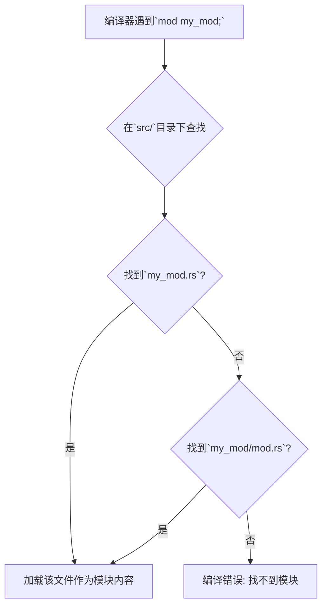

# 2.1 Rust项目结构与模块化

## 目录

- [2.1 Rust项目结构与模块化](#21-rust项目结构与模块化)
  - [目录](#目录)
  - [1. 引言与定义](#1-引言与定义)
  - [2. Rust的模块系统](#2-rust的模块系统)
    - [2.1 Crates, Modules, 和 Paths](#21-crates-modules-和-paths)
    - [2.2 文件系统映射](#22-文件系统映射)
    - [2.3 可见性: `pub`关键字](#23-可见性-pub关键字)
  - [3. 社区推荐的项目布局](#3-社区推荐的项目布局)
    - [3.1 `src/main.rs` 与 `src/lib.rs`](#31-srcmainrs-与-srclibrs)
    - [3.2 `src/bin/`](#32-srcbin)
    - [3.3 `tests/` 与 `benches/`](#33-tests-与-benches)
    - [3.4 `examples/`](#34-examples)
  - [4. 工作区（Workspaces）](#4-工作区workspaces)
    - [4.1 什么是工作区](#41-什么是工作区)
    - [4.2 工作区的优势](#42-工作区的优势)
  - [5. 配置/代码示例](#5-配置代码示例)
    - [5.1 典型的库项目结构](#51-典型的库项目结构)
    - [5.2 工作区`Cargo.toml`示例](#52-工作区cargotoml示例)
  - [6. 行业应用案例](#6-行业应用案例)
  - [7. Mermaid图表：模块解析流程](#7-mermaid图表模块解析流程)
  - [8. 参考文献](#8-参考文献)

---

## 1. 引言与定义

**项目结构与模块化**是组织和管理代码复杂度的核心手段。在Rust中，这一体系由**Crates**和**Modules**构成。一个良好组织的Rust项目能清晰地反映代码的逻辑关系，控制代码的可见性（封装），并方便地进行测试和复用。

- **Crate**: Rust的编译单元。它可以是一个二进制程序（binary crate）或一个库（library crate）。
- **Module**: 在一个crate内部组织代码、控制作用域和路径私密性的方式。

## 2. Rust的模块系统

Rust拥有一个强大而清晰的模块系统，用于在crate内部进行代码组织。

### 2.1 Crates, Modules, 和 Paths

- 每个项目至少包含一个crate，即**crate根**（`src/main.rs`或`src/lib.rs`）。
- 在crate根中，你可以声明新的**模块（module）**，例如 `mod garden;`。
- Rust编译器会根据模块名，在特定路径下查找模块的源代码。
- 在模块内部，你可以定义函数、结构体、枚举等，并通过**路径（path）** 来访问它们，例如`crate::garden::vegetables::Asparagus`。

### 2.2 文件系统映射

模块的声明与文件系统结构有直接的对应关系：

- `mod my_mod;`: 编译器会查找 `src/my_mod.rs` 或 `src/my_mod/mod.rs`。
- 在`src/my_mod.rs`中声明`mod another_mod;`，编译器会查找`src/my_mod/another_mod.rs`。

这种清晰的映射关系使得代码的物理布局和逻辑结构保持一致。

### 2.3 可见性: `pub`关键字

默认情况下，模块中的所有内容（函数、结构体、字段等）都是私有的。使用`pub`关键字可以将其公开，使其能被外部模块访问。`pub(crate)`则表示仅在当前crate内部可见，这是实现内部封装的常用方式。

## 3. 社区推荐的项目布局

Cargo根据文件和目录的特定名称来理解项目结构。

### 3.1 `src/main.rs` 与 `src/lib.rs`

- `src/main.rs`: 这是一个二进制crate的根。它的存在告诉Cargo项目需要编译成一个可执行文件。
- `src/lib.rs`: 这是一个库crate的根。它的存在告诉Cargo项目需要编译成一个可供其他项目引用的库。
- 一个项目可以同时拥有`src/main.rs`和`src/lib.rs`。这种情况下，二进制crate可以引用同一个包内的库crate，这是一种分享代码的常用模式。

### 3.2 `src/bin/`

如果项目需要构建多个二进制文件，可以将它们的`main.rs`文件放在`src/bin/`目录下。例如`src/bin/server.rs`和`src/bin/cli.rs`会被分别编译成`server`和`cli`两个可执行文件。

### 3.3 `tests/` 与 `benches/`

- `tests/`: 存放集成测试。此目录下的每个`.rs`文件都会被编译成一个独立的测试crate。
- `benches/`: 存放基准测试。

### 3.4 `examples/`

存放示例代码。`examples/`目录下的每个`.rs`文件都会被编译成一个独立的可执行文件，用于展示如何使用你的库。

## 4. 工作区（Workspaces）

### 4.1 什么是工作区

**工作区（Workspace）** 是一种帮助管理多个相关联crate的功能。它由一个顶层的`Cargo.toml`文件定义，该文件不包含`[package]`部分，而是包含一个`[workspace]`部分，指明工作区包含的成员crate。

### 4.2 工作区的优势

- **共享依赖**: 工作区内所有crate共享同一个`Cargo.lock`文件和`target`目录。这意味着依赖版本是统一的，并且依赖只需被编译一次。
- **协同工作**: 可以通过一次`cargo build`或`cargo test`命令构建或测试工作区内的所有crate，极大地简化了对大型多crate项目的管理。

## 5. 配置/代码示例

### 5.1 典型的库项目结构

```
my-library/
├── Cargo.toml
├── src/
│   ├── lib.rs        # 库的根，声明模块 mod front_of_house;
│   └── front_of_house.rs # 模块文件，声明子模块 pub mod hosting;
│       └── hosting.rs    # 子模块文件
├── tests/
│   └── integration_test.rs
└── examples/
    └── usage.rs
```

### 5.2 工作区`Cargo.toml`示例

```toml
# Top-level Cargo.toml
[workspace]

members = [
    "adder",      # a binary crate
    "add-one",    # a library crate used by `adder`
]
```

## 6. 行业应用案例

- **Tokio**: `tokio`本身就是一个工作区，它包含了`tokio`（核心运行时）、`tokio-macros`（过程宏）和`tokio-util`等多个crate。这种组织方式使得开发和版本管理更加清晰。
- **Bevy Engine**: 这是一个流行的Rust游戏引擎，它也使用工作区来管理引擎的核心功能、渲染器、物理系统等不同的组件，每个组件都是一个独立的crate。

## 7. Mermaid图表：模块解析流程



## 8. 参考文献

- [The Rust Book - Packages, Crates, and Modules](https://doc.rust-lang.org/book/ch07-00-managing-growing-projects-with-packages-crates-and-modules.html)
- [The Rust Book - Workspaces](https://doc.rust-lang.org/book/ch14-03-cargo-workspaces.html)
- [The Cargo Book - Manifest and Workspaces](https://doc.rust-lang.org/cargo/reference/workspaces.html)
