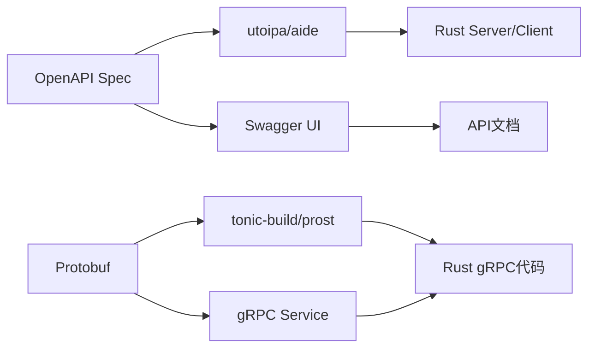

# 2.2 OpenAPI/Swagger/Protobuf协议标准

## 目录

1. 引言与协议简介
2. OpenAPI/Swagger标准与生态
3. Protobuf协议与gRPC集成
4. 自动化API文档与代码生成
5. 代码与配置示例
6. 行业应用案例
7. Mermaid协议关系图
8. 参考文献

---

## 1. 引言与协议简介

OpenAPI/Swagger和Protobuf是现代Rust微服务架构中主流的API协议标准。它们支持接口自动化、文档生成、代码生成与多语言互操作，极大提升了Rust微服务的开发效率与一致性。

## 2. OpenAPI/Swagger标准与生态

- **OpenAPI**（原Swagger）：描述RESTful API的开放标准，支持自动生成文档、客户端/服务端代码。
- 生态工具：utoipa、aide、openapi-generator、paperclip等。
- 优势：接口契约驱动开发、自动化测试、文档与代码同步。

## 3. Protobuf协议与gRPC集成

- **Protobuf**：Google推出的高性能二进制序列化协议，广泛用于gRPC服务定义。
- **gRPC**：基于Protobuf的高性能RPC框架，支持多语言、自动生成代码、流式通信。
- 生态工具：prost、tonic、tonic-build、grpc-rs等。

## 4. 自动化API文档与代码生成

- OpenAPI/Swagger：通过宏或结构体定义，自动生成接口文档与Go代码（如utoipa、aide）。
- Protobuf/gRPC：通过.proto文件自动生成Rust服务端与客户端代码（prost、tonic-build）。
- 支持接口Mock、自动化测试、API版本管理。

## 5. 代码与配置示例

### OpenAPI自动生成文档（utoipa）

```rust
use utoipa::OpenApi;
use utoipa_swagger_ui::SwaggerUi;
#[derive(OpenApi)]
#[openapi(paths(ping), components(schemas(PingResponse)))]
struct ApiDoc;
#[utoipa::path(get, path = "/ping", responses((status = 200, body = PingResponse)))]
async fn ping() -> impl Responder { /* ... */ }
```

### Protobuf定义与Rust代码生成

```proto
syntax = "proto3";
package api;
service Greeter { rpc SayHello (HelloRequest) returns (HelloReply); }
message HelloRequest { string name = 1; }
message HelloReply { string message = 1; }
```

```rust
// build.rs
fn main() -> Result<(), Box<dyn std::error::Error>> {
    tonic_build::compile_protos("proto/greeter.proto")?;
    Ok(())
}
```

## 6. 行业应用案例

- 区块链、Web3、金融等领域广泛采用OpenAPI/Swagger/Protobuf标准，实现多语言互操作与自动化集成

## 7. Mermaid协议关系图



## 8. 参考文献

- [OpenAPI官方文档](https://swagger.io/specification/)
- [utoipa](https://github.com/juhaku/utoipa)
- [aide](https://github.com/tamasfe/aide)
- [Protobuf官方文档](https://developers.google.com/protocol-buffers)
- [tonic](https://github.com/hyperium/tonic)
- [prost](https://github.com/tokio-rs/prost)

---
> 支持断点续写与递归细化，如需扩展某一小节请指定。
