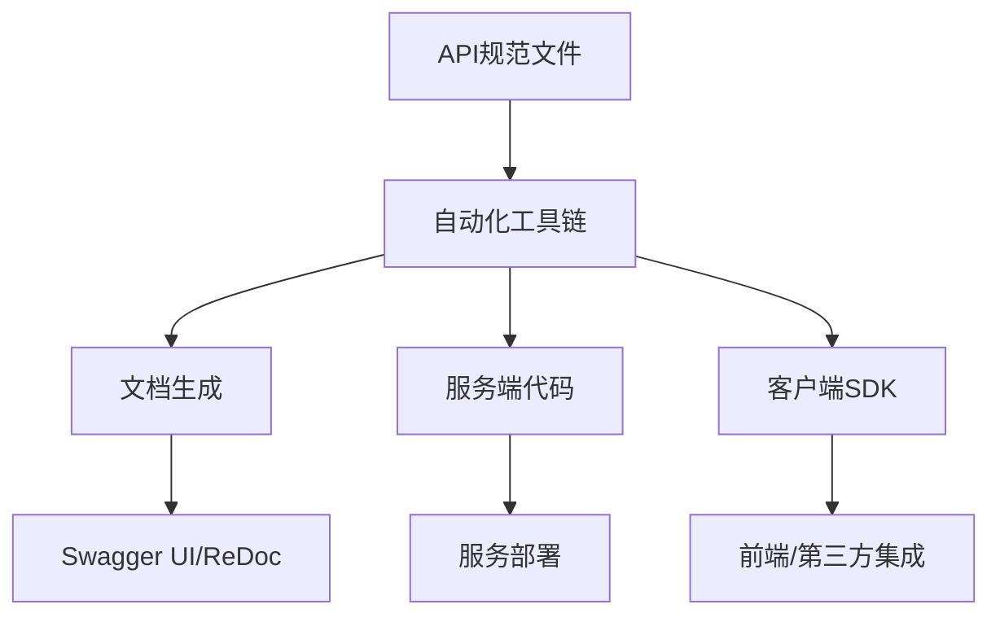

# 2.3 自动化API文档与代码生成

## 目录

1. 引言与自动化流程概述
2. 主流工具与生态（utoipa、aide、tonic-build、prost等）
3. 自动化API文档生成实践
4. 自动化服务端/客户端代码生成
5. 集成CI/CD与自动化测试
6. 代码与配置示例
7. 行业应用案例
8. Mermaid自动化流程图
9. 参考文献

---

## 1. 引言与自动化流程概述

自动化API文档与代码生成是现代Rust微服务开发的核心环节。通过标准协议（OpenAPI/Swagger/Protobuf）与自动化工具链，实现接口文档、服务端/客户端代码、Mock服务等的自动生成，提升开发效率与一致性。

## 2. 主流工具与生态

- **utoipa**：基于宏自动生成OpenAPI文档，集成actix-web、axum等主流框架
- **aide**：数据库驱动的API文档与代码生成
- **openapi-generator**：支持多语言API代码生成
- **prost/tonic-build**：Protobuf/gRPC接口与代码生成
- **grpc-rs**：gRPC生态工具

## 3. 自动化API文档生成实践

- 通过宏、结构体定义或.proto文件，自动生成接口文档（Swagger UI、ReDoc等）
- 支持接口Mock、自动化测试、API版本管理
- 文档与代码同步，减少手工维护成本

## 4. 自动化服务端/客户端代码生成

- OpenAPI/Swagger：自动生成Rust类型、路由、请求/响应结构体、客户端SDK
- Protobuf/gRPC：自动生成服务端与客户端代码，支持多语言互操作
- 支持接口契约驱动开发，提升系统一致性与可维护性

## 5. 集成CI/CD与自动化测试

- 在CI/CD流水线中集成API文档与代码生成步骤，保证接口变更自动同步
- 自动化测试覆盖API契约、Mock服务、回归测试等

## 6. 代码与配置示例

### utoipa宏生成Swagger文档

```rust
use utoipa::{OpenApi, IntoParams};
#[derive(OpenApi)]
#[openapi(paths(hello))]
struct ApiDoc;

#[utoipa::path(get, path = "/hello")]
async fn hello() -> &'static str { "Hello!" }
```

### tonic-build生成gRPC代码

```rust
// build.rs
fn main() -> Result<(), Box<dyn std::error::Error>> {
    tonic_build::compile_protos("proto/service.proto")?;
    Ok(())
}
```

## 7. 行业应用案例

- 区块链、Web3、金融等行业通过自动化API文档与代码生成提升开发效率与接口一致性

## 8. Mermaid自动化流程图



## 9. 参考文献

- [utoipa](https://github.com/juhaku/utoipa)
- [aide](https://github.com/tamasfe/aide)
- [openapi-generator](https://github.com/OpenAPITools/openapi-generator)
- [prost](https://github.com/tokio-rs/prost)
- [tonic](https://github.com/hyperium/tonic)

---
> 支持断点续写与递归细化，如需扩展某一小节请指定。
