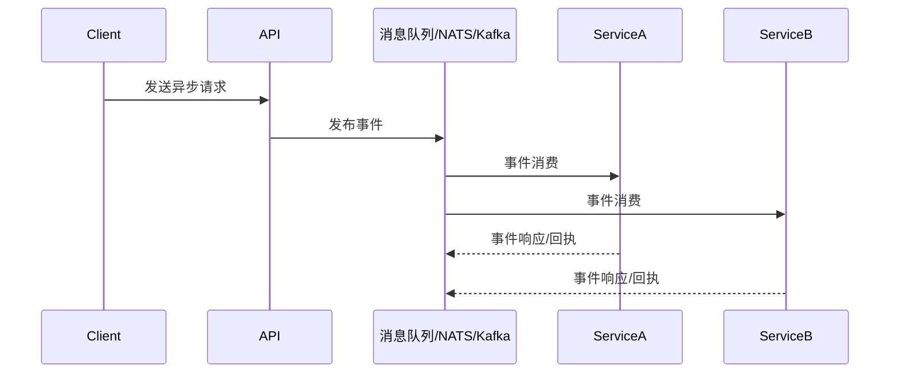

# 2.5 异步协议与事件驱动集成

## 目录

1. 引言与异步协议简介
2. 主流异步协议与实现
3. 事件驱动架构（EDA）与微服务集成
4. 自动化集成与最佳实践
5. 代码与配置示例
6. 行业应用案例
7. Mermaid异步通信架构图
8. 参考文献

---

## 1. 引言与异步协议简介

异步协议和事件驱动架构（EDA）是现代分布式系统和Rust微服务架构的关键。通过消息队列、流式通信、事件总线等机制，实现服务间解耦、高并发与弹性扩展。

## 2. 主流异步协议与实现

- **WebSocket**：基于TCP的全双工通信协议，适合实时推送与前后端异步交互。常用库：`tokio-tungstenite`, `axum`, `warp`。
- **gRPC-Streaming**：gRPC支持的流式异步通信，适合高性能服务间数据流。常用库：`tonic`。
- **NATS**：轻量级高性能消息队列，支持发布/订阅、请求/响应、流式传输。常用库：`async-nats`。
- **Kafka**：分布式流处理平台，适合大规模事件驱动与数据管道。常用库：`rdkafka`。
- **RabbitMQ/AMQP**：企业级消息中间件，支持多种消息模式。常用库：`lapin`。

## 3. 事件驱动架构（EDA）与微服务集成

- 事件总线/消息队列实现服务解耦与异步通信。
- 支持事件溯源、CQRS、Saga等分布式事务模式。
- 结合Rust生态实现高效EDA，利用`async/await`和`tokio`运行时。

## 4. 自动化集成与最佳实践

- 在CI/CD中集成异步协议与事件驱动组件的自动化部署与测试。
- 自动化健康检查、消息追踪、事件重放等。
- 支持多协议混合、异步与同步API协同。

## 5. 代码与配置示例

### gRPC-Streaming服务端示例 (tonic)

```rust
// proto定义
service Chat { rpc StreamMessages(stream Message) returns (stream Message); }

// Rust实现
use tonic::{transport::Server, Request, Response, Status};
pub struct MyChat;
#[tonic::async_trait]
impl Chat for MyChat {
    type StreamMessagesStream = futures::stream::BoxStream<'static, Result<Message, Status>>;
    async fn stream_messages(&self, request: Request<tonic::Streaming<Message>>) -> Result<Response<Self::StreamMessagesStream>, Status> {
        // ...
        unimplemented!()
    }
}
```

### NATS发布/订阅示例 (async-nats)

```rust
use async_nats as nats;
use futures::StreamExt;

#[tokio::main]
async fn main() -> Result<(), nats::Error> {
    let client = nats::connect("demo.nats.io").await?;
    let mut subscriber = client.subscribe("updates").await?;
    client.publish("updates", "hello async!".into()).await?;
    if let Some(msg) = subscriber.next().await {
        println!("Received: {}", String::from_utf8_lossy(&msg.payload));
    }
    Ok(())
}
```

## 6. 行业应用案例

- 区块链、Web3、金融、物联网等场景广泛采用Rust异步协议与EDA提升系统弹性与实时性。

## 7. Mermaid异步通信架构图



## 8. 参考文献

- [gRPC Streaming官方文档](https://grpc.io/docs/guides/concepts/)
- [NATS官方文档](https://docs.nats.io/)
- [Kafka官方文档](https://kafka.apache.org/documentation/)
- [tokio-tungstenite](https://github.com/snapview/tokio-tungstenite)
- [async-nats](https://github.com/nats-io/nats.rs)
- [rdkafka](https://github.com/fede1024/rust-rdkafka)
- [lapin](https://github.com/amqp-rs/lapin)

---
> 支持断点续写与递归细化，如需扩展某一小节请指定。
