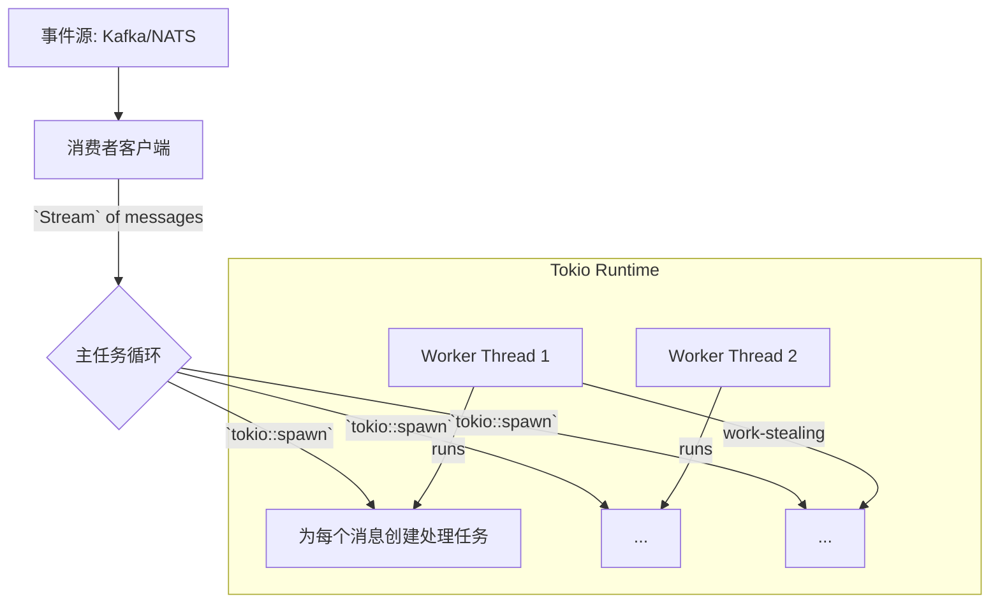

# 2.5 Rust异步模式与事件驱动

## 目录

- [1. 引言与定义](#1-引言与定义)
- [2. Rust异步核心概念](#2-rust异步核心概念)
  - [2.1 `async/await`语法](#21-async-await语法)
  - [2.2 `Future` Trait](#22-future-trait)
  - [2.3 异步运行时 (Runtime)](#23-异步运行时-runtime)
- [3. 核心工具与Crates](#3-核心工具与crates)
  - [3.1 运行时: Tokio](#31-运行时-tokio)
  - [3.2 消息队列客户端: `lapin` & `rdkafka`](#32-消息队列客户端-lapin--rdkafka)
  - [3.3 协议规范: AsyncAPI](#33-协议规范-asyncapi)
- [4. Rust中的事件驱动模式](#4-rust中的事件驱动模式)
  - [4.1 `tokio::sync::broadcast`](#41-tokiosyncbroadcast)
  - [4.2 `Stream`与`futures::stream`](#42-stream与futuresstream)
  - [4.3 优雅关闭](#43-优雅关闭)
- [5. 自动化集成与实践](#5-自动化集成与实践)
  - [5.1 AsyncAPI与代码生成](#51-asyncapi与代码生成)
  - [5.2 结构化的并发](#52-结构化的并发)
- [6. 代码示例](#6-代码示例)
  - [6.1 Tokio Broadcast Channel示例](#61-tokio-broadcast-channel示例)
  - [6.2 `rdkafka`消费者示例](#62-rdkafka消费者示例)
- [7. 行业应用案例](#7-行业应用案例)
- [8. Mermaid图表：异步任务处理流程](#8-mermaid图表异步任务处理流程)
- [9. 参考文献](#9-参考文献)

---

## 1. 引言与定义

**异步编程**是一种允许程序在等待耗时操作（如I/O）完成时继续执行其他任务的编程范式。在Rust中，异步编程是构建高并发、高性能网络服务和事件驱动系统的关键。**事件驱动架构 (EDA)** 则是一种利用异步消息传递来促进服务间松耦合和可伸缩性的软件架构模式。

Rust的异步模型以其**无畏并发（Fearless Concurrency）** 和**零成本抽象（Zero-cost Abstractions）** 而著称，能够在编译时保证内存安全，同时提供接近C/C++的性能。

## 2. Rust异步核心概念

### 2.1 `async/await`语法

`async fn`关键字用于定义一个异步函数，它会返回一个`Future`。在`async`函数内部，`await`关键字用于暂停函数的执行，直到它等待的`Future`完成（resolved），在此期间，线程可以去执行其他任务。

### 2.2 `Future` Trait

`Future`是Rust异步编程的核心抽象。它是一个trait，代表一个可能在未来某个时间点完成的计算。一个`Future`可以被轮询（poll），并且会返回`Pending`（还未完成）或`Ready(value)`（已完成并返回值）。

### 2.3 异步运行时 (Runtime)

Rust本身只提供了`async/await`语法和`Future` trait，但它不包含一个执行这些`Future`的**运行时**。运行时负责调度`Future`，将它们放在线程池上执行，并处理I/O事件的唤醒。最流行的运行时是**Tokio**。

## 3. 核心工具与Crates

### 3.1 运行时: Tokio

**Tokio** ([https://tokio.rs/](https://tokio.rs/)) 是一个用于编写异步应用的事件驱动、非阻塞I/O平台。它提供了一个多线程的、工作窃取（work-stealing）的调度器，以及TCP/UDP、定时器、同步原语（如channel, mutex）等构建网络服务所需的一切。

### 3.2 消息队列客户端: `lapin` & `rdkafka`

- **`lapin`**: 一个用纯Rust编写的功能完整的AMQP 0.9.1客户端，用于与RabbitMQ等消息代理通信。
- **`rdkafka`**: 一个基于`librdkafka`的高性能Kafka客户端，提供了对Kafka生产者和消费者的全面支持。

### 3.3 协议规范: AsyncAPI

与Go类似，**AsyncAPI**也正在Rust社区中获得关注，用于定义和文档化事件驱动的API，并有潜力用于代码生成。

## 4. Rust中的事件驱动模式

### 4.1 `tokio::sync::broadcast`

Tokio的`broadcast` channel是一种多生产者、多消费者（MPMC）的channel。一个发送者可以向channel广播一条消息，所有活跃的订阅者都会收到该消息的克隆。这非常适合实现服务内部的事件总线。

### 4.2 `Stream`与`futures::stream`

`Stream` trait（由`futures` crate提供）是异步版本的`Iterator`。它代表一个能异步地产生一系列值的序列。消息队列的消费者客户端通常会实现`Stream`，允许你以一种非常自然的方式处理传入的消息流。

### 4.3 优雅关闭

在异步服务中，优雅关闭至关重要。Tokio提供了强大的支持，例如`tokio::select!`宏和cancellation token，可以监听操作系统的中断信号（如Ctrl-C），并协调所有正在运行的异步任务，让它们有机会清理资源并有序退出。

## 5. 自动化集成与实践

### 5.1 AsyncAPI与代码生成

虽然Rust的AsyncAPI代码生成工具生态不如某些语言成熟，但社区正在积极发展相关工具，旨在根据AsyncAPI规范自动生成消息结构体和客户端/服务器骨架。

### 5.2 结构化的并发

使用`tokio::spawn`来启动独立的任务（类似于Go的`go`关键字）。最佳实践是使用`JoinHandle`来管理这些任务的生命周期，确保在服务关闭或发生错误时，所有衍生的任务都能被正确地取消或完成。

## 6. 代码示例

### 6.1 Tokio Broadcast Channel示例

```rust
use tokio::sync::broadcast;

#[tokio::main]
async fn main() {
    let (tx, mut rx1) = broadcast::channel(16);
    let mut rx2 = tx.subscribe();

    tokio::spawn(async move {
        assert_eq!(rx1.recv().await.unwrap(), 10);
        assert_eq!(rx1.recv().await.unwrap(), 20);
    });

    tokio::spawn(async move {
        assert_eq!(rx2.recv().await.unwrap(), 10);
        assert_eq!(rx2.recv().await.unwrap(), 20);
    });

    tx.send(10).unwrap();
    tx.send(20).unwrap();
}
```

### 6.2 `rdkafka`消费者示例

```rust
// (需要添加 rdkafka = "0.28" 到 Cargo.toml)
use rdkafka::consumer::{Consumer, StreamConsumer};
use rdkafka::config::ClientConfig;

async fn consume() {
    let consumer: StreamConsumer = ClientConfig::new()
        .set("group.id", "my-group")
        .set("bootstrap.servers", "localhost:9092")
        .create()
        .expect("Consumer creation failed");

    consumer
        .subscribe(&["my-topic"])
        .expect("Can't subscribe to specified topics");

    loop {
        match consumer.recv().await {
            Err(e) => println!("Kafka error: {}", e),
            Ok(m) => {
                let payload = match m.payload_view::<str>() {
                    Some(Ok(s)) => s,
                    _ => "Invalid payload",
                };
                println!("Received message: {}", payload);
            }
        }
    }
}
```

## 7. 行业应用案例

- **Fly.io**: 这家应用托管平台使用Rust和Tokio来构建其全球分布式的代理和后端服务，处理大量的网络连接和内部事件。
- **Vector.dev**: 一个高性能的可观测性数据管道，完全用Rust编写。它广泛使用异步模式来从多种来源（文件、网络）并发地拉取和处理日志、指标，然后路由到不同的目的地。

## 8. Mermaid图表：异步任务处理流程



## 9. 参考文献

- [The Tokio Tutorial](https://tokio.rs/tokio/tutorial)
- [The Rust Async Book](https://rust-lang.github.io/async-book/)
- [`futures` crate documentation](https://docs.rs/futures/latest/futures/)
- [`rdkafka` crate documentation](https://docs.rs/rdkafka/latest/rdkafka/) 