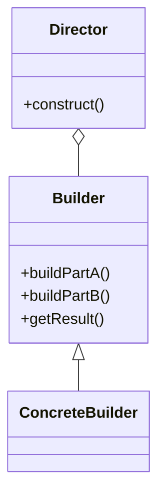

# 3.1 Rust常用设计模式实现

## 目录

1. 引言与设计模式概述
2. 创建型模式：单例、工厂、构建者
3. 结构型模式：装饰器、适配器、代理
4. 行为型模式：观察者、策略、命令
5. 自动化生成与工程集成
6. 代码示例
7. 行业应用案例
8. Mermaid模式结构图
9. 参考文献

---

## 1. 引言与设计模式概述

设计模式是提升Rust工程可维护性、可扩展性的重要手段。Rust的所有权、trait、泛型等特性为设计模式实现提供了独特的思路。

## 2. 创建型模式：单例、工厂、构建者

- **单例模式**：保证全局唯一实例，常用于配置、连接池等。Rust实现：`once_cell`、`lazy_static`。
- **工厂方法模式**：通过工厂方法创建对象，解耦实例化逻辑。Rust实现：trait+工厂函数/方法。
- **构建者模式**：分步构建复杂对象，链式调用。Rust实现：结构体+方法。

## 3. 结构型模式：装饰器、适配器、代理

- **装饰器模式**：动态扩展对象功能，常用于中间件、日志等。Rust实现：结构体包装、trait对象。
- **适配器模式**：转换接口，使不兼容的类可以协同工作。Rust实现：trait实现。
- **代理模式**：控制对对象的访问。Rust实现：结构体包装。

## 4. 行为型模式：观察者、策略、命令

- **观察者模式**：实现事件订阅与通知，适合事件驱动架构。Rust实现：trait对象列表、通道。
- **策略模式**：封装算法族，使其可以互换。Rust实现：trait对象、枚举。
- **命令模式**：将请求封装为对象，实现请求排队、撤销等。Rust实现：trait对象。

## 5. 自动化生成与工程集成

- 结合宏（如`macro_rules!`, 过程宏）自动生成模式代码。
- 集成CI/CD自动化测试与部署。

## 6. 代码示例

### 构建者模式

```rust
#[derive(Debug)]
struct Server { host: String, port: u16 }
struct ServerBuilder { host: String, port: u16 }
impl ServerBuilder {
    fn new() -> Self { Self { host: "127.0.0.1".to_string(), port: 8080 } }
    fn host(mut self, host: String) -> Self { self.host = host; self }
    fn port(mut self, port: u16) -> Self { self.port = port; self }
    fn build(self) -> Server { Server { host: self.host, port: self.port } }
}
let server = ServerBuilder::new().host("localhost".to_string()).build();
```

### 策略模式

```rust
trait Strategy { fn execute(&self); }
struct StrategyA;
impl Strategy for StrategyA { fn execute(&self) { println!("Executing A"); } }
struct Context { strategy: Box<dyn Strategy> }
impl Context { fn execute(&self) { self.strategy.execute(); } }
```

## 7. 行业应用案例

- 区块链、Web3、金融等领域广泛采用设计模式提升系统可维护性与安全性。

## 8. Mermaid模式结构图



## 9. 参考文献

- [Rust Design Patterns](https://rust-unofficial.github.io/patterns/)
- [Refactoring Guru: Design Patterns in Rust](https://refactoring.guru/design-patterns/rust)

---
> 支持断点续写与递归细化，如需扩展某一小节请指定。
