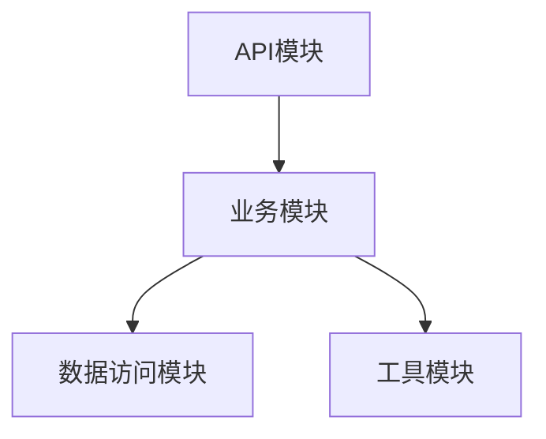

# 3.2 自动化生成与模块化工程

## 目录

1. 引言与自动化生成概述
2. 自动化生成工具与生态
3. 模块化设计原则
4. 工程集成与自动化实践
5. 代码与配置示例
6. 行业应用案例
7. Mermaid模块依赖图
8. 参考文献

---

## 1. 引言与自动化生成概述

自动化生成与模块化设计是提升Rust工程效率与可维护性的关键。通过代码生成工具、宏、自动化脚本等，实现工程结构标准化与高效集成。

## 2. 自动化生成工具与生态

- 过程宏（如`serde`、`utoipa`）、`build.rs`脚本、`tonic-build`等
- 支持API、数据结构、序列化/反序列化、Mock、测试用例等自动生成

## 3. 模块化设计原则

- 单一职责、低耦合高内聚、trait抽象、依赖注入
- 支持多包工作区（workspace）与独立部署

## 4. 工程集成与自动化实践

- 结合`cargo-make`、`CI/CD`、自动化脚本实现模块自动集成与测试
- 自动化生成与模块注册、依赖管理

## 5. 代码与配置示例

### 过程宏自动生成

```rust
use serde::{Serialize, Deserialize};
#[derive(Serialize, Deserialize, Debug)]
struct Point { x: i32, y: i32 }
```

### `build.rs`生成gRPC代码

```rust
// build.rs
fn main() -> Result<(), Box<dyn std::error::Error>> {
    tonic_build::compile_protos("proto/api.proto")?;
    Ok(())
}
```

## 6. 行业应用案例

- 区块链、Web3、金融等行业通过自动化生成与模块化提升工程效率与安全性

## 7. Mermaid模块依赖图



## 8. 参考文献

- [Rust官方模块化指南](https://doc.rust-lang.org/book/ch07-00-managing-growing-projects-with-packages-crates-and-modules.html)
- [过程宏](https://doc.rust-lang.org/reference/procedural-macros.html)
- [`build.rs`脚本](https://doc.rust-lang.org/cargo/reference/build-scripts.html)

---
> 支持断点续写与递归细化，如需扩展某一小节请指定。
