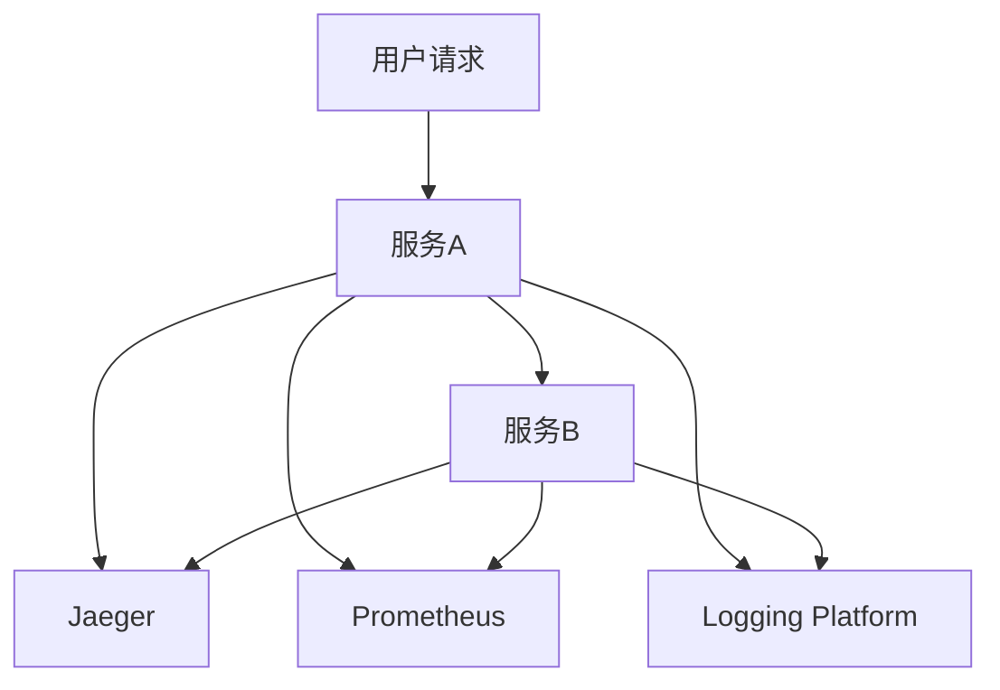

# 3.4 可观测性与OpenTelemetry集成

## 目录

1. 引言与可观测性概述
2. Rust中的OpenTelemetry生态
3. Tracing、Metrics、Logging集成实践
4. 自动化集成与最佳实践
5. 代码与配置示例
6. 行业应用案例
7. Mermaid可观测性架构图
8. 参考文献

---

## 1. 引言与可观测性概述

可观测性（Tracing、Metrics、Logging）是保障Rust微服务稳定性的基石。通过集成OpenTelemetry，实现分布式追踪、指标监控与日志聚合，提升系统透明度。

## 2. Rust中的OpenTelemetry生态

- **`tracing`**: 高性能、结构化的日志与追踪库
- **`opentelemetry`**: OpenTelemetry官方Rust SDK
- **`opentelemetry-jaeger`**, **`opentelemetry-zipkin`**: Jaeger/Zipkin导出器
- **`opentelemetry-prometheus`**: Prometheus指标导出器
- **`tonic-tracing`**: `tonic`与`tracing`的集成

## 3. Tracing、Metrics、Logging集成实践

- **Tracing**: 跨服务边界传播上下文，实现分布式追踪
- **Metrics**: 记录关键业务指标（如QPS、延迟）
- **Logging**: 结构化日志，聚合到统一平台

## 4. 自动化集成与最佳实践

- 通过`axum`/`tonic`中间件自动注入追踪与指标记录
- 在CI/CD中集成可观测性配置验证与测试

## 5. 代码与配置示例

### `tracing`与`opentelemetry`集成

```rust
use tracing::{info, instrument};
use tracing_subscriber::{prelude::*, Registry};
use opentelemetry::global;

#[instrument]
fn my_function() {
    info!("Executing my function");
}

fn main() {
    let tracer = opentelemetry_jaeger::new_pipeline().install_simple().unwrap();
    let telemetry = tracing_opentelemetry::layer().with_tracer(tracer);
    let subscriber = Registry::default().with(telemetry);
    tracing::subscriber::set_global_default(subscriber).unwrap();
    my_function();
}
```

### `axum`中间件集成

```rust
use axum::{Router, routing::get, middleware};
use tower_http::trace::TraceLayer;

let app = Router::new()
    .route("/", get(|| async { "Hello, World!" }))
    .layer(TraceLayer::new_for_http());
```

## 6. 行业应用案例

- 金融、电商、物联网等行业通过可观测性保障系统SLA与稳定性

## 7. Mermaid可观测性架构图



## 8. 参考文献

- [`tracing`](https://github.com/tokio-rs/tracing)
- [`opentelemetry-rust`](https://github.com/open-telemetry/opentelemetry-rust)
- [OpenTelemetry官方文档](https://opentelemetry.io/docs/)

---
> 支持断点续写与递归细化，如需扩展某一小节请指定。
