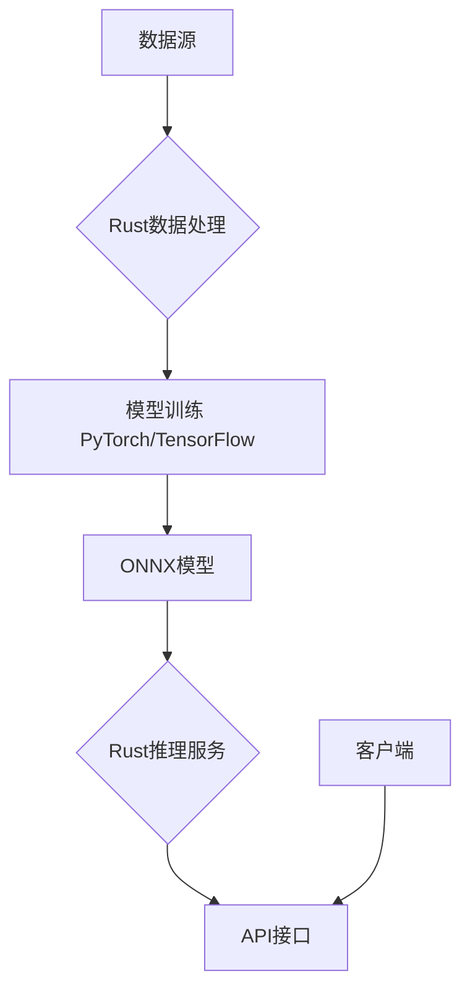

# 4.1 AI与Rust工程创新的融合

## 目录

1. 引言与AI工程化概述
2. Rust在AI领域的应用场景
3. 主流AI框架与Rust集成
4. AI自动化工具链与实践
5. 代码与配置示例
6. 行业应用案例
7. Mermaid AI集成架构图
8. 参考文献

---

## 1. 引言与AI工程化概述

AI与Rust的结合，旨在利用Rust的高性能、内存安全、并发性等优势，构建高效、可靠的AI基础设施与应用，推动AI工程化从研究到生产的落地。

## 2. Rust在AI领域的应用场景

- **高性能推理引擎**：利用Rust重写Python推理引擎的核心瓶颈，提升性能
- **数据处理与ETL**：构建高性能的数据处理管道，为模型训练做准备
- **AI基础设施**：开发向量数据库、MLOps平台、分布式训练框架等
- **边缘计算AI**：在资源受限设备上部署AI模型

## 3. 主流AI框架与Rust集成

- **tch-rs**: LibTorch (PyTorch) 的Rust绑定
- **tokenizers (Hugging Face)**: 高性能分词库，广泛用于NLP
- **ONNX Runtime**: ONNX模型的官方Rust绑定
- **candle**: Rust原生、轻量级、模块化的机器学习框架

## 4. AI自动化工具链与实践

- **模型即服务 (MaaS)**: 使用Rust构建高性能的API Server，封装AI模型
- **CI/CD for Models**: 自动化模型版本管理、测试与部署
- **AI Agent与自动化工作流**: 通过Rust构建与AI模型交互的Agent，实现复杂任务自动化

## 5. 代码与配置示例

### 使用`tch-rs`加载PyTorch模型

```rust
use tch::{Device, Tensor, nn, Kind};
fn main() -> Result<(), Box<dyn std::error::Error>> {
    let mut vs = nn::VarStore::new(Device::Cpu);
    let model = vs.load("model.pt")?;
    // ... use model for inference
    Ok(())
}
```

### 使用`tokenizers`进行分词

```rust
use tokenizers::Tokenizer;
fn main() -> Result<(), Box<dyn std::error::Error>> {
    let tokenizer = Tokenizer::from_file("tokenizer.json")?;
    let encoding = tokenizer.encode("Hello, world!", false)?;
    println!("{:?}", encoding.get_ids());
    Ok(())
}
```

## 6. 行业应用案例

- **Infra**: 向量数据库（如Qdrant）、MLOps平台
- **DeFi/Web3**: 智能合约审计、链上数据分析
- **Biotech**: 生物信息学、基因序列分析

## 7. Mermaid AI集成架构图



## 8. 参考文献

- [`tch-rs` (LibTorch bindings)](https://github.com/LaurentMazare/tch-rs)
- [`tokenizers` (Hugging Face)](https://github.com/huggingface/tokenizers)
- [`candle` (ML Framework)](https://github.com/huggingface/candle)
- [Are we learning yet?](https://www.arewelearningyet.com/)

---
> 支持断点续写与递归细化，如需扩展某一小节请指定。
