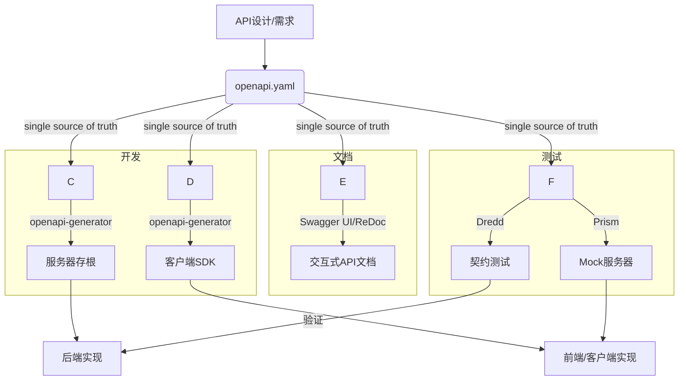

# 1.1 OpenAPI与Swagger：自动化实践

## 目录

- [1.1 OpenAPI与Swagger：自动化实践](#11-openapi与swagger自动化实践)
  - [目录](#目录)
  - [1. 引言与定义](#1-引言与定义)
  - [2. 核心概念](#2-核心概念)
    - [2.1 OpenAPI规范 (OAS)](#21-openapi规范-oas)
    - [2.2 Swagger工具集](#22-swagger工具集)
    - [2.3 设计优先 vs 代码优先](#23-设计优先-vs-代码优先)
  - [3. 自动化工作流](#3-自动化工作流)
    - [3.1 代码生成](#31-代码生成)
    - [3.2 文档生成](#32-文档生成)
    - [3.3 Mock服务器](#33-mock服务器)
    - [3.4 契约测试](#34-契约测试)
  - [4. 核心工具与实践](#4-核心工具与实践)
    - [4.1 `swagger-codegen` / `openapi-generator`](#41-swagger-codegen--openapi-generator)
    - [4.2 `Swagger UI` \& `ReDoc`](#42-swagger-ui--redoc)
    - [4.3 `Prism`](#43-prism)
  - [5. 配置/代码示例](#5-配置代码示例)
    - [5.1 OpenAPI 3.0定义示例 (`openapi.yaml`)](#51-openapi-30定义示例-openapiyaml)
    - [5.2 `openapi-generator`使用示例](#52-openapi-generator使用示例)
  - [6. 行业应用案例](#6-行业应用案例)
  - [7. Mermaid图表：OpenAPI自动化工作流](#7-mermaid图表openapi自动化工作流)
  - [8. 参考文献](#8-参考文献)

---

## 1. 引言与定义

**OpenAPI规范 (OpenAPI Specification, OAS)** 是一个用于定义、描述、可视化RESTful API的语言无关的标准格式。它允许人类和计算机在没有访问源代码或额外文档的情况下，理解一个服务的功能。**Swagger**是围绕OpenAPI规范构建的一套最流行的开源工具集。

在现代软件工程中，利用OpenAPI进行**自动化实践**，是实现API标准化、提高团队协作效率、加速开发和测试周期的关键。

## 2. 核心概念

### 2.1 OpenAPI规范 (OAS)

OAS使用YAML或JSON格式来描述API的方方面面，包括：

- **端点（Endpoints）**: API的路径，如`/users/{id}`。
- **操作（Operations）**: 每个端点支持的HTTP方法，如`GET`, `POST`, `DELETE`。
- **参数（Parameters）**: 操作所需的输入，如路径参数、查询参数、请求头。
- **请求体（Request Bodies）**: `POST`或`PUT`请求的数据结构。
- **响应（Responses）**: 操作可能返回的HTTP状态码和数据结构。
- **模式（Schemas）**: 使用JSON Schema方言定义的可复用的数据模型。

### 2.2 Swagger工具集

Swagger提供了支持API整个生命周期的工具，主要包括：

- **Swagger Editor**: 用于编写和验证OAS文件的浏览器编辑器。
- **Swagger UI**: 将OAS文件渲染成一个交互式的、美观的API文档页面。
- **Swagger Codegen**: 根据OAS文件为多种语言和框架（超过40种）自动生成客户端SDK、服务器存根（stub）和API文档。

### 2.3 设计优先 vs 代码优先

- **设计优先 (Design-First)**: 先由架构师或API设计师编写`openapi.yaml`文件来定义API契约。然后，前端、后端和测试团队可以基于此契约并行工作，后端使用代码生成器创建服务骨架，前端使用Mock服务器进行开发。这是推荐的最佳实践。
- **代码优先 (Code-First)**: 后端开发者先编写代码和注释，然后通过工具从代码中自动生成OAS文件。这种方式对于快速原型开发可能很方便，但容易导致API设计与业务逻辑紧密耦合。

## 3. 自动化工作流

以OAS文件为"单一事实来源（Single Source of Truth）"，可以驱动以下自动化流程：

### 3.1 代码生成

根据OAS文件，自动为Go, Rust, Java, Python, TypeScript等多种语言生成：

- **客户端SDK**: 封装了所有API调用，包含正确的类型定义、请求序列化和响应反序列化，使前端和客户端开发者无需关心HTTP细节。
- **服务器存根**: 生成API接口定义（如Go的interface, Java的Interface）和数据模型，后端开发者只需填充业务逻辑即可。

### 3.2 文档生成

在CI/CD流程中，自动将OAS文件发布到`Swagger UI`或`ReDoc`，确保API文档永远与API的实现保持同步。

### 3.3 Mock服务器

根据OAS文件，可以立即启动一个Mock服务器（如Prism）。这个服务器会根据定义返回示例数据，使得前端和移动端团队可以在后端API尚未开发完成时就开始集成和测试。

### 3.4 契约测试

使用工具（如Dredd）将OAS文件作为API契约，自动对真实的API实现发送请求，并验证其响应是否与契约中定义的格式、类型和状态码完全一致。

## 4. 核心工具与实践

### 4.1 `swagger-codegen` / `openapi-generator`

`openapi-generator`是`swagger-codegen`的一个社区驱动的分支，拥有更活跃的开发和更多的功能。它是实现代码生成的核心工具。

### 4.2 `Swagger UI` & `ReDoc`

两者都是将OAS文件可视化的工具。`Swagger UI`功能更丰富，提供"Try it out"功能来直接调用API。`ReDoc`则生成一个更简洁、更适合阅读的三栏式文档页面。

### 4.3 `Prism`

由Stoplight开发的Prism是一个流行的开源Mock服务器，它可以根据OAS文件动态生成Mock数据，并验证传入的请求是否符合规范。

## 5. 配置/代码示例

### 5.1 OpenAPI 3.0定义示例 (`openapi.yaml`)

```yaml
openapi: 3.0.0
info:
  title: Simple User API
  version: 1.0.0
paths:
  /users/{userId}:
    get:
      summary: Get a user by ID
      parameters:
        - name: userId
          in: path
          required: true
          schema:
            type: integer
      responses:
        '200':
          description: A user object
          content:
            application/json:
              schema:
                $ref: '#/components/schemas/User'
components:
  schemas:
    User:
      type: object
      properties:
        id:
          type: integer
        name:
          type: string
```

### 5.2 `openapi-generator`使用示例

```bash
# 安装 openapi-generator-cli
npm install @openapitools/openapi-generator-cli -g

# 生成Go服务器存根
openapi-generator-cli generate -i openapi.yaml -g go-server -o ./go-server-generated

# 生成TypeScript客户端SDK
openapi-generator-cli generate -i openapi.yaml -g typescript-axios -o ./ts-client-generated
```

## 6. 行业应用案例

- **Stripe**: 全球领先的支付平台，其API是行业的黄金标准。Stripe使用OpenAPI来精确地定义其复杂的API，并自动生成多种语言的客户端SDK，极大地简化了开发者的集成工作。
- **Google Cloud Platform (GCP)**: GCP的许多服务都提供了OpenAPI规范，允许用户和开发者通过自动化工具来探索API、生成客户端库和进行集成。

## 7. Mermaid图表：OpenAPI自动化工作流



## 8. 参考文献

- [OpenAPI Specification](https://spec.openapis.org/oas/v3.0.3)
- [Swagger Tools](https://swagger.io/tools/)
- [OpenAPI Generator](https://openapi-generator.tech/)
- [Stoplight Prism](https://stoplight.io/open-source/prism)
- [Introduction to Design-First APIs](https://www.apisyouwonthate.com/blog/api-design-first-vs-code-first)
