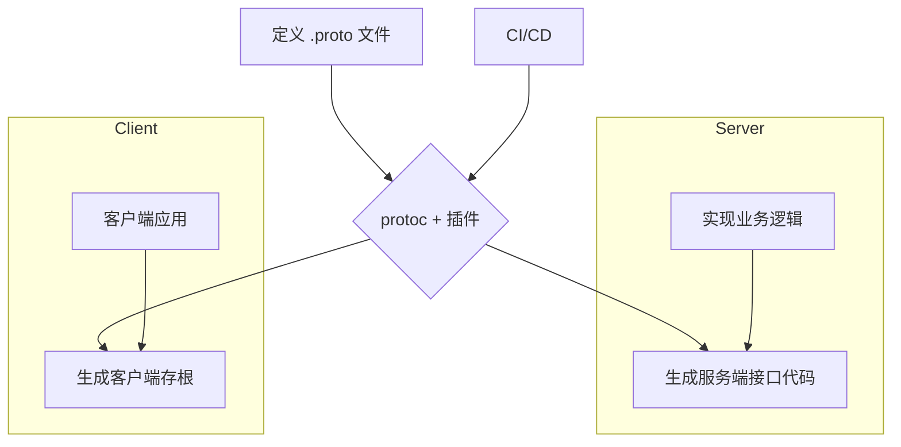

# 1.2 Protocol Buffers与gRPC生态

## 目录

1. 引言与gRPC概述
2. Protocol Buffers核心语法与概念
3. gRPC自动化工具链
4. RPC自动化实践与工作流
5. `.proto`定义与生成示例
6. 行业应用案例
7. Mermaid gRPC工作流图
8. 参考文献

---

## 1. 引言与gRPC概述

gRPC是一个由Google开发的高性能、开源的通用RPC（远程过程调用）框架。它使用Protocol Buffers (Protobuf) 作为其接口定义语言（IDL）和底层消息交换格式。与基于JSON的RESTful API不同，gRPC基于HTTP/2协议，提供双向流、头部压缩等高级功能，并通过二进制序列化实现极高的数据传输效率，是构建微服务架构的理想选择。

## 2. Protocol Buffers核心语法与概念

- **IDL**: Protocol Buffers是一种语言无关、平台无关的接口定义语言。
- **`.proto`文件**: API的接口、服务、方法和消息都在`.proto`文件中定义。
- **核心元素**:
  - `syntax`: 定义Protobuf版本（如`proto3`）。
  - `package`: 防止命名冲突的包声明。
  - `message`: 定义结构化数据，类似于`struct`或`class`。
  - `service`: 定义RPC服务，包含一系列`rpc`方法。
  - **标量类型**: `string`, `int32`, `bool`, `bytes`等。
  - **字段编号**: 每个字段都有一个唯一的、不可变更的数字编号，用于二进制序列化。

## 3. gRPC自动化工具链

- **`protoc`**: Protobuf编译器，用于解析`.proto`文件并生成指定语言的源代码。
- **语言插件**: `protoc`通过插件机制支持不同语言。
  - **Go**: `protoc-gen-go`, `protoc-gen-go-grpc`
  - **Rust**: `tonic-build` (通常在`build.rs`中调用)
  - **Java**: `protoc-gen-grpc-java`
- **辅助工具**:
  - `grpcurl`: gRPC的命令行客户端，类似于`curl`。
  - `grpc-gateway`: 将RESTful JSON API代理到gRPC服务。

## 4. RPC自动化实践与工作流

1. **定义**: 在`.proto`文件中定义服务（`service`）、方法（`rpc`）和数据结构（`message`）。
2. **生成**: 使用`protoc`和相应的语言插件，为服务端和客户端生成接口代码、存根（stub）和数据模型。
3. **实现**: 服务端实现生成的接口，填充业务逻辑。
4. **调用**: 客户端引入生成的存根，像调用本地方法一样调用远程服务。
5. **集成**: 在CI/CD中，将`.proto`文件作为"单一事实来源"，当其变更时自动触发代码生成、编译和契约测试。

## 5. `.proto`定义与生成示例

### `greeter.proto`

```protobuf
syntax = "proto3";

package greeter.v1;

// The greeter service definition.
service Greeter {
  // Sends a greeting
  rpc SayHello (HelloRequest) returns (HelloReply) {}
}

// The request message containing the user's name.
message HelloRequest {
  string name = 1;
}

// The response message containing the greetings
message HelloReply {
  string message = 1;
}
```

### `protoc`生成命令 (Go)

```bash
protoc --go_out=. --go_opt=paths=source_relative \
    --go-grpc_out=. --go-grpc_opt=paths=source_relative \
    greeter.proto
```

## 6. 行业应用案例

- **内部微服务通信**: 在大型分布式系统中，服务间通过gRPC进行高效、低延迟的通信。
- **云原生应用**: 与Kubernetes、Istio等云原生技术深度集成，提供服务发现、负载均衡和认证。
- **移动端与后端通信**: 利用其高效的二进制协议，减少移动应用的网络带宽消耗和电量。

## 7. Mermaid gRPC工作流图



## 8. 参考文献

- [gRPC Official Website](https://grpc.io/)
- [Protocol Buffers Documentation](https://developers.google.com/protocol-buffers)
- [gRPC-Go](https://github.com/grpc/grpc-go)
- [Tonic (Rust gRPC)](https://github.com/hyperium/tonic)

---
> 支持断点续写与递归细化，如需扩展某一小节请指定。
