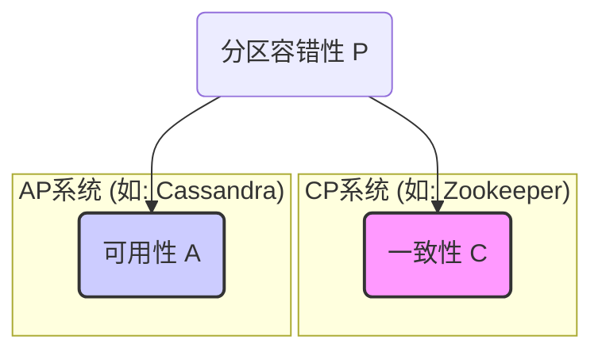
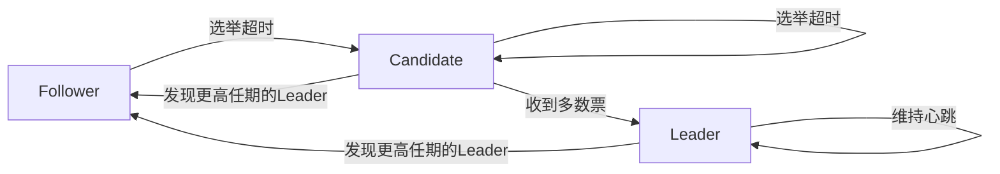

# 1.1 分布式系统核心理论 (CAP/FLP/Etc)

## 目录

- [1.1 分布式系统核心理论 (CAP/FLP/Etc)](#11-分布式系统核心理论-capflpetc)
  - [目录](#目录)
  - [1. 引言：为何理论至关重要](#1-引言为何理论至关重要)
  - [2. CAP理论：分布式系统设计的"三选二"](#2-cap理论分布式系统设计的三选二)
  - [3. FLP不可能性原理：共识的极限](#3-flp不可能性原理共识的极限)
  - [4. 共识算法：在不可能中寻求可能 (Paxos/Raft)](#4-共识算法在不可能中寻求可能-paxosraft)
  - [5. 分布式计算的八大谬误](#5-分布式计算的八大谬误)
  - [6. Mermaid图解核心理论](#6-mermaid图解核心理论)
    - [CAP理论权衡](#cap理论权衡)
    - [Raft状态机](#raft状态机)
  - [7. 参考文献](#7-参考文献)
  - [分布式一致性与CAP/FLP理论](#分布式一致性与capflp理论)
    - [1. CAP定理](#1-cap定理)
    - [2. FLP不可能性定理](#2-flp不可能性定理)
    - [3. 一致性模型](#3-一致性模型)
    - [4. 批判性分析与工程权衡](#4-批判性分析与工程权衡)

---

## 1. 引言：为何理论至关重要

构建分布式系统前，必须理解其固有的复杂性和挑战，如网络不可靠、节点故障、时钟不一致等。
分布式理论为我们提供了分析这些问题的数学模型和思想框架，帮助我们在设计系统时做出合理的、有依据的权衡。
它们是"巨人的肩膀"，让我们避免重复踩坑。

## 2. CAP理论：分布式系统设计的"三选二"

由Eric Brewer提出的CAP理论指出，任何一个分布式系统在以下三个核心诉求中，最多只能同时满足两个：

- **一致性 (Consistency)**: 所有节点在同一时间看到的数据是完全一致的。每次读取操作都能返回最新的写入数据。
- **可用性 (Availability)**: 任何来自客户端的请求，都能在有限时间内获得一个非错误的响应（但不保证是最新数据）。
- **分区容错性 (Partition Tolerance)**: 系统在网络分区（节点间通信中断）的情况下，仍能继续运行。

在现代分布式系统中，网络分区是必然会发生的故障，因此**分区容错性(P)是必须保证的前提**。
架构师的真正选择是在一致性(C)和可用性(A)之间进行权衡：

- **选择CP (放弃A)**: 当网络分区发生时，系统为了保证数据一致性，会拒绝一部分请求（例如，被分区的节点会停止服务），牺牲了可用性。适用于对数据一致性要求极高的场景，如银行交易、分布式锁。
- **选择AP (放弃C)**: 当网络分区发生时，系统为了保证可用性，会继续响应客户端请求，但可能返回过期的数据，牺牲了强一致性（通常转向"最终一致性"）。适用于对可用性要求极高的场景，如社交媒体的信息流、电商网站的商品浏览。

## 3. FLP不可能性原理：共识的极限

由Fischer, Lynch, Paterson提出的FLP不可能性原理证明了：**在一个异步分布式系统中（消息可能无限延迟），只要有一个节点可能会崩溃，就不存在任何一个确定性的算法能让所有节点达成共识**。

- **核心启示**: 它为共识问题划定了一条理论上的界限，告诉我们"完美"的共识算法是不存在的。
- **现实意义**: 实际的共识算法（如Paxos, Raft）都对这个"完全异步"的理想模型做了一定的妥协，最常见的就是引入**超时机制**。通过超时来"怀疑"一个节点是否已崩溃，从而绕开了FLP的限制，但这也意味着这些算法在极端网络延迟下可能导致活性问题（liveness issue）。

## 4. 共识算法：在不可能中寻求可能 (Paxos/Raft)

共识算法的目标是让一组节点对某个值达成一致。

- **Paxos**: 由Leslie Lamport提出，是第一个被证明的、实用的共识算法。它通过一套复杂的两阶段提交协议（Prepare/Promise, Propose/Accept）来达成共识。Paxos以其严谨和高效而闻名，但也因其难以理解和实现而著称。
- **Raft**: 由Stanford的Diego Ongaro设计，其首要目标就是**可理解性**。它将共识问题分解为三个相对独立的子问题：
    1. **领导者选举 (Leader Election)**: 从一组节点中选举出一个领导者，全权负责处理客户端请求。
    2. **日志复制 (Log Replication)**: 领导者将所有操作作为日志条目，复制到其他跟随者节点。
    3. **安全性 (Safety)**: 通过一系列机制保证所有节点最终执行的日志序列是完全一致的。
    Raft因其清晰的设计而成为当今最流行的共识算法之一，被广泛应用于etcd, Consul, TiKV等项目中。

## 5. 分布式计算的八大谬误

由L. Peter Deutsch等人总结的、工程师在构建分布式系统时容易做出的错误假设：

1. 网络是可靠的。
2. 延迟是零。
3. 带宽是无限的。
4. 网络是安全的。
5. 拓扑结构不会改变。
6. 只有一个管理员。
7. 传输成本是零。
8. 网络是同构的。
时刻牢记这些谬误，有助于我们设计出更健壮、更实际的分布式系统。

## 6. Mermaid图解核心理论

### CAP理论权衡

### Raft状态机

## 7. 参考文献

- [Brewer's Conjecture and the Feasibility of Consistent, Available, Partition-Tolerant Web Services](https://users.ece.cmu.edu/~adrian/731-sp04/readings/GL-cap.pdf)
- [Impossibility of Distributed Consensus with One Faulty Process (FLP Paper)](https://groups.csail.mit.edu/tds/papers/Lynch/jacm85.pdf)
- [In Search of an Understandable Consensus Algorithm (Raft Paper)](https://raft.github.io/raft.pdf)

---

## 分布式一致性与CAP/FLP理论

分布式系统一致性理论是理解系统设计权衡的核心基础。

### 1. CAP定理

- **内容**：分布式系统最多只能同时满足一致性（Consistency）、可用性（Availability）、分区容错性（Partition Tolerance）三者中的两项。
- **形式化表达**：
  - 一致性：所有节点在同一时刻看到的数据一致
  - 可用性：每个请求都能在有限时间内获得响应
  - 分区容错性：系统能容忍任意网络分区
- **工程意义**：实际系统需根据业务需求权衡，常见如CP（Zookeeper）、AP（Cassandra）、CA（理论上难实现）

### 2. FLP不可能性定理

- **内容**：在异步网络中，哪怕只有一个进程可能崩溃，也无法保证确定性共识算法同时满足安全性和活性。
- **形式化表达**：
  - 系统模型：异步、消息可能丢失、进程可能崩溃
  - 性质：安全性（不会产生错误决定）、活性（最终做出决定）
- **工程意义**：实际系统需引入超时、随机化等机制，或接受概率性活性保证

### 3. 一致性模型

- **线性一致性（强一致性）**：所有操作可串行化，且顺序与真实时间一致。
- **顺序一致性**：所有进程看到的操作顺序一致，但不要求与真实时间一致。
- **因果一致性**：保证因果相关的操作顺序一致，无因果关系的操作可乱序。
- **最终一致性**：只保证最终所有副本一致，不保证中间状态一致。

### 4. 批判性分析与工程权衡

- CAP/FLP理论为分布式系统设计提供了理论边界，但实际工程中需结合业务需求、网络环境、性能目标灵活取舍。
- 一致性模型的选择直接影响系统的可扩展性、可用性与复杂度。
- 趋势：多级一致性、可调一致性、AI辅助一致性检测等前沿方向。

---

> 本节内容吸收自FormalUnified分支，系统性补充分布式一致性理论、CAP/FLP定理及其工程意义，为后续共识协议与架构模式等章节提供理论支撑。
