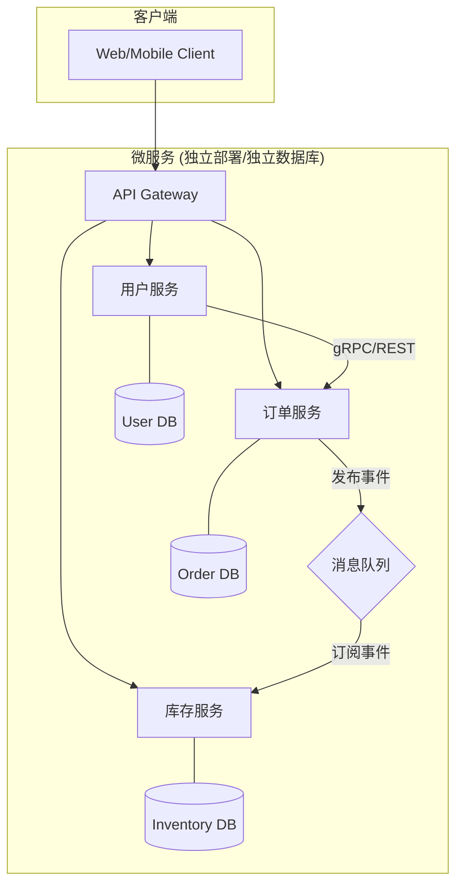

# 1.2 微服务架构核心原则与模式

## 目录

1. 引言：从单体到微服务
2. 微服务架构的核心原则
3. 关键架构设计模式
4. 优点与挑战 (Pros & Cons)
5. Mermaid图解架构模式
6. 参考文献

---

## 1. 引言：从单体到微服务

微服务架构是一种将单个应用程序开发为一套小型、独立、围绕业务能力构建的服务的方法。与紧密耦合的单体架构（Monolithic Architecture）相比，微服务的核心思想在于"化整为零"，每个服务都运行在自己的进程中，并通过轻量级机制（通常是HTTP/gRPC API）进行通信。其目标是提升系统的可扩展性、可维护性和团队的开发效率。

## 2. 微服务架构的核心原则

- **单一职责与限界上下文 (Single Responsibility & Bounded Context)**: 每个微服务应只关注一个独立的业务功能。这个功能的边界最好与领域驱动设计（DDD）中的"限界上下文"保持一致，确保服务的高内聚、低耦合。
- **独立部署 (Independent Deployment)**: 每个服务都可以独立于其他服务进行修改、测试、构建和部署。这是实现CI/CD和提升交付速度的关键。
- **去中心化治理 (Decentralized Governance)**: "Smart endpoints and dumb pipes"。微服务架构推崇"选择最适合工作的工具"，允许不同团队为自己的服务选择最合适的技术栈（语言、数据库、框架），而不是被集中式的技术决策所限制。
- **去中心化数据管理 (Decentralized Data Management)**: 每个服务都应拥有其私有的数据存储，其他服务不能直接访问其数据库。所有跨服务的数据交互必须通过该服务暴露的API进行，这保证了服务的封装性和独立性。
- **围绕业务能力构建 (Organized Around Business Capabilities)**: 团队组织结构应从传统的按技术分层（UI团队、DBA团队）转向按业务能力划分的跨职能团队。每个团队对一个或多个服务的整个生命周期（从开发到运维）负责。
- **为故障设计 (Design for Failure)**: 认识到在分布式环境中服务随时可能失败。必须在架构中内置容错机制，如超时、重试、熔断等，以防止局部故障演变成雪崩式的系统性灾难。

## 3. 关键架构设计模式

- **API网关模式 (API Gateway)**: 为所有客户端提供一个统一的入口点，负责请求路由、API组合、认证、限流、监控等。它简化了客户端的交互，并隐藏了内部的服务划分。
- **数据库分离模式 (Database per Service)**: 核心原则的具体实践，每个服务管理自己的数据库。
- **Saga模式 (Saga Pattern)**: 用于在没有两阶段提交（2PC）的情况下维护跨多个服务的数据一致性。通过一系列的本地事务和补偿操作来完成一个完整的业务流程。
- **命令查询职责分离 (CQRS)**: 将数据修改操作（Command）的模型与数据查询操作（Query）的模型分离开来。这使得读、写两端可以独立扩展和优化。
- **事件溯源 (Event Sourcing)**: 不直接存储对象的当前状态，而是存储导致该状态的所有变更事件的序列。通过重放事件可以随时重建当前状态。
- **断路器模式 (Circuit Breaker)**: 防止应用程序反复尝试执行一个可能失败的操作。当某个服务的错误率超过阈值时，"断路器"会"跳闸"，在一段时间内直接拒绝后续请求，避免资源耗尽和级联失败。
- **服务发现模式 (Service Discovery)**: 自动检测服务实例的网络位置（IP和端口），因为在云环境中这些位置是动态变化的。
- **服务网格模式 (Service Mesh)**: 将服务间通信的网络功能（如负载均衡、服务发现、熔断、监控、安全）从业务逻辑中分离出来，下沉到一个独立的基础设施层（Sidecar代理）。这使得开发者可以更专注于业务本身。Istio和Linkerd是该模式的代表实现。
- **无服务器架构模式 (Serverless)**: 进一步将基础设施的管理抽象掉，开发者只需编写和部署函数（FaaS - Function as a Service），由云平台负责资源的动态分配和伸缩。它与微服务可以结合使用，适用于事件驱动和短暂任务的场景。

## 3.5 微服务通信模式

服务间的通信是微服务架构的基石。选择合适的通信模式对系统性能、可靠性和复杂性有重大影响。

### 3.5.1 同步通信 (Synchronous Communication)

客户端发送请求并阻塞等待服务端的响应。这种模式简单直接，易于理解。

- **模式**:
  - **REST/HTTP**: 基于HTTP协议，使用GET/POST/PUT/DELETE等方法操作资源。是目前最广泛使用的方式。
  - **gRPC**: Google开发的高性能RPC框架，使用HTTP/2作为传输协议，Protocol Buffers作为接口定义语言。提供强类型、高效率的二进制通信。
- **优点**:
  - 实时性强，请求-响应模型清晰。
- **缺点**:
  - **时间耦合**: 客户端和服务端必须同时在线。
  - **级联失败风险**: 如果一个下游服务响应缓慢或失败，会阻塞上游服务，可能导致雪崩效应。

### 3.5.2 异步通信 (Asynchronous Communication)

客户端发送消息后无需等待响应，消息被放入队列中，由消费者在合适的时机处理。

- **模式**:
  - **消息队列 (Message Queue)**: 使用RabbitMQ, Kafka, ActiveMQ等中间件。服务间通过发布/订阅或点对点模式交换消息。
  - **事件驱动 (Event-Driven)**: 服务通过发布事件来通知状态变更，其他感兴趣的服务订阅这些事件并作出反应。这是实现松耦合的强大模式。
- **优点**:
  - **松耦合**: 服务间没有直接依赖，生产者甚至不需要知道消费者的存在。
  - **高可用性**: 即使消费者服务暂时不可用，消息也会保留在队列中，待其恢复后处理，增强了系统的弹性。
- **缺点**:
  - **复杂性增加**: 需要引入消息中间件，增加了系统的运维和监控成本。
  - **最终一致性**: 数据的最终一致性需要仔细设计，调试也更困难。

## 4. 优点与挑战 (Pros & Cons)

- **优点**:
  - **技术异构性**: 自由选择技术栈。
  - **弹性**: 单个服务故障不会导致整个系统崩溃。
  - **可扩展性**: 可以对需要更高性能的服务进行独立扩展。
  - **简化部署**: 服务粒度小，部署速度快。
  - **团队自治**: 授权小团队独立负责自己的服务。
- **挑战**:
  - **运维复杂性**: 需要管理和监控大量的服务实例。
  - **分布式系统复杂性**: 面临网络延迟、数据一致性、分布式事务等难题。
  - **测试复杂性**: 端到端测试和集成测试变得更加困难。
  - **服务间调用成本**: 跨进程通信比单体应用内部的方法调用成本更高。

## 5. Mermaid图解架构模式

## 6. 参考文献

- [Martin Fowler - Microservices](https://martinfowler.com/articles/microservices.html)
- [Microservices.io - Patterns](https://microservices.io/patterns/index.html) by Chris Richardson
- [Sam Newman, "Building Microservices"](https://samnewman.io/books/building_microservices/)

---
> 支持断点续写与递归细化，如需扩展某一小节请指定。
