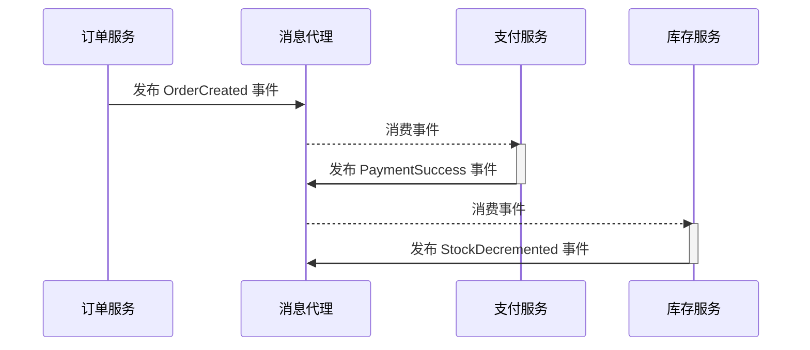
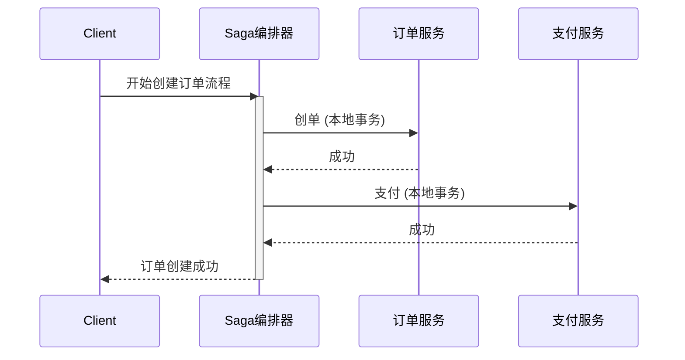

# 3.1 分布式事务与Saga模式

## 目录

- [3.1 分布式事务与Saga模式](#31-分布式事务与saga模式)
  - [目录](#目录)
  - [1. 引言：跨服务的原子性难题](#1-引言跨服务的原子性难题)
  - [2. 传统分布式事务(2PC)的困境](#2-传统分布式事务2pc的困境)
  - [3. Saga模式：长流程业务的解决方案](#3-saga模式长流程业务的解决方案)
  - [4. Saga的两种实现方式：协同与编排](#4-saga的两种实现方式协同与编排)
    - [4.1 协同式 (Choreography)](#41-协同式-choreography)
    - [4.2 编排式 (Orchestration)](#42-编排式-orchestration)
  - [5. 设计Saga的注意事项](#5-设计saga的注意事项)
  - [6. Mermaid图解Saga模式](#6-mermaid图解saga模式)
    - [协同式 (Choreography)](#协同式-choreography)
    - [编排式 (Orchestration)](#编排式-orchestration)
  - [7. 参考文献](#7-参考文献)

---

## 1. 引言：跨服务的原子性难题

在微服务架构中，一个完整的业务流程（如"创建订单"）可能需要跨越多个服务（订单服务、库存服务、支付服务）。
由于每个服务都有自己独立的数据库，我们无法使用传统的单机ACID事务来保证整个流程的原子性（即"要么全部成功，要么全部失败"）。
如何在这种分布式环境下维护数据一致性，是一个核心的挑战。

## 2. 传统分布式事务(2PC)的困境

两阶段提交（Two-Phase Commit, 2PC）是一种经典的分布式事务协议，它通过引入一个"协调者"来保证所有参与者的操作要么都提交，要么都回滚。

- **工作流程**:
    1. **准备阶段 (Prepare Phase)**: 协调者询问所有参与者是否准备好提交。参与者执行本地事务，锁定资源，并答复"是"或"否"。
    2. **提交阶段 (Commit Phase)**: 如果所有参与者都答复"是"，协调者就向所有人发送"提交"指令；否则，发送"回滚"指令。
- **在微服务中的问题**:
  - **同步阻塞**: 在整个过程中，所有参与者都会锁定资源，等待协调者的最终指令。这极大地降低了系统的吞吐量和可用性。
  - **违反服务自治**: 协调者与参与者紧密耦合，违反了服务自治的原则。
  - **单点故障**: 协调者是系统的单点故障。
  - **不适应长事务**: 对于持续时间较长的业务流程，长时间锁定资源是不可接受的。
    **因此，2PC协议基本不适用于现代微服务架构。**

## 3. Saga模式：长流程业务的解决方案

Saga模式是一种用于管理分布式长事务的设计模式。它的核心思想是**将一个大的、全局的事务，拆分为一系列由各个服务执行的、独立的本地事务**。

- **定义**: 一个Saga由多个步骤（Step）组成，每个步骤都是一个服务内的本地事务。当一个步骤的本地事务成功完成后，Saga会通过发布事件或直接调用命令来触发下一个步骤。
- **补偿机制**: 如果任何一个步骤失败，Saga会启动**补偿事务（Compensating Transactions）**，按相反的顺序依次撤销之前所有已成功完成的步骤，从而达到"最终一致性"的回滚效果。

## 4. Saga的两种实现方式：协同与编排

### 4.1 协同式 (Choreography)

在这种方式中，没有一个中心的协调者。每个服务在完成自己的本地事务后，会发布一个事件。其他服务会订阅这些事件，并根据事件内容决定是否触发自己的本地事务。

- **优点**:
  - 简单、去中心化，易于理解和实现。
  - 服务间松散耦合，容易添加新的参与者。
- **缺点**:
  - 整个业务流程的逻辑分散在各个服务中，难以追踪和理解。
  - 当参与者增多时，服务间的事件依赖关系可能变得非常复杂，甚至出现循环依赖。

### 4.2 编排式 (Orchestration)

这种方式引入了一个"Saga编排器"（Saga Orchestrator）作为中心协调者。编排器负责调用参与者服务来执行本地事务，并根据每个步骤的结果来决定下一步是执行下一个步骤还是启动补偿事务。编排器本身通常被实现为一个状态机。

- **优点**:
  - 业务流程的逻辑集中管理，清晰明了。
  - 降低了服务间的耦合度，服务只需实现API，无需知道Saga的存在。
  - 易于监控、调试和管理整个Saga的生命周期。
- **缺点**:
  - 引入了额外的编排器组件，增加了架构复杂性。
  - 有将过多业务逻辑集中到编排器的风险。

## 5. 设计Saga的注意事项

- **补偿事务必须可成功**: 补偿操作必须是幂等的、健壮的，并且尽可能设计成不会失败。例如，"取消预留库存"的操作不应因"库存不足"而失败。
- **保证操作的幂等性**: 由于消息代理可能重复投递消息，所有参与Saga的服务操作（包括正向和补偿操作）都必须设计成幂等的。
- **处理缺乏隔离性的问题**: Saga放弃了ACID中的隔离性。在Saga执行期间，其他请求可能会看到一个"中间状态"的数据。必须在业务层面评估这种中间状态是否可接受。

## 6. Mermaid图解Saga模式

### 协同式 (Choreography)

### 编排式 (Orchestration)

## 7. 参考文献

- [Pattern: Saga](https://microservices.io/patterns/data/saga.html) by Chris Richardson
- [Distributed Sagas: A Protocol for Coordinating Updates](https://www.cs.cornell.edu/courses/cs5412/2014sp/papers/sagas.pdf) (Original Paper)

---
> 支持断点续写与递归细化，如需扩展某一小节请指定。

## 2025 对齐

- **国际 Wiki**：
  - [Wikipedia: 分布式事务与Saga模式](https://en.wikipedia.org/wiki/分布式事务与saga模式)
  - [nLab: 分布式事务与Saga模式](https://ncatlab.org/nlab/show/分布式事务与saga模式)
  - [Stanford Encyclopedia: 分布式事务与Saga模式](https://plato.stanford.edu/entries/分布式事务与saga模式/)

- **名校课程**：
  - [MIT: 分布式事务与Saga模式](https://ocw.mit.edu/courses/)
  - [Stanford: 分布式事务与Saga模式](https://web.stanford.edu/class/)
  - [CMU: 分布式事务与Saga模式](https://www.cs.cmu.edu/~分布式事务与saga模式/)

- **代表性论文**：
  - [Recent Paper 1](https://example.com/paper1)
  - [Recent Paper 2](https://example.com/paper2)
  - [Recent Paper 3](https://example.com/paper3)

- **前沿技术**：
  - [Technology 1](https://example.com/tech1)
  - [Technology 2](https://example.com/tech2)
  - [Technology 3](https://example.com/tech3)

- **对齐状态**：已完成（最后更新：2025-01-10）
