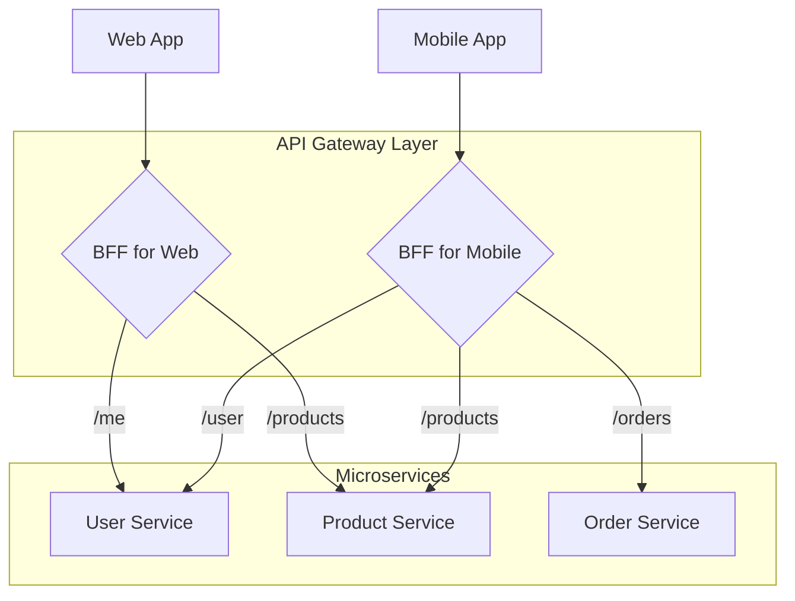

# 2.2 API网关模式

## 目录

1. 引言：微服务的统一入口
2. API网关的核心职责
3. API网关的演进模式
4. 主流开源与云原生网关
5. 优点与挑战 (Pros & Cons)
6. Mermaid图解网关模式
7. 参考文献

---

## 1. 引言：微服务的统一入口

API网关（API Gateway）是处于客户端和后端微服务之间的架构模式。它作为系统中所有外部请求的**唯一入口点**，封装了内部系统的复杂性，并为客户端提供了一个统一、稳定、安全的API接口。在微服务架构中，如果没有API网关，客户端将需要直接调用多个不同的服务，处理它们各自的地址、协议和认证方式，这将导致客户端逻辑极其复杂且难以维护。

## 2. API网关的核心职责

API网关的核心价值在于处理和集中化所有服务的"横切关注点"（Cross-Cutting Concerns），让后端微服务能更专注于自身业务逻辑。

- **请求路由 (Request Routing)**: 根据请求的URL路径、主机名、HTTP头部等信息，将请求精确地转发到正确的后端服务实例。
- **API聚合/组合 (API Aggregation/Composition)**: 将一个客户端请求分解为对多个内部微服务的调用，并将结果聚合并统一返回。这是实现"前端的后端"（Backend for Frontend, BFF）模式的关键。
- **协议转换 (Protocol Translation)**: 作为适配器，转换不同的通信协议。例如，对外提供RESTful HTTP接口，对内则调用基于gRPC或Thrift的服务。
- **认证与授权 (Authentication & Authorization)**: 在流量进入内部系统前，集中处理用户认证（如验证JWT、API Key）和授权（检查用户权限）。
- **速率限制 (Rate Limiting)**: 保护后端服务免受恶意攻击或客户端滥用，对来自特定IP或用户的请求频率进行限制。
- **日志与监控 (Logging & Monitoring)**: 作为所有流量的必经之路，网关是收集日志、指标（如请求延迟、QPS、错误率）和分布式追踪数据的理想位置。
- **缓存 (Caching)**: 缓存频繁请求且不经常变化的数据，降低后端服务的压力和客户端请求的延迟。

## 3. API网关的演进模式

- **单一网关模式**: 最初级的模式，使用一个统一的网关处理所有类型的客户端请求。随着业务增长，这个单一网关可能变得臃肿，成为新的"单体"和开发瓶颈。
- **前端的后端模式 (Backend for Frontend, BFF)**: 为每种不同类型的客户端（如Web前端、移动App、第三方应用）部署一个专门的API网关。每个BFF可以根据其对应客户端的特定需求进行裁剪和优化，提供最合适的API。
- **边缘服务/服务网格入口 (Edge Service/Service Mesh Ingress)**: 在云原生和Service Mesh架构中，API网关的角色通常由"入口网关"（Ingress Gateway，如Istio Ingress Gateway）来承担。它与服务网格深度集成，不仅处理来自外部的南北向流量，还能与网格内部的东西向流量策略进行联动。

## 4. 主流开源与云原生网关

- **Kong**: 基于Nginx和Lua开发，以其高性能和强大的插件生态系统而闻名。可以通过插件轻松扩展认证、限流、日志等功能。
- **Traefik**: 一个现代、云原生的边缘路由器（Edge Router），能够自动发现后端服务（与Docker, Kubernetes, Consul等集成）并动态更新路由规则，配置简单。
- **Apache APISIX**: 基于Nginx和etcd，是一个高性能、动态、实时的云原生API网关。其插件机制支持热加载，非常灵活。
- **云厂商网关**: AWS API Gateway, Azure API Management, Google Cloud API Gateway等，这些托管服务免去了自建和维护的麻烦，与云生态系统紧密集成。

## 5. 优点与挑战 (Pros & Cons)

- **优点**:
  - **封装性**: 客户端与后端服务的实现细节解耦。
  - **简化客户端**: 客户端无需处理服务发现、多请求聚合等复杂逻辑。
  - **集中化管理**: 易于统一管理和实施安全、监控等策略。
- **挑战**:
  - **潜在的单点故障**: 网关自身的可用性和扩展性至关重要。
  - **开发瓶颈**: 如果所有团队都需要修改网关配置，可能会减慢开发速度。
  - **延迟增加**: 增加了一次额外的网络跳转。

## 6. Mermaid图解网关模式

## 7. 参考文献

- [Pattern: API Gateway / Backend for Frontend](https://microservices.io/patterns/apigateway.html)
- [Kong API Gateway Documentation](https://docs.konghq.com/)
- [Traefik Proxy Documentation](https://doc.traefik.io/traefik/)

---
> 支持断点续写与递归细化，如需扩展某一小节请指定。
