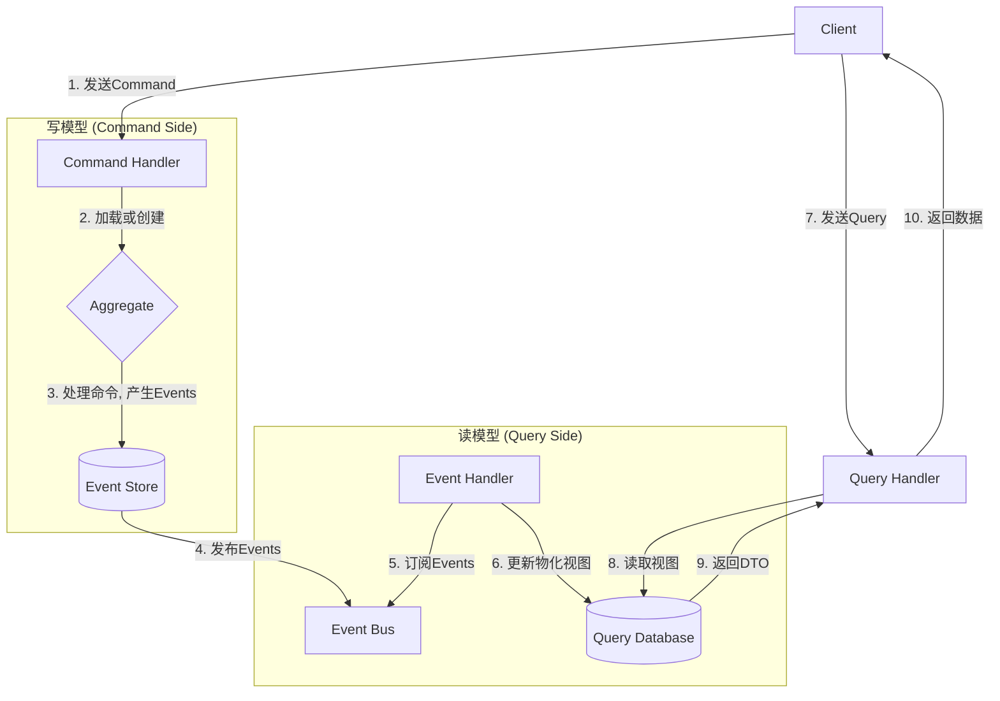

# 3.2 CQRS与事件溯源模式

## 目录

1. 引言：超越传统CRUD
2. 命令查询职责分离 (CQRS)
3. 事件溯源 (Event Sourcing)
4. CQRS与事件溯源的结合
5. 适用场景与挑战
6. Mermaid图解CQRS/ES流程
7. 参考文献

---

## 1. 引言：超越传统CRUD

在处理复杂业务领域时，传统的CRUD（创建、读取、更新、删除）数据模型常常会变得臃肿和难以维护。同一个数据模型既要满足写操作的事务一致性，又要应对各种复杂的读操作，导致模型越来越复杂。CQRS和事件溯源是两种高级的架构模式，旨在通过分离读写操作和改变数据持久化的方式来解决这一问题。它们经常被一同使用，但也可以独立应用。

## 2. 命令查询职责分离 (CQRS)

CQRS (Command Query Responsibility Segregation) 的核心思想是：**任何一个方法，要么是执行动作的"命令(Command)"，要么是返回数据的"查询(Query)"，而不能两者都是**。在架构层面，这意味着将系统的读模型（Query Model）和写模型（Command Model）彻底分离开。

- **命令端 (Command Side)**:
  - 负责处理所有改变系统状态的请求（如`CreateOrderCommand`, `UpdateAddressCommand`）。
  - 命令通常是任务导向、有明确意图的。
  - 这一端的模型和数据库通常是规范化的，以保证事务的强一致性。
- **查询端 (Query Side)**:
  - 负责处理所有数据查询请求。
  - 这一端的模型通常是为特定的UI或API查询场景而优化的，可能是反规范化的"物化视图"。
- **数据同步**: 写模型发生变化后，通常通过**异步事件**来通知并更新读模型。这意味着读写模型之间存在**最终一致性**。

- **优点**:
  - **独立扩展**: 读、写两端可以根据各自的负载情况独立扩展。例如，读密集型系统可以大量增加读库的副本。
  - **模型优化**: 可以为读、写操作分别选择最合适的数据模型和存储技术。
  - **关注点分离**: 简化了复杂的业务逻辑，使写模型可以更专注于业务规则和一致性。

## 3. 事件溯源 (Event Sourcing)

事件溯源是一种完全不同的数据持久化范式。它的核心思想是：**不存储对象的当前状态，而是存储导致该状态的所有变更事件的完整序列**。

- **核心概念**:
  - **事件 (Event)**: 表示系统中已发生的、不可变的事实（如`OrderPlaced`, `ItemAddedToCart`, `PaymentTaken`）。
  - **事件存储 (Event Store)**: 一个只能追加（Append-Only）的、用于持久化事件的数据库。它是系统的"单一事实来源"（Single Source of Truth）。
  - **聚合 (Aggregate)**: 源自DDD，是处理命令并产生事件的业务实体。一个聚合的当前状态是通过从头到尾重放其相关的事件流来计算得出的。
- **优点**:
  - **完整的审计日志**: 永久保留了每一次状态变更的完整历史，这对于审计、调试和业务分析非常有价值。
  - **时间旅行 (Temporal Queries)**: 可以轻松查询任何历史时间点的系统状态。
  - **强大的解耦能力**: 事件流可以被多个下游消费者（如查询模型、数据仓库、其他微服务）订阅，实现强大的集成能力。
- **挑战**:
  - **事件模式演化**: 修改或版本化已经持久化的事件是一个挑战。
  - **查询复杂性**: 直接从事件流中查询特定状态很困难，通常需要结合CQRS。
  - **思维转变**: 需要开发者从"状态"驱动转向"事件"驱动的思维模式。

## 4. CQRS与事件溯源的结合

CQRS和事件溯源是天作之合。当它们结合使用时：

- **写模型/命令端**采用**事件溯源**模式。当一个命令到达时，它被路由到一个聚合实例。聚合处理该命令，并产生一个或多个事件。这些事件被保存到事件存储中。
- **读模型/查询端**通过**订阅事件流**来工作。一个或多个事件处理器（Event Handler）监听来自事件存储的事件，并将这些事件转化为优化的、可供查询的读模型（物化视图），存入专门的查询数据库（如Elasticsearch, PostgreSQL等）。

## 5. 适用场景与挑战

- **适用场景**:
  - 具有复杂业务逻辑和规则的协作领域。
  - 需要保留完整审计日志或进行历史状态分析的系统（如金融、保险）。
  - 高性能、高并发的写密集型应用。
- **挑战**:
  - **架构复杂性**: 引入了更多的移动部件和概念。
  - **最终一致性**: UI/UX设计需要能优雅地处理读写延迟。
  - **陡峭的学习曲线**: 需要团队对DDD、事件驱动等概念有深入理解。

## 6. Mermaid图解CQRS/ES流程

## 7. 参考文献

- [Martin Fowler - CQRS](https://martinfowler.com/bliki/CQRS.html)
- [Martin Fowler - Event Sourcing](https://martinfowler.com/eaaDev/EventSourcing.html)
- [Greg Young - CQRS and Event Sourcing](https://www.youtube.com/watch?v=JHGkaShoyNs) (Video)

---
> 支持断点续写与递归细化，如需扩展某一小节请指定。
