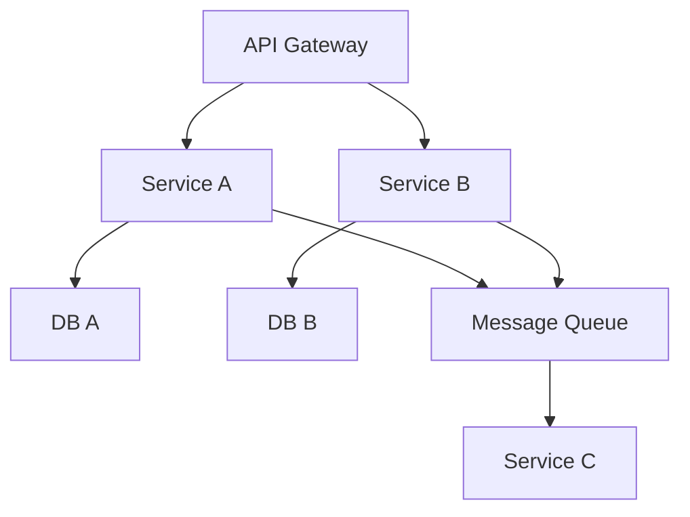
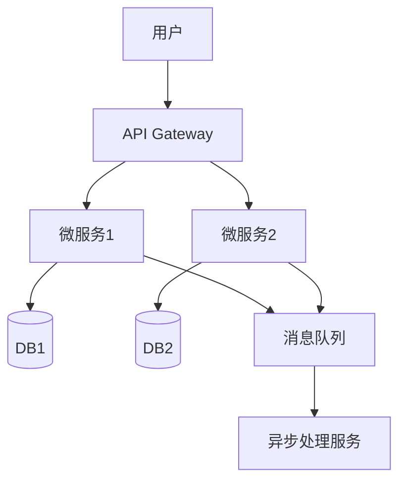

# 04-分布式系统与微服务架构理论与实践

> 本文档系统梳理分布式系统与微服务架构的核心理论、设计模式、服务治理、弹性架构、云原生与工程实践，突出自动化、工程创新与高可用性。

## 目录

- [04-分布式系统与微服务架构理论与实践](#04-分布式系统与微服务架构理论与实践)
  - [目录](#目录)
  - [1. 主题概述与内容索引](#1-主题概述与内容索引)
  - [2. 分布式系统核心原理](#2-分布式系统核心原理)
    - [2.1 分布式一致性](#21-分布式一致性)
    - [2.2 服务发现与注册](#22-服务发现与注册)
    - [2.3 分布式事务与消息队列](#23-分布式事务与消息队列)
  - [3. 微服务架构设计与模式](#3-微服务架构设计与模式)
    - [3.1 微服务设计原则](#31-微服务设计原则)
    - [3.2 微服务设计模式](#32-微服务设计模式)
    - [3.3 Mermaid微服务架构图](#33-mermaid微服务架构图)
  - [4. 服务治理与弹性架构](#4-服务治理与弹性架构)
    - [4.1 服务治理](#41-服务治理)
    - [4.2 弹性架构](#42-弹性架构)
  - [5. 云原生与服务网格](#5-云原生与服务网格)
    - [5.1 云原生架构](#51-云原生架构)
    - [5.2 服务网格（Service Mesh）](#52-服务网格service-mesh)
  - [6. API网关与通信协议](#6-api网关与通信协议)
  - [7. 代码示例（Rust/Golang）与架构图](#7-代码示例rustgolang与架构图)
    - [7.1 Golang微服务示例（gRPC）](#71-golang微服务示例grpc)
    - [7.2 Rust微服务示例（tonic gRPC）](#72-rust微服务示例tonic-grpc)
    - [7.3 Mermaid分布式架构图](#73-mermaid分布式架构图)
  - [8. 行业应用与最佳实践](#8-行业应用与最佳实践)
  - [9. 相关性跳转与引用](#9-相关性跳转与引用)

---

## 1. 主题概述与内容索引

- 聚焦分布式系统与微服务架构的理论基础与工程实践
- 强调高可用、可扩展、自动化治理、云原生与服务网格
- 适用于大规模服务、金融、电商、云原生等场景

---

## 2. 分布式系统核心原理

### 2.1 分布式一致性

- CAP理论（Consistency, Availability, Partition tolerance）
- BASE理论、最终一致性
- 共识算法（Paxos、Raft、ZAB等）

### 2.2 服务发现与注册

- 服务注册中心（Consul、Etcd、Zookeeper）
- 动态服务发现与健康检查

### 2.3 分布式事务与消息队列

- 两阶段提交、SAGA、TCC
- 消息中间件（Kafka、RabbitMQ、NATS）

---

## 3. 微服务架构设计与模式

### 3.1 微服务设计原则

- 单一职责、自治性、去中心化
- 独立部署、弹性伸缩、容错隔离

### 3.2 微服务设计模式

- API网关、服务注册与发现、配置中心
- 断路器、服务降级、限流、重试
- 事件驱动、CQRS、Saga模式

### 3.3 Mermaid微服务架构图



---

## 4. 服务治理与弹性架构

### 4.1 服务治理

- 配置中心、服务发现、健康检查
- 熔断、限流、降级、重试
- 链路追踪、监控、日志收集

### 4.2 弹性架构

- 自动扩缩容、负载均衡
- 灾备与高可用设计
- 服务自愈与自动化运维

---

## 5. 云原生与服务网格

### 5.1 云原生架构

- 容器化（Docker）、编排（Kubernetes）
- 无状态服务、声明式配置、自动化部署

### 5.2 服务网格（Service Mesh）

- Istio、Linkerd、Consul Connect
- 流量管理、可观测性、安全治理

---

## 6. API网关与通信协议

- API网关（Kong、APISIX、Envoy）
- REST/gRPC/GraphQL等通信协议
- 认证鉴权、流量控制、API聚合

---

## 7. 代码示例（Rust/Golang）与架构图

### 7.1 Golang微服务示例（gRPC）

```go
import (
    "google.golang.org/grpc"
    pb "example.com/proto"
)
func main() {
    lis, _ := net.Listen("tcp", ":50051")
    s := grpc.NewServer()
    pb.RegisterMyServiceServer(s, &server{})
    s.Serve(lis)
}
```

### 7.2 Rust微服务示例（tonic gRPC）

```rust
use tonic::{transport::Server, Request, Response, Status};
use myproto::my_service_server::{MyService, MyServiceServer};
struct MyServiceImpl;
#[tonic::async_trait]
impl MyService for MyServiceImpl {
    // 实现gRPC方法
}
#[tokio::main]
async fn main() -> Result<(), Box<dyn std::error::Error>> {
    Server::builder()
        .add_service(MyServiceServer::new(MyServiceImpl))
        .serve("[::1]:50051".parse()?)
        .await?;
    Ok(())
}
```

### 7.3 Mermaid分布式架构图



---

## 8. 行业应用与最佳实践

- 金融级高可用分布式系统、弹性微服务平台
- 电商大促流量治理、云原生多租户架构
- 物联网、车联网、智能制造等分布式场景

---

## 9. 相关性跳转与引用

- [00-软件工程理论与实践体系总论.md](00-软件工程理论与实践体系总论.md)
- 进度追踪与上下文：
  - [软件工程体系版本](进度追踪与上下文.md)
  - [项目报告与总结版本](../13-项目报告与总结/进度追踪与上下文.md)
  - [实践应用开发子目录版本](../08-实践应用开发/软件工程理论与实践体系/进度追踪与上下文.md)

---

> 本文件为自动归纳生成，后续将递归细化各分主题，持续补全图表、公式、代码等多表征内容。
