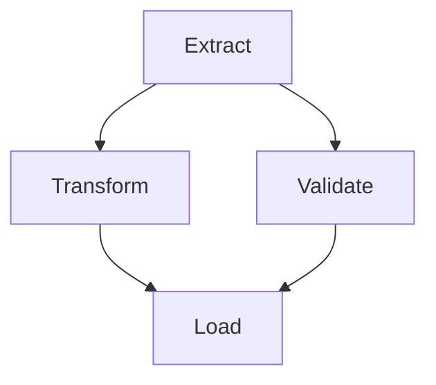
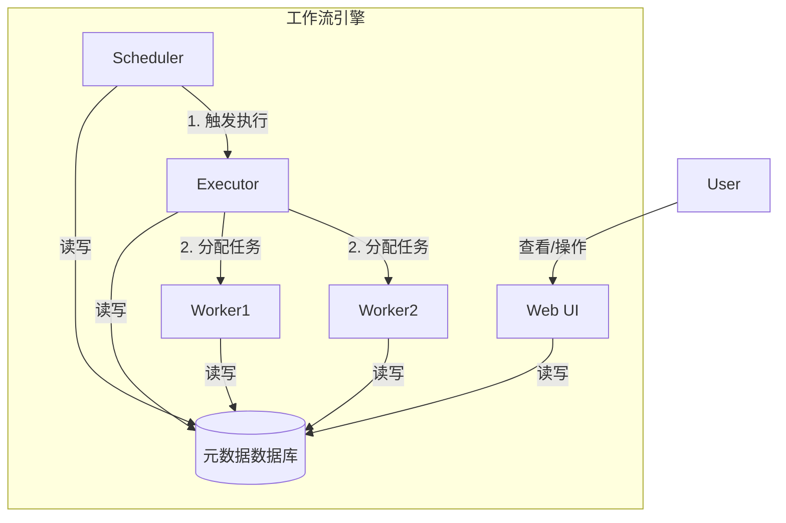

# 1.1 工作流引擎核心概念

## 目录

- [1.1 工作流引擎核心概念](#11-工作流引擎核心概念)
  - [目录](#目录)
  - [1. 引言：什么是工作流引擎](#1-引言什么是工作流引擎)
  - [2. 核心抽象：任务与流程的语言](#2-核心抽象任务与流程的语言)
  - [3. 关键组件：引擎的内部构造](#3-关键组件引擎的内部构造)
  - [4. "代码即工作流" (Workflow as Code)](#4-代码即工作流-workflow-as-code)
  - [5. Mermaid图解核心概念](#5-mermaid图解核心概念)
    - [简单的ETL DAG](#简单的etl-dag)
    - [工作流引擎组件交互](#工作流引擎组件交互)
  - [6. 参考文献](#6-参考文献)

---

## 1. 引言：什么是工作流引擎

工作流引擎（Workflow Engine）是一个用于编排、执行、调度和监控一系列任务（Tasks）的软件系统。在计算领域，一个工作流代表了为达成某个业务目标而需要执行的、具有依赖关系的一系列步骤。例如，一个每日报表生成工作流可能包含"从数据库抽取数据"、"清洗和转换数据"、"加载到数据仓库"、"生成报表"和"发送邮件"等多个任务。工作流引擎的核心价值在于将这些复杂的、跨系统的流程自动化、可视化和可管理。

## 2. 核心抽象：任务与流程的语言

所有工作流引擎都建立在一套通用的核心概念之上：

- **工作流 (Workflow)**: 最高层级的定义，描述了一个完整的业务流程或数据管道。它是一个包含了多个任务及其依赖关系的蓝图。
- **有向无环图 (DAG - Directed Acyclic Graph)**: 这是描述工作流结构的核心数据模型。
  - **节点 (Node)**: 代表工作流中的一个**任务**。
  - **有向边 (Directed Edge)**: 代表任务之间的**依赖关系**。一条从A指向B的边意味着"任务B必须在任务A成功完成后才能开始"。
  - **无环 (Acyclic)**: 保证了工作流有明确的开始和结束，不会陷入无限循环。
- **任务 (Task / Activity)**: 工作流中不可再分的、最小的执行单元。一个任务代表了一个具体的操作，如执行一段脚本、调用一个API、运行一条SQL查询等。
- **工作流实例 (Workflow Instance / Run)**: 工作流定义的一次具体执行。每个实例都有自己独立的状态（如`running`, `success`, `failed`）、执行日志、开始和结束时间。例如，一个每日执行的工作流，每天都会产生一个新的、独立的实例。

## 3. 关键组件：引擎的内部构造

一个典型的工作流引擎通常由以下几个关键部分组成：

- **调度器 (Scheduler)**: 引擎的"心脏"，负责触发工作流的运行。触发方式包括：
  - **基于时间的调度**: 按预设的CRON表达式定时触发。
  - **基于事件的触发**: 监听到特定事件（如文件上传、API调用）后触发。
  - **手动触发**: 由用户在UI上点击触发。
- **元数据数据库 (Metadata Database)**: 系统的"大脑"和"记忆"，存储了所有关于工作流的状态信息，包括：DAG结构、每个实例的运行状态、每个任务的成功或失败记录、连接信息、配置等。
- **执行器 (Executor)**: 负责管理和分配任务执行所需的资源。它决定了任务在**哪里**以及**如何**运行。常见的执行器类型有：
  - `LocalExecutor`: 在本地单机上以多进程方式运行任务。
  - `CeleryExecutor` / `DaskExecutor`: 将任务分发到一个分布式的任务队列中。
  - `KubernetesExecutor`: 将每个任务作为一个独立的Pod在Kubernetes集群中运行。
- **工作单元 (Worker)**: 实际"干活"的进程。它从执行器那里接收任务，执行任务定义的具体逻辑，并将结果和日志报告给元数据数据库。
- **Web服务器/UI (Web Server/UI)**: 提供一个可视化的用户界面，让用户可以监控工作流的运行状态、查看日志、管理连接、手动触发和重试任务。

## 4. "代码即工作流" (Workflow as Code)

这是现代工作流平台（如Airflow, Temporal, Prefect）的核心理念。与通过拖拽UI或编写JSON/XML来定义流程的传统方式不同，"代码即工作流"主张使用通用的编程语言（如Python, Go）来定义DAG。

- **优点**:
  - **动态性**: 可以用代码动态生成复杂的DAG结构。
  - **版本控制**: 可以像管理其他源代码一样，使用Git对工作流进行版本控制、代码审查和协作。
  - **可测试性**: 可以为工作流编写单元测试和集成测试。
  - **可重用性**: 可以将通用的逻辑封装成模块或库，在不同的工作流中复用。

## 5. Mermaid图解核心概念

### 简单的ETL DAG

### 工作流引擎组件交互

## 6. 参考文献

- [The Rise of Data-Aware Schedulers](https://engineering.atspotify.com/2015/10/the-rise-of-data-aware-schedulers/)
- [Awesome Pipelines: A curated list of pipeline framework](https://github.com/pditommaso/awesome-pipeline)

---
> 支持断点续写与递归细化，如需扩展某一小节请指定。
