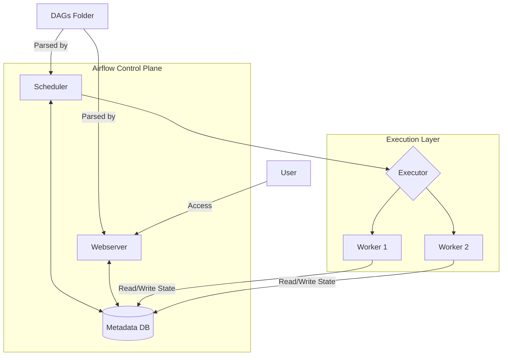

# 2.1 Apache Airflow：数据管道编排

## 目录

1. 引言：数据工程师的瑞士军刀
2. 核心理念与架构
3. 主要特点与优势
4. 适用场景与局限性
5. Python代码示例：定义一个DAG
6. Mermaid图解Airflow架构
7. 参考文献

---

## 1. 引言：数据工程师的瑞士军刀

Apache Airflow是一个由Airbnb公司在2014年发起，并于后来捐赠给Apache软件基金会的顶级开源项目。它是一个用于以编程方式编排、调度和监控工作流的平台。凭借其"代码即工作流"的核心理念和强大的Python生态，Airflow已经成为数据工程领域ETL/ELT管道编排的事实标准。

## 2. 核心理念与架构

- **"代码即工作流" (Workflow as Code)**: Airflow的核心哲学。所有的工作流（DAGs）都由Python代码定义。这为数据工程师带来了版本控制、动态生成、模块化和可测试性等软件工程的最佳实践。
- **核心组件**:
  - **Web服务器 (Web Server)**: 提供功能丰富的用户界面（UI）。
  - **调度器 (Scheduler)**: 负责解析DAG文件，并根据调度策略（时间、外部触发）创建和触发工作流实例。
  - **元数据数据库 (Metadata Database)**: 存储所有状态信息，是调度器和执行器的协调中心。
  - **执行器与工作单元 (Executor & Workers)**: 实际执行任务的组件。Airflow支持多种执行器，以适应不同规模的部署需求。
- **关键抽象**:
  - **DAG**: 在Airflow中，这是一个Python对象，它定义了任务的集合及其依赖关系。
  - **Operator**: DAG中任务的模板，定义了一个任务具体要做什么。Airflow内置了大量Operator（如`BashOperator`, `PythonOperator`, `DockerOperator`），并且有庞大的社区贡献的Provider包，用于与AWS, GCP, Snowflake等外部系统交互。
  - **Task**: Operator的一个实例化对象，代表DAG中的一个节点。
  - **XComs (Cross-communications)**: 一个允许任务间传递少量元数据的机制，例如将一个下载任务的文件路径传递给一个处理任务。

## 3. 主要特点与优势

- **强大的生态系统**: 拥有上百个由社区和厂商维护的Provider包，可以轻松与几乎所有主流的数据存储、计算和云服务平台集成。
- **高度可扩展**: 用户可以非常容易地编写自己的Operator、Hook或插件来扩展Airflow的功能，以满足特定的业务需求。
- **功能丰富的UI**: 提供了一个强大的Web界面，可以可视化DAG的依赖关系、查看任务日志、监控运行状态、手动触发和重试，以及管理连接和变量。
- **纯Python定义**: 允许工程师使用熟悉的语言和工具来构建和测试复杂的数据管道，并且可以利用Python庞大的库生态。

## 4. 适用场景与局限性

- **非常适合**:
  - **ETL/ELT数据管道**: 这是Airflow的"主场"。无论是简单的每日批处理，还是复杂的多源数据整合，Airflow都能胜任。
  - **机器学习（MLOps）管道**: 编排模型训练、评估、版本管理和部署等一系列步骤。
  - **基础设施自动化**: 如定时执行数据库备份、生成报告、启动和销毁云资源等。
- **不太适合**:
  - **流式数据处理 (Streaming)**: Airflow是为批处理（Batch）设计的，其调度模型不适合处理需要亚秒级延迟的实时流数据（应使用Flink, Spark Streaming等）。
  - **高频、低延迟任务**: Airflow的调度器本身存在一定的延迟（通常是秒级到分钟级），不适合需要即时响应的任务。

## 5. Python代码示例：定义一个DAG

```python
from __future__ import annotations

import pendulum

from airflow.models.dag import DAG
from airflow.operators.bash import BashOperator

with DAG(
    dag_id="simple_etl_dag",
    schedule="0 0 * * *",  # Daily at midnight
    start_date=pendulum.datetime(2023, 1, 1, tz="UTC"),
    catchup=False,
    tags=["example"],
) as dag:
    # Task to extract data
    extract_task = BashOperator(
        task_id="extract",
        bash_command="echo 'Extracting data...'",
    )

    # Task to transform data
    transform_task = BashOperator(
        task_id="transform",
        bash_command="echo 'Transforming data...'",
    )

    # Task to load data
    load_task = BashOperator(
        task_id="load",
        bash_command="echo 'Loading data...'",
    )

    # Define task dependencies
    extract_task >> transform_task >> load_task
```

## 6. Mermaid图解Airflow架构



## 7. 参考文献

- [Apache Airflow Documentation](https://airflow.apache.org/docs/)
- [Astronomer Registry (Discoverable Airflow Providers)](https://registry.astronomer.io/)
- [The Airflow-Kubernetes-Executor in a Nutshell](https://www.astronomer.io/blog/the-airflow-kubernetes-executor-in-a-nutshell/)

---
> 支持断点续写与递归细化，如需扩展某一小节请指定。
