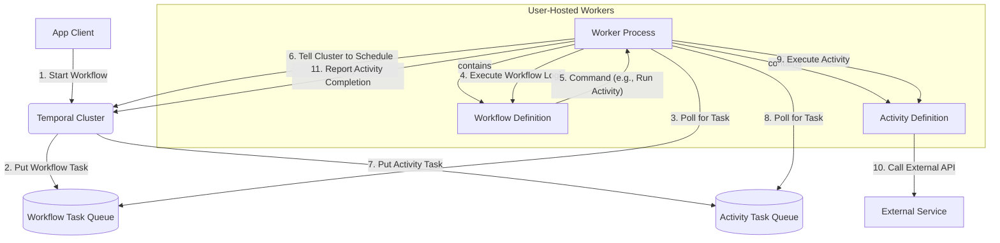

# 2.2 Temporal.io：可靠执行引擎

## 目录
1. 引言：超越传统工作流
2. 核心理念：持久化执行与代码优先
3. Temporal vs. Airflow：关键区别
4. 核心架构与关键抽象
5. 适用场景：从Saga到交互式应用
6. Go代码示例：定义一个工作流
7. Mermaid图解Temporal架构
8. 参考文献

---

## 1. 引言：超越传统工作流
Temporal是一个开源的、分布式的、高容错的持久化执行系统（Durable Execution System）。它源自Uber内部的Cadence项目，其目标是让开发者能够以编写普通代码的方式，来构建和运行具有极高可靠性的、可扩展的、长周期的应用程序。Temporal从根本上改变了处理有状态、容错应用的范式，尤其擅长解决分布式事务、业务流程自动化等难题。

## 2. 核心理念：持久化执行与代码优先
- **持久化执行 (Durable Execution)**: 这是Temporal最核心的理念。工作流的完整执行状态，包括本地变量、调用栈、正在等待的任务等，都会被Temporal服务端（Cluster）自动地、持续地持久化。这意味着，即使运行工作流代码的Worker进程崩溃、重启，甚至整个数据中心下线，工作流也能在恢复后从中断处无缝地继续执行，仿佛什么都没发生过。它可以支持执行长达数天、数月甚至数年的工作流。
- **代码优先 (Code-First)**: 与Airflow类似，Temporal的工作流也是用通用编程语言（如Go, Java, Python, TypeScript）定义的。但其SDK设计得非常巧妙，使得一个复杂的、异步的、具有重试和错误处理的分布式流程，看起来就像一段简单的、单线程的同步代码。开发者只需关注业务逻辑，而将分布式系统的复杂性（如状态管理、重试、超时、持久化）完全交给Temporal的SDK和Cluster来处理。

## 3. Temporal vs. Airflow：关键区别
| 特性 | Temporal | Apache Airflow |
| :--- | :--- | :--- |
| **核心模型** | **有状态 (Stateful)**，持久化工作流的完整状态 | **无状态 (Stateless)**，任务间通过XComs传递少量数据 |
| **主要用途** | 通用业务流程、Saga编排、交互式应用 | 数据ETL、批处理、ML管道 |
| **调度延迟** | **低延迟**（毫秒级），事件驱动 | **高延迟**（秒级到分钟级），批处理调度 |
| **任务执行** | 由外部Worker进程执行，与服务端解耦 | 由Executor管理的Worker执行 |
| **编程范式** | 像写普通函数一样写工作流 | 声明式地定义DAG和Task依赖 |

## 4. 核心架构与关键抽象
- **Temporal服务端 (Temporal Cluster)**: 负责工作流执行的协调、状态持久化、任务队列管理和计时器等。
- **工作单元 (Worker)**: 由用户自己托管的进程。它包含工作流（Workflow）和活动（Activity）的具体实现代码，通过gRPC长轮询从Cluster的任务队列中获取任务并执行。
- **关键抽象**:
    - **工作流 (Workflow)**: 定义业务流程的编排逻辑。**工作流代码必须是确定性的**，即相同的输入总是产生相同的输出，不能包含任何直接的I/O操作或不确定的函数（如随机数、当前时间）。
    - **活动 (Activity)**: 工作流中实际执行"副作用"的地方，如调用外部API、读写数据库、访问文件系统等。活动代码是非确定性的，并且可以配置独立的超时和重试策略。Temporal保证一个活动**最多执行一次**或**最少执行一次**。
    - **任务队列 (Task Queues)**: Cluster与Worker之间解耦的通信机制，用于分发工作流任务和活动任务。

## 5. 适用场景：从Saga到交互式应用
- **分布式事务/Saga编排**: 这是Temporal的"杀手级"应用。其工作流代码天然地成为了Saga的编排器，状态管理和补偿逻辑可以被清晰、可靠地实现。
- **关键业务流程自动化**: 如用户注册、订单处理、金融交易、订阅管理等需要高可靠性的场景。
- **基础设施编排**: 自动化复杂的云资源部署、配置和生命周期管理。
- **异步交互式应用**: 构建需要等待用户输入的、长周期的交互流程，如多步表单、审批流等。

## 6. Go代码示例：定义一个工作流
```go
// main.go - Worker
func main() {
    // ... setup worker
    w.RegisterWorkflow(SimpleWorkflow)
    w.RegisterActivity(SimpleActivity)
    // ... run worker
}

// workflow.go
func SimpleWorkflow(ctx workflow.Context, name string) (string, error) {
    // Configure retries and timeouts for the activity.
    ao := workflow.ActivityOptions{
        StartToCloseTimeout: 10 * time.Second,
    }
    ctx = workflow.WithActivityOptions(ctx, ao)

    var result string
    // Execute the activity and wait for its result.
    // The SDK handles all the complexity of durable execution.
    err := workflow.ExecuteActivity(ctx, SimpleActivity, name).Get(ctx, &result)
    if err != nil {
        return "", err
    }
    return result, nil
}

// activity.go
func SimpleActivity(ctx context.Context, name string) (string, error) {
    // This is where you call external APIs, databases, etc.
    greeting := "Hello, " + name + "!"
    return greeting, nil
}
```

## 7. Mermaid图解Temporal架构


## 8. 参考文献
- [Temporal.io Official Documentation](https://docs.temporal.io/)
- [Temporal by Example (Go)](https://github.com/temporalio/samples-go)
- [How Temporal Works](https://learn.temporal.io/getting_started/go/dev_environment/##how-temporal-works)

---
> 支持断点续写与递归细化，如需扩展某一小节请指定。 