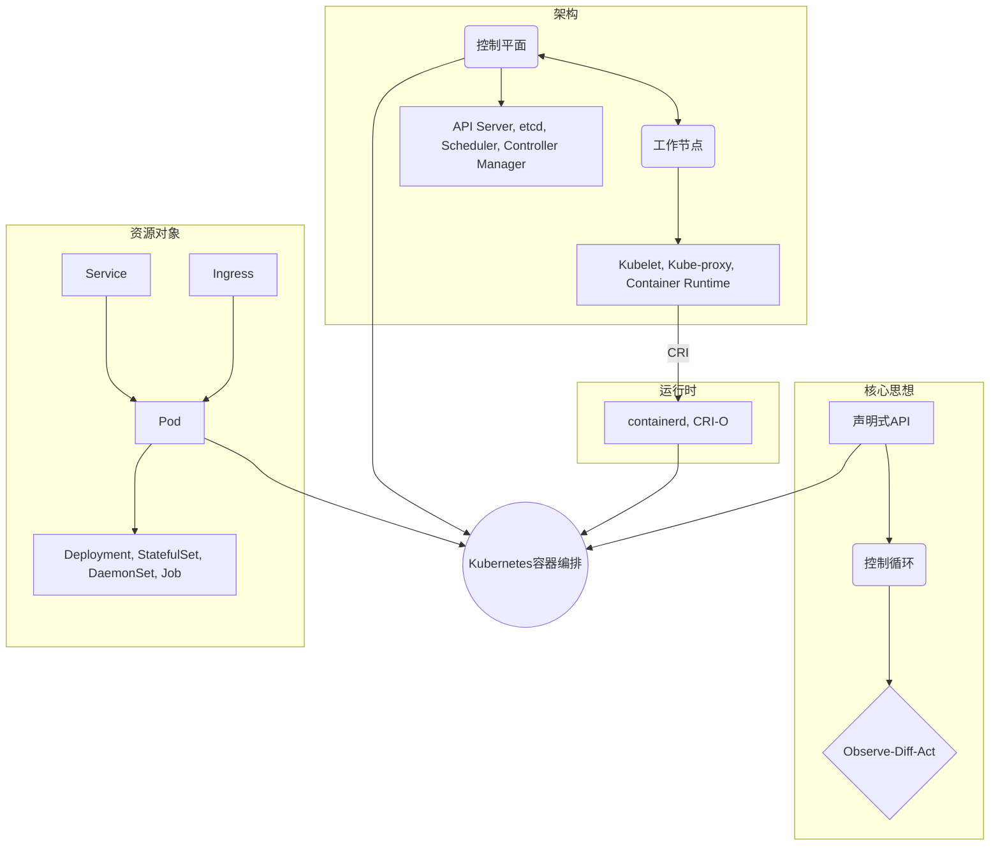

# 03-Kubernetes容器编排核心原理

## 目录

- [03-Kubernetes容器编排核心原理](#03-kubernetes容器编排核心原理)
  - [目录](#目录)
  - [思维导图](#思维导图)
  - [1. 容器技术基础概念](#1-容器技术基础概念)
    - [1.1 Docker: 容器化的基石](#11-docker-容器化的基石)
    - [1.2 Kubernetes: 容器编排的标准](#12-kubernetes-容器编排的标准)
  - [2. Kubernetes 架构模型](#2-kubernetes-架构模型)
    - [2.1 控制平面 (Control Plane) 组件](#21-控制平面-control-plane-组件)
    - [2.2 节点 (Node) 组件](#22-节点-node-组件)
    - [2.3 核心资源对象 (API Objects)](#23-核心资源对象-api-objects)
  - [3. 工作流核心：控制循环与声明式API](#3-工作流核心控制循环与声明式api)
    - [3.1 声明式API与工作流](#31-声明式api与工作流)
    - [3.2 控制循环 (Reconciliation Loop)](#32-控制循环-reconciliation-loop)
    - [3.3 编排生命周期示例](#33-编排生命周期示例)
  - [4. Kubernetes 与容器运行时的关系 (CRI)](#4-kubernetes-与容器运行时的关系-cri)
    - [4.1 演变：从耦合到解耦](#41-演变从耦合到解耦)
    - [4.2 CRI接口的角色](#42-cri接口的角色)
  - [5. 总结](#5-总结)

---

## 思维导图



## 1. 容器技术基础概念

### 1.1 Docker: 容器化的基石

Docker 是一个开源平台，用于将应用程序及其所有依赖项打包成一个标准化的、可移植的单元，即**容器**。它通过利用Linux内核的**命名空间（Namespaces）**和**控制组（Cgroups）**等特性，实现了轻量级的操作系统级虚拟化。

- **核心价值**: 解决了"在我的机器上可以运行"的问题，确保了环境的一致性。
- **主要组件**: Docker引擎（运行时）、镜像（模板）、容器（实例）、仓库（分发）。

### 1.2 Kubernetes: 容器编排的标准

Kubernetes（K8s）是一个开源的**容器编排**平台，用于自动部署、扩展和管理大规模的容器化应用。

- **核心价值**: 解决在生产环境中管理成百上千个容器的复杂性问题。
- **核心理念**:
  - **声明式配置**: 用户描述期望的最终状态，系统自动使其达成。
  - **自我修复**: 自动替换失败的容器。
  - **水平扩展**: 根据负载自动调整应用实例数量。
  - **服务发现与负载均衡**: 为动态变化的容器提供稳定的访问入口。

## 2. Kubernetes 架构模型

Kubernetes采用典型的**主从（Master-Worker）架构**，由控制平面和一系列工作节点组成。

### 2.1 控制平面 (Control Plane) 组件

控制平面是集群的大脑，负责全局决策和状态管理。

- **kube-apiserver**: 集群的统一入口，暴露Kubernetes API，负责处理请求、验证和持久化到etcd。
- **etcd**: 一个高可用、一致性的键值存储，用作Kubernetes所有集群数据的后台数据库。
- **kube-scheduler**: 监视新创建的、未分配节点的Pod，并根据资源需求、策略等因素为其选择一个最佳节点。
- **kube-controller-manager**: 运行所有控制器进程。每个控制器都是一个独立的控制循环，负责将资源的当前状态驱动到期望状态（如副本控制器、节点控制器等）。

### 2.2 节点 (Node) 组件

节点（也称Worker或Minion）是运行容器化应用的工作负载的机器。

- **kubelet**: 每个节点上的代理，直接与控制平面通信，确保Pod中描述的容器按照预期运行。
- **kube-proxy**: 维护节点上的网络规则，实现了Kubernetes的Service网络概念，允许对内和对外的网络通信。
- **容器运行时 (Container Runtime)**: 负责实际运行容器的软件。Kubernetes通过**CRI (Container Runtime Interface)** 与之交互。

### 2.3 核心资源对象 (API Objects)

用户通过操作这些声明式的API对象来与Kubernetes交互。

- **Pod**: 最小的部署单元，包含一个或多个紧密关联的容器，它们共享存储和网络。
- **Workloads (工作负载)**:
  - **Deployment**: 管理无状态应用的发布和扩缩容。
  - **StatefulSet**: 管理有状态应用，提供稳定的网络标识和持久存储。
  - **DaemonSet**: 确保每个（或部分）节点上都运行一个Pod副本。
  - **Job/CronJob**: 用于执行一次性或定时的任务。
- **Networking (网络)**:
  - **Service**: 为一组Pod提供一个稳定的网络端点（IP地址和DNS名）。
  - **Ingress**: 管理从集群外部到集群内部服务的HTTP/S路由。
- **Configuration (配置)**:
  - **ConfigMap/Secret**: 用于注入配置信息和敏感数据。
- **Storage (存储)**:
  - **PersistentVolume (PV)/PersistentVolumeClaim (PVC)**: 解耦存储资源与Pod的生命周期。

## 3. 工作流核心：控制循环与声明式API

### 3.1 声明式API与工作流

Kubernetes的工作流基于**声明式API**。用户不发出"运行容器X"这样的命令式指令，而是提交一个YAML或JSON文件，声明"我期望系统中有3个运行容器X的副本"。

```yaml
# deployment.yaml
apiVersion: apps/v1
kind: Deployment
metadata:
  name: my-app
spec:
  replicas: 3 # 期望状态
  template:
    spec:
      containers:
      - name: my-container
        image: my-image:latest
```

### 3.2 控制循环 (Reconciliation Loop)

Kubernetes通过**控制循环**（或称**调和循环**）将当前状态转变为期望状态。这是一个持续运行的"观察-比较-行动"过程：

1. **Observe (观察)**: 控制器通过API Server获取资源的当前状态。
2. **Diff (比较)**: 将当前状态与用户在资源规约（Spec）中定义的期望状态进行比较。
3. **Act (行动)**: 如果存在差异，控制器执行操作以弥合差异（如创建/删除Pod）。

### 3.3 编排生命周期示例

当用户提交上述`Deployment`文件时，一个协同工作流被触发：

1. **Deployment控制器**观察到新的Deployment对象，发现当前没有对应的`ReplicaSet`。
2. 它**行动**，创建一个管理3个Pod副本的`ReplicaSet`对象。
3. **ReplicaSet控制器**观察到新的`ReplicaSet`，发现当前只有0个Pod，而期望是3个。
4. 它**行动**，创建3个Pod对象。
5. **Scheduler**观察到3个未被调度的Pod。
6. 它为每个Pod**行动**，选择一个合适的节点，并更新Pod对象的`nodeName`字段。
7. 目标节点上的**Kubelet**观察到分配给它的Pod。
8. 它**行动**，通过CRI调用容器运行时，在本地创建并运行Pod所需的容器。

这个过程周而复始，确保持续符合期望状态。

## 4. Kubernetes 与容器运行时的关系 (CRI)

### 4.1 演变：从耦合到解耦

- **早期**: Kubernetes直接内置了对Docker的支持（通过dockershim）。
- **现在**: 为了支持多样化的容器技术，Kubernetes定义了**容器运行时接口 (CRI)**。Kubelet不再直接与Docker交互，而是通过CRI这个标准的gRPC接口与任何兼容CRI的容器运行时通信。

### 4.2 CRI接口的角色

CRI是一层关键的抽象，它定义了Kubelet如何管理Pod、容器和镜像。

- **兼容的运行时**: `containerd` (Docker自己也在使用), `CRI-O` 等。
- **意义**: 这种解耦使得Kubernetes生态系统更加开放和灵活，用户可以选择最适合其需求的容器运行时，而无需修改Kubernetes核心代码。

## 5. 总结

- **Docker**提供了构建和运行单个容器的标准和工具。
- **Kubernetes**在此基础上，提供了大规模管理和编排这些容器的平台。
- 二者通过**CRI**标准接口解耦，协同工作，构成了现代云原生应用部署的基石。Kubernetes负责"大脑"的决策和调度，而兼容CRI的容器运行时（如containerd）负责"肌肉"的执行。
