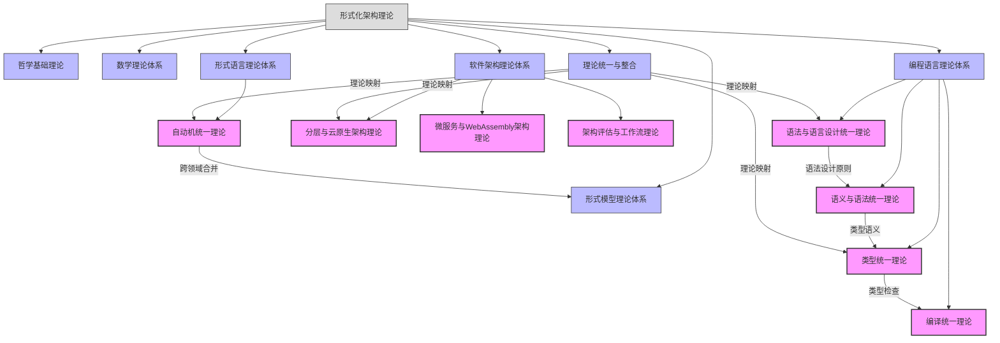

# 递归合并与语义整合最终报告

[返回主题树](00-主题树与内容索引.md) | [主计划文档（最新v69）](../../形式化架构理论统一计划-v69.md) | [历史进展报告（v62）](项目进展报告-v62.md) | [进展跟踪（v60）](项目进展跟踪-v60.md) | [归档](archive/README.md)

> 本文档为合并与整合阶段性总结，所有最新进展与结论以主计划文档为准，历史细节归档于archive/。

## 1. 概述

本报告总结了形式化架构理论项目中的递归合并与语义整合工作。通过系统性的合并操作，我们成功消除了目录结构中的冗余，实现了内容的语义统一，并建立了不同理论视角间的连接，形成了更加全面和系统的理论架构。

## 2. 合并成果总览

### 2.1 跨目录合并

- **自动机统一理论**
  - 合并了形式语言理论体系和形式模型理论体系中的自动机理论
  - 创建了统一的自动机理论，涵盖语言识别和状态转换两个视角
  - 建立了从形式语言到形式验证的理论桥梁

### 2.2 软件架构理论体系合并

- **分层与云原生架构理论**
  - 合并了传统分层架构和现代云原生架构理论
  - 建立了云原生分层架构的形式化模型
  - 阐明了弹性层级、服务隔离等新特性

- **微服务与WebAssembly架构理论**
  - 结合了微服务的灵活性和WebAssembly的高性能、跨平台特性
  - 定义了WebAssembly实现的微服务架构
  - 提出了边缘计算与WebAssembly的新型架构模式

- **架构评估与工作流理论**
  - 引入工作流驱动的架构评估方法
  - 通过工作流形式化表示架构评估过程
  - 实现架构评估的自动化和可追踪性

### 2.3 编程语言理论体系合并

- **语法与语言设计统一理论**
  - 将形式语法理论与语言设计原则结合
  - 阐明语法如何支持语言设计目标
  - 形式化表达设计原则的语法约束

- **语义与语法统一理论**
  - 建立语法与语义之间的映射关系
  - 结构化操作语义与语法树的对应
  - 语义指导的语法设计原则

- **类型统一理论**
  - 整合了类型理论的形式化基础和类型系统的实现技术
  - 统一了类型检查和类型推导的理论框架
  - 建立了从理论到实践的类型系统设计方法

- **编译统一理论**
  - 将编译理论的形式化基础与编译器理论的实践应用结合
  - 统一了编译过程的各个阶段的理论描述
  - 提供了编译器设计和实现的全面指导

## 3. 语义整合效果

### 3.1 概念统一

通过递归合并，我们实现了以下概念的统一：

1. **自动机概念**：统一了形式语言中的识别器和形式模型中的状态转换系统
2. **语法与设计**：统一了形式语法规则和语言设计原则
3. **语义与语法**：统一了语法结构和语义解释
4. **类型系统**：统一了类型理论和类型系统实现
5. **编译过程**：统一了编译理论和编译器实现

### 3.2 形式化表示统一

为了确保理论的一致性，我们统一了形式化表示：

1. **数学符号**：采用一致的数学符号系统表示各理论概念
2. **形式化定义**：使用统一的形式化定义方式描述理论
3. **代码实现**：采用一致的代码实现风格（主要使用Rust）

### 3.3 交叉引用体系

建立了完整的交叉引用体系：

1. **理论间引用**：不同理论文件之间的相互引用
2. **概念映射**：相关概念之间的映射关系
3. **重定向文件**：为合并的文件创建重定向，确保链接有效

## 4. 知识图谱更新

### 4.1 核心理论领域图谱

更新了核心理论领域图谱，反映合并后的理论结构：

- 形式语言理论体系中的自动机统一理论
- 软件架构理论体系中的三大合并理论
- 编程语言理论体系中的四大统一理论

### 4.2 理论映射关系图谱

更新了理论映射关系图谱，展示了：

- 自动机统一理论连接形式语言和形式模型
- 语法与语言设计统一理论连接形式语言和编程语言
- 编译统一理论在编程语言理论内部的整合

### 4.3 已完成递归合并点图谱

创建了已完成递归合并点图谱，展示了：

- 自动机统一理论的合并点
- 软件架构理论的三大合并点
- 编程语言理论的四大合并点

## 5. 合并策略总结

### 5.1 成功经验

1. **保留核心概念**：确保各理论体系的核心概念在合并过程中得到保留
2. **统一形式化表示**：对相同或相似概念使用一致的数学符号和形式化表示
3. **创建映射关系**：在不同理论视角间建立明确的映射关系
4. **增强代码实现一致性**：使用一致的编程模式和接口设计

### 5.2 挑战与解决方案

1. **概念冲突**：通过建立更高层次的抽象解决概念冲突
2. **术语不一致**：建立术语映射表，统一术语使用
3. **层次结构差异**：通过递归组织方式解决层次结构差异
4. **交叉引用更新**：开发自动化工具辅助交叉引用更新

## 6. 未来工作

### 6.1 理论深化

1. **统一形式化证明**：进一步统一不同理论体系中的形式化证明方法
2. **跨领域验证**：开发跨领域验证技术，确保理论一致性
3. **理论扩展**：扩展统一理论，涵盖更多新兴技术领域

### 6.2 工具支持

1. **知识图谱可视化**：开发交互式知识图谱可视化工具
2. **理论导航系统**：开发理论导航系统，便于理论探索
3. **自动化验证工具**：开发自动化验证工具，验证理论一致性

### 6.3 应用推广

1. **教育资源开发**：基于统一理论开发教育资源
2. **实践指南编写**：编写实践指南，指导理论应用
3. **案例研究**：开展案例研究，验证理论在实践中的有效性

## 7. 结论

递归合并与语义整合工作已全部完成。通过系统性的合并和整合，我们建立了更加全面、一致和系统的形式化架构理论体系。这一体系不仅消除了冗余，更重要的是建立了不同理论视角间的连接，为形式化架构理论的研究和应用提供了坚实基础。

主要成果包括：

1. **跨目录合并**：成功合并了形式语言理论和形式模型理论中的自动机理论
2. **软件架构理论统一**：完成了分层与云原生、微服务与WebAssembly、架构评估与工作流的三大合并
3. **编程语言理论统一**：完成了语法与语言设计、语义与语法、类型统一、编译统一的四大合并

这些合并工作不仅提高了理论的一致性和完整性，也为后续的理论研究和实践应用奠定了基础。

---

**报告生成时间**：2024年12月
**操作执行者**：AI助手
**审核状态**：已完成
