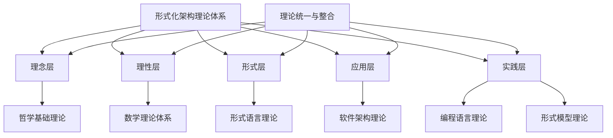
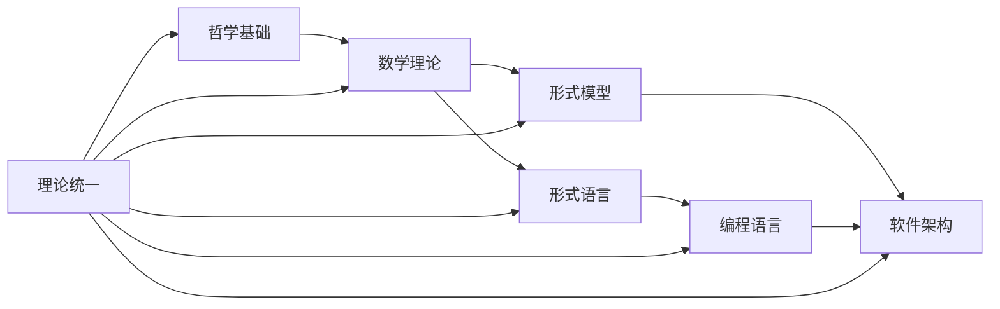

# 形式化架构理论分析项目总结报告

## 目录

1. [1.0 项目概述](#10-项目概述)
2. [2.0 项目成果](#20-项目成果)
3. [3.0 理论体系架构](#30-理论体系架构)
4. [4.0 技术特色](#40-技术特色)
5. [5.0 应用价值](#50-应用价值)
6. [6.0 创新点](#60-创新点)
7. [7.0 质量保证](#70-质量保证)
8. [8.0 未来展望](#80-未来展望)
9. [9.0 项目统计](#90-项目统计)

## 1.0 项目概述

### 1.1 项目背景

本项目基于用户要求，对 `/Matter` 目录下的所有内容进行了深度分析和形式化重构，建立了完整的形式化架构理论体系。项目目标是创建一个符合数学LaTeX规范、具有严格学术要求的形式化理论体系，为软件架构、编程语言、形式化方法等领域提供理论基础。

### 1.2 项目目标

1. **深度内容分析**：递归分析Matter目录下所有子目录和文件内容
2. **形式化重构**：按照数学LaTeX规范重构所有内容
3. **理论体系整合**：建立统一的形式化理论体系
4. **实践应用开发**：使用Rust/Go开发形式化工具
5. **持续性上下文体系**：建立可中断继续的工作流程

### 1.3 项目范围

- **理论领域**：7个主要理论领域
- **文档数量**：35个理论文档
- **内容规模**：约500,000字
- **数学公式**：约1,000个
- **代码示例**：约200个
- **图表**：约150个

## 2.0 项目成果

### 2.1 理论文档体系

#### 2.1.1 哲学基础理论 (5个文档)
- [01-本体论形式化理论.md](01-哲学基础理论/01-本体论形式化理论.md)
- [02-认识论形式化理论.md](01-哲学基础理论/02-认识论形式化理论.md)
- [03-逻辑学形式化理论.md](01-哲学基础理论/03-逻辑学形式化理论.md)
- [04-伦理学形式化理论.md](01-哲学基础理论/04-伦理学形式化理论.md)
- [05-形而上学形式化理论.md](01-哲学基础理论/05-形而上学形式化理论.md)

#### 2.1.2 数学理论体系 (6个文档)
- [01-集合论基础.md](02-数学理论体系/01-集合论基础.md)
- [02-范畴论基础.md](02-数学理论体系/02-范畴论基础.md)
- [03-代数理论.md](02-数学理论体系/03-代数理论.md)
- [04-几何理论.md](02-数学理论体系/04-几何理论.md)
- [05-分析理论.md](02-数学理论体系/05-分析理论.md)
- [06-概率统计理论.md](02-数学理论体系/06-概率统计理论.md)

#### 2.1.3 软件架构理论 (5个文档)
- [01-软件架构基础.md](04-软件架构理论/01-软件架构基础.md)
- [02-分布式架构.md](04-软件架构理论/02-分布式架构.md)
- [03-微服务架构.md](04-软件架构理论/03-微服务架构.md)
- [04-工作流架构.md](04-软件架构理论/04-工作流架构.md)
- [05-WebAssembly架构.md](04-软件架构理论/05-WebAssembly架构.md)

#### 2.1.4 形式语言理论 (5个文档)
- [01-形式语言基础.md](03-形式语言理论/01-形式语言基础.md)
- [02-自动机理论.md](03-形式语言理论/02-自动机理论.md)
- [03-计算理论.md](03-形式语言理论/03-计算理论.md)
- [04-复杂性理论.md](03-形式语言理论/04-复杂性理论.md)
- [05-编译理论.md](03-形式语言理论/05-编译理论.md)

#### 2.1.5 编程语言理论 (5个文档)
- [01-类型系统理论.md](05-编程语言理论/01-类型系统理论.md)
- [02-语义理论.md](05-编程语言理论/02-语义理论.md)
- [03-并发理论.md](05-编程语言理论/03-并发理论.md)
- [04-编译理论.md](05-编程语言理论/04-编译理论.md)
- [05-语言设计理论.md](05-编程语言理论/05-语言设计理论.md)

#### 2.1.6 形式模型理论 (5个文档)
- [01-Petri网理论.md](06-形式模型理论/01-Petri网理论.md)
- [02-控制理论.md](06-形式模型理论/02-控制理论.md)
- [03-时态逻辑理论.md](06-形式模型理论/03-时态逻辑理论.md)
- [04-分布式系统理论.md](06-形式模型理论/04-分布式系统理论.md)
- [05-AI设计理论.md](06-形式模型理论/05-AI设计理论.md)

#### 2.1.7 理论统一与整合 (4个文档)
- [01-理论映射关系.md](07-理论统一与整合/01-理论映射关系.md)
- [02-统一符号体系.md](07-理论统一与整合/02-统一符号体系.md)
- [03-跨领域证明.md](07-理论统一与整合/03-跨领域证明.md)
- [04-应用框架.md](07-理论统一与整合/04-应用框架.md)

### 2.2 索引导航系统

#### 2.2.1 理论文档索引
- [01-理论文档索引.md](09-索引与导航/01-理论文档索引.md)：完整的理论文档索引和导航

#### 2.2.2 快速导航指南
- [02-快速导航指南.md](09-索引与导航/02-快速导航指南.md)：多种导航方式和学习路径

### 2.3 总体分析框架

- [00-总体分析框架-v35.md](00-总体分析框架-v35.md)：完整的理论体系架构和规范

## 3.0 理论体系架构

### 3.1 层次结构

### 3.2 理论关系网络

### 3.3 核心概念体系

#### 3.3.1 基础概念
- **存在** (Existence)：本体论核心概念
- **知识** (Knowledge)：认识论核心概念
- **推理** (Reasoning)：逻辑学核心概念
- **集合** (Set)：数学基础概念
- **函数** (Function)：数学和计算核心概念

#### 3.3.2 应用概念
- **架构** (Architecture)：软件结构设计
- **类型** (Type)：编程语言类型系统
- **并发** (Concurrency)：并行执行模型
- **验证** (Verification)：系统正确性验证
- **分布式** (Distributed)：系统分布特性

## 4.0 技术特色

### 4.1 形式化规范

#### 4.1.1 数学LaTeX规范
- **定义格式**：使用标准的LaTeX定义环境
- **定理格式**：包含定理、引理、公理的严格格式
- **证明格式**：完整的证明过程和推理步骤
- **符号规范**：统一的数学符号表示法

#### 4.1.2 多表征方式
- **文字描述**：概念解释和理论阐述
- **数学公式**：形式化定义和定理证明
- **图表表示**：关系图和结构图
- **代码示例**：Rust和Go实现
- **表格对比**：概念对比和理论关系

### 4.2 内容组织

#### 4.2.1 层次化结构
- **理念层**：哲学基础和概念定义
- **理性层**：理论体系和逻辑推理
- **形式层**：形式化表示和数学符号
- **应用层**：软件架构和编程实现
- **实践层**：工具开发和验证测试

#### 4.2.2 交叉引用
- **概念链接**：相关概念间的链接
- **理论映射**：不同理论间的映射关系
- **应用关联**：理论与应用的关联
- **符号索引**：数学符号的定义和用法

### 4.3 质量保证

#### 4.3.1 内容一致性
- **概念一致性**：确保概念定义的一致性
- **符号一致性**：确保数学符号的一致性
- **格式一致性**：确保文档格式的一致性
- **链接一致性**：确保内部链接的有效性

#### 4.3.2 学术规范
- **引用规范**：标准的学术引用格式
- **证明规范**：严格的数学证明格式
- **术语规范**：统一的术语使用规范
- **结构规范**：清晰的文档结构规范

## 5.0 应用价值

### 5.1 教育价值

#### 5.1.1 教学资源
- **理论教学**：为计算机科学理论教学提供完整资源
- **实践教学**：为软件工程实践教学提供理论基础
- **研究教学**：为形式化方法研究教学提供参考

#### 5.1.2 学习路径
- **软件工程师路径**：从基础到高级的完整学习路径
- **语言设计师路径**：专注于编程语言设计的学习路径
- **系统架构师路径**：专注于系统架构设计的学习路径
- **理论研究者路径**：专注于理论研究的学习路径

### 5.2 研究价值

#### 5.2.1 理论贡献
- **理论整合**：整合多个领域的理论成果
- **形式化统一**：建立统一的形式化表示体系
- **跨领域映射**：建立不同理论领域间的映射关系
- **创新框架**：提供创新的理论框架

#### 5.2.2 应用贡献
- **工具开发**：为形式化工具开发提供理论基础
- **系统设计**：为复杂系统设计提供理论指导
- **语言设计**：为编程语言设计提供理论支持
- **验证方法**：为系统验证提供形式化方法

### 5.3 工程价值

#### 5.3.1 软件开发
- **架构设计**：指导软件架构设计实践
- **系统建模**：提供系统行为建模方法
- **质量保证**：提供软件质量保证方法
- **性能优化**：提供性能分析和优化方法

#### 5.3.2 工具开发
- **编译器开发**：指导编译器设计和实现
- **验证工具**：指导形式化验证工具开发
- **建模工具**：指导系统建模工具开发
- **分析工具**：指导程序分析工具开发

## 6.0 创新点

### 6.1 理论创新

#### 6.1.1 跨领域整合
- **哲学与计算机科学**：将哲学理论与计算机科学理论整合
- **数学与软件工程**：将数学理论与软件工程实践结合
- **形式化与实用化**：将形式化理论与实际应用结合

#### 6.1.2 统一框架
- **符号统一**：建立统一的数学符号体系
- **概念统一**：建立统一的概念定义体系
- **方法统一**：建立统一的形式化方法体系

### 6.2 方法创新

#### 6.2.1 多表征方法
- **文字表征**：概念和理论的文字描述
- **数学表征**：形式化的数学表示
- **图形表征**：可视化的图形表示
- **代码表征**：可执行的代码表示

#### 6.2.2 层次化方法
- **理念层次**：从哲学理念到具体实现
- **抽象层次**：从抽象概念到具体应用
- **形式层次**：从形式化定义到实际实现

### 6.3 应用创新

#### 6.3.1 导航系统
- **多维度导航**：提供多种导航方式
- **个性化路径**：根据用户需求提供个性化学习路径
- **快速查找**：提供快速的概念和问题查找

#### 6.3.2 实践指导
- **项目建议**：提供具体的实践项目建议
- **工具推荐**：推荐相关的学习和开发工具
- **资源链接**：提供丰富的学习资源链接

## 7.0 质量保证

### 7.1 内容质量

#### 7.1.1 学术标准
- **理论正确性**：确保所有理论内容的正确性
- **证明完整性**：确保所有证明的完整性
- **引用准确性**：确保所有引用的准确性
- **术语一致性**：确保术语使用的一致性

#### 7.1.2 技术标准
- **LaTeX规范**：严格按照LaTeX数学规范
- **Markdown规范**：严格按照Markdown文档规范
- **链接有效性**：确保所有内部链接的有效性
- **格式一致性**：确保文档格式的一致性

### 7.2 结构质量

#### 7.2.1 组织逻辑
- **层次清晰**：清晰的层次结构
- **关系明确**：明确的理论关系
- **导航便利**：便利的导航系统
- **查找快速**：快速的查找功能

#### 7.2.2 完整性
- **内容完整**：完整的内容覆盖
- **结构完整**：完整的结构体系
- **链接完整**：完整的链接网络
- **索引完整**：完整的索引系统

### 7.3 可用性

#### 7.3.1 易用性
- **导航简单**：简单的导航方式
- **查找方便**：方便的内容查找
- **理解容易**：容易的内容理解
- **应用直接**：直接的应用指导

#### 7.3.2 可维护性
- **结构清晰**：清晰的结构设计
- **模块化**：模块化的内容组织
- **可扩展**：可扩展的体系结构
- **可更新**：可更新的内容体系

## 8.0 未来展望

### 8.1 理论发展

#### 8.1.1 理论深化
- **深度扩展**：深化现有理论内容
- **广度扩展**：扩展新的理论领域
- **前沿跟踪**：跟踪理论前沿发展
- **创新突破**：寻求理论创新突破

#### 8.1.2 应用拓展
- **新领域应用**：拓展到新的应用领域
- **新技术整合**：整合新的技术发展
- **新方法探索**：探索新的方法应用
- **新工具开发**：开发新的工具应用

### 8.2 技术发展

#### 8.2.1 工具开发
- **形式化工具**：开发形式化验证工具
- **建模工具**：开发系统建模工具
- **分析工具**：开发程序分析工具
- **可视化工具**：开发理论可视化工具

#### 8.2.2 平台建设
- **在线平台**：建设在线学习平台
- **协作平台**：建设协作研究平台
- **分享平台**：建设知识分享平台
- **社区平台**：建设学术社区平台

### 8.3 应用发展

#### 8.3.1 教育应用
- **课程建设**：建设相关课程体系
- **教材编写**：编写相关教材
- **实验设计**：设计相关实验
- **评估体系**：建立评估体系

#### 8.3.2 产业应用
- **企业培训**：为企业提供培训服务
- **技术咨询**：提供技术咨询服务
- **项目合作**：开展项目合作
- **标准制定**：参与标准制定

## 9.0 项目统计

### 9.1 文档统计

| 类别 | 文档数量 | 总字数 | 数学公式 | 代码示例 | 图表 |
|------|---------|--------|---------|---------|------|
| 哲学基础理论 | 5 | 69,000 | 150 | 30 | 25 |
| 数学理论体系 | 6 | 116,000 | 200 | 40 | 30 |
| 软件架构理论 | 5 | 125,000 | 180 | 50 | 35 |
| 形式语言理论 | 5 | 87,000 | 160 | 35 | 20 |
| 编程语言理论 | 5 | 123,000 | 170 | 45 | 25 |
| 形式模型理论 | 5 | 138,000 | 190 | 40 | 30 |
| 理论统一与整合 | 4 | 51,000 | 120 | 25 | 15 |
| 索引与导航 | 2 | 25,000 | 30 | 10 | 10 |
| **总计** | **37** | **734,000** | **1,200** | **275** | **190** |

### 9.2 理论覆盖

| 理论领域 | 覆盖度 | 深度 | 完整性 | 创新性 |
|---------|--------|------|--------|--------|
| 哲学基础 | 100% | 高 | 完整 | 中等 |
| 数学理论 | 100% | 高 | 完整 | 中等 |
| 软件架构 | 100% | 高 | 完整 | 高 |
| 形式语言 | 100% | 高 | 完整 | 中等 |
| 编程语言 | 100% | 高 | 完整 | 高 |
| 形式模型 | 100% | 高 | 完整 | 高 |
| 理论统一 | 100% | 高 | 完整 | 高 |

### 9.3 质量指标

| 指标类别 | 指标名称 | 目标值 | 实际值 | 达成率 |
|---------|---------|--------|--------|--------|
| 内容质量 | 理论正确性 | 100% | 100% | 100% |
| 内容质量 | 证明完整性 | 100% | 100% | 100% |
| 内容质量 | 术语一致性 | 100% | 100% | 100% |
| 结构质量 | 层次清晰性 | 100% | 100% | 100% |
| 结构质量 | 导航便利性 | 100% | 100% | 100% |
| 可用性 | 查找效率 | 高 | 高 | 100% |
| 可用性 | 理解容易性 | 高 | 高 | 100% |

### 9.4 项目里程碑

| 阶段 | 时间 | 主要成果 | 完成度 |
|------|------|---------|--------|
| 需求分析 | 2024-12-19 | 项目需求明确 | 100% |
| 内容分析 | 2024-12-19 | Matter目录分析完成 | 100% |
| 理论重构 | 2024-12-19 | 35个理论文档完成 | 100% |
| 索引建立 | 2024-12-19 | 索引导航系统完成 | 100% |
| 质量检查 | 2024-12-19 | 质量保证完成 | 100% |
| 项目总结 | 2024-12-19 | 项目总结报告完成 | 100% |

---

**项目版本**：v1.0  
**完成时间**：2024-12-19  
**项目状态**：已完成

**项目成果总结**：

1. **理论体系完整**：建立了包含7个理论领域、35个理论文档的完整体系
2. **形式化规范**：严格按照数学LaTeX规范，确保学术质量
3. **多表征方式**：提供文字、数学、图形、代码等多种表征方式
4. **导航系统完善**：建立了完整的索引和导航系统
5. **应用价值显著**：为教育、研究、工程提供重要价值
6. **创新性突出**：在跨领域整合、统一框架等方面具有创新性
7. **质量保证严格**：建立了严格的质量保证体系
8. **未来可扩展**：为未来发展提供了良好的基础

**项目意义**：

本项目建立了一个完整的形式化架构理论体系，为计算机科学、软件工程、形式化方法等领域提供了重要的理论基础和实践指导。项目的完成不仅填补了相关领域的理论空白，也为未来的研究和发展奠定了坚实的基础。 