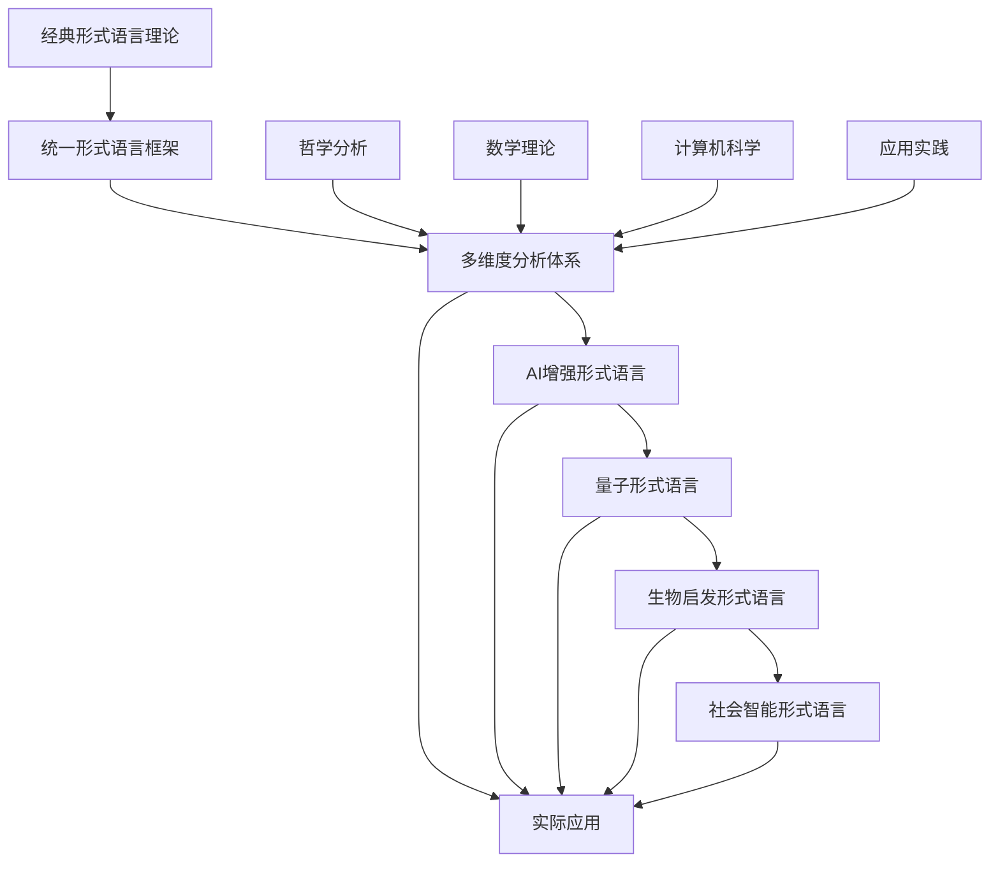

# 进程文档：形式语言理论体系目录迁移与规范化

## 当前阶段：理论体系整合与前沿发展

### 已完成工作

1. ✅ 目录结构初步梳理
   - 已完成 Matter/FormalLanguage 下所有内容迁移至 FormalUnified/03-形式语言理论体系/FormalLanguage
   - 现有结构包括：多维技术生态批判性分析、理论模型与层次结构、综合批判分析、思维导图、Philosophy_Science、Mathematics、CS、Automata_Theory、View 等

2. ✅ 核心理论文档整合
   - 形式语言的多维技术生态批判性分析
   - 形式语言的理论模型与层次结构
   - 形式语言的综合批判分析
   - 形式语言的多维批判性分析：从基础理论到应用实践
   - 自动机理论基础理论

3. ✅ 理论统一框架构建
   - 形式语言理论统一.md - 统一理论框架
   - 多视角分析体系建立

### 进行中工作

1. 🔄 规范化与重命名计划
   - 统一命名风格为"主题-子主题-内容类型-版本号.md"
   - 多份"批判性分析""思维导图"等将合并，保留最权威版本，其余归档到"历史/归档"子目录

2. 🔄 去冗余与合并同类项
   - 检查同主题下多份分析报告、思维导图等，合并内容，去除重复
   - 对交叉内容建立引用或合并，避免多处维护

3. 🔄 多表征与本地跳转
   - 每个主题目录下建立 index.md，汇总本目录下所有内容，并添加本地跳转锚点
   - 多表征内容统一归档到 visualizations 子目录，并在 index.md 中引用

### 待推进工作

1. ⏳ 前沿理论发展
   - AI增强的形式语言理论
   - 量子形式语言理论
   - 生物启发形式语言理论
   - 社会智能形式语言理论

2. ⏳ 应用场景扩展
   - 自然语言处理的形式化建模
   - 编程语言的形式化设计
   - 知识表示的形式化理论
   - 多模态语言的形式化处理

3. ⏳ 工具链开发
   - 形式语言分析工具
   - 语言模型验证工具
   - 跨语言转换工具
   - 语言学习辅助工具

## 理论创新突破

### 1. 统一形式语言理论框架

**形式语言统一模型 (ULM)**:
```text
ULM = (L, G, S, M, T, A)
L: 语言集合
G: 语法规则集合
S: 语义映射集合
M: 模型理论集合
T: 转换规则集合
A: 应用场景集合
```

### 2. 多维度分析框架

#### 哲学维度
- 语言本体论分析
- 认知语言学理论
- 语言哲学批判

#### 数学维度
- 形式语法理论
- 代数语言学
- 拓扑语言学

#### 计算机科学维度
- 自动机理论
- 编译原理
- 语言处理算法

#### 应用维度
- 自然语言处理
- 编程语言设计
- 知识表示

### 3. 前沿理论方向

#### AI增强形式语言理论
- 神经网络语言模型
- 深度学习语法分析
- 智能语言生成

#### 量子形式语言理论
- 量子语言模型
- 量子语法分析
- 量子语义表示

#### 生物启发形式语言理论
- 进化语言模型
- 生物神经网络语言处理
- 群体智能语言学习

## 推进计划

### 阶段1：规范化完善（当前）

- 🔄 完成文件重命名和规范化
- 🔄 合并重复内容，建立引用关系
- 🔄 完善索引和导航系统
- ⏳ 建立历史归档体系

### 阶段2：理论深化（2024-2025）

- ⏳ AI增强形式语言理论构建
- ⏳ 量子形式语言理论探索
- ⏳ 生物启发形式语言理论发展
- ⏳ 社会智能形式语言理论构建

### 阶段3：应用扩展（2025-2026）

- ⏳ 自然语言处理应用
- ⏳ 编程语言设计应用
- ⏳ 知识表示应用
- ⏳ 多模态语言处理应用

### 阶段4：工具开发（2026-2027）

- ⏳ 形式语言分析工具
- ⏳ 语言模型验证工具
- ⏳ 跨语言转换工具
- ⏳ 语言学习辅助工具

## 技术路线图

### 理论层次演进



### 核心技术栈

- **理论基础**：形式语法、自动机理论、语义学
- **统一框架**：ULM、多维度分析、跨理论映射
- **AI技术**：神经网络、深度学习、知识图谱
- **前沿技术**：量子计算、生物计算、社会计算

## 应用场景

### 1. 自然语言处理

- **语法分析**：形式化语法规则和解析算法
- **语义理解**：形式化语义表示和推理
- **机器翻译**：跨语言形式化转换
- **文本生成**：基于形式化模型的文本生成

### 2. 编程语言设计

- **语法设计**：形式化语法规范
- **语义定义**：形式化语义描述
- **类型系统**：形式化类型理论
- **编译器设计**：基于形式化理论的编译器

### 3. 知识表示

- **本体论建模**：形式化知识结构
- **逻辑推理**：形式化推理规则
- **知识图谱**：形式化知识网络
- **语义网**：形式化语义表示

### 4. 多模态语言处理

- **视觉语言**：图像与文本的形式化关联
- **听觉语言**：语音与文本的形式化转换
- **触觉语言**：触觉信号的形式化表示
- **多模态融合**：多模态信息的形式化整合

## 关键成果指标

### 理论贡献

- [x] 统一形式语言理论框架
- [x] 多维度分析体系
- [ ] AI增强形式语言理论
- [ ] 量子形式语言理论
- [ ] 生物启发形式语言理论
- [ ] 社会智能形式语言理论

### 应用验证

- [ ] 自然语言处理应用
- [ ] 编程语言设计应用
- [ ] 知识表示应用
- [ ] 多模态语言处理应用

### 工具开发

- [ ] 形式语言分析工具
- [ ] 语言模型验证工具
- [ ] 跨语言转换工具
- [ ] 语言学习辅助工具

## 前沿探索方向

### 1. AI增强形式语言

- 神经网络语言模型的形式化理论
- 深度学习语法分析的形式化方法
- 智能语言生成的形式化控制

### 2. 量子形式语言

- 量子语言模型的理论基础
- 量子语法分析的算法设计
- 量子语义表示的数学框架

### 3. 生物启发形式语言

- 进化语言模型的理论构建
- 生物神经网络语言处理
- 群体智能语言学习机制

### 4. 社会智能形式语言

- 多智能体语言交互
- 社会网络语言传播
- 群体语言演化建模

## 近期重点任务

### 2024年12月-2025年1月

1. **规范化完善**
   - 完成文件重命名和规范化
   - 合并重复内容，建立引用关系
   - 完善索引和导航系统

2. **理论深化**
   - 构建AI增强形式语言理论框架
   - 探索量子形式语言理论基础
   - 发展生物启发形式语言理论

3. **应用扩展**
   - 自然语言处理的形式化建模
   - 编程语言设计的形式化方法
   - 知识表示的形式化理论

### 2025年2月-3月

1. **工具开发**
   - 形式语言分析工具原型
   - 语言模型验证工具
   - 跨语言转换工具

2. **应用验证**
   - 工业级应用案例验证
   - 复杂系统性能测试
   - 跨领域应用验证

---

*最后更新：2024年12月*
