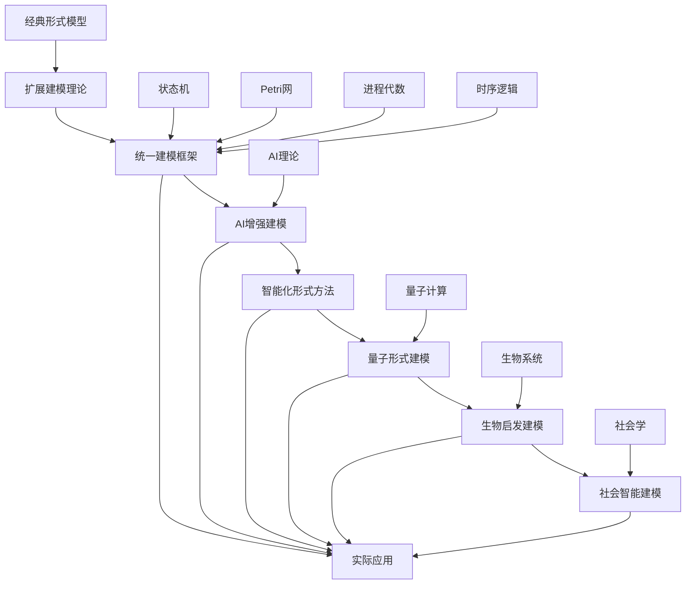

# 形式模型理论体系推进进程

## 当前阶段：统一建模框架构建与AI融合

### 已完成工作

1. ✅ 状态机理论完整体系（经典FSM到扩展状态机）
2. ✅ Petri网理论深度研究（基础Petri网到有色时间Petri网）
3. ✅ 进程代数理论（CCS、CSP、π-演算）
4. ✅ 时序逻辑体系（LTL、CTL、μ-演算）
5. ✅ 统一状态转换系统理论构建
6. ✅ AI多层级映射理论体系构建
7. ✅ AI涌现特征与人类功能替代分析
8. ✅ 形式化理论与AI人脑意识综合分析

### 进行中工作

1. 🔄 AI与形式模型的深度融合
   - AI驱动的模型发现与生成
   - 智能模型验证与修复
   - 自适应建模框架
2. 🔄 混合系统建模理论扩展
   - 量子-经典混合系统建模
   - 生物-人工系统融合建模
3. 🔄 分布式系统形式化建模
   - 微服务架构形式化建模
   - 区块链系统形式化建模
4. 🔄 模型验证工具链集成
   - 统一验证引擎开发
   - 可视化建模平台

### 待推进工作

1. ⏳ 实时系统建模框架
2. ⏳ 量子系统形式化建模
3. ⏳ 自适应系统建模理论
4. ⏳ 多范式建模统一框架
5. ⏳ AI增强的模型优化理论
6. ⏳ 跨领域知识迁移建模

## 理论创新突破

### 统一建模框架

**统一状态转换系统 (USTS)**:

```text
USTS = (S, E, R, M, I, F, L, A)
S: 状态元素集合
E: 事件集合  
R: 关系集合
M: 标记函数
I: 初始状态集合
F: 终止状态集合
L: 关系权重函数
A: AI增强函数
```

### AI增强建模

- **智能模型发现**：从数据自动推断形式模型
- **模型修复建议**：AI辅助的模型错误修复
- **复杂性管理**：AI驱动的模型抽象和简化
- **验证策略优化**：智能选择验证方法和参数
- **自适应建模**：根据系统行为动态调整模型
- **知识迁移建模**：跨领域知识的形式化迁移

### 跨理论融合

- **状态机 ⊕ Petri网**：统一的状态-事件建模
- **进程代数 ⊕ 时序逻辑**：行为与性质的统一描述
- **形式模型 ⊕ 机器学习**：数据驱动的形式化方法
- **量子系统 ⊕ 经典系统**：混合量子-经典建模
- **生物系统 ⊕ 人工系统**：生物启发的人工智能建模

### 新兴理论方向

#### 1. 量子形式建模理论

```text
量子形式模型 = (Q, U, M, V)
Q: 量子状态空间
U: 幺正演化算子
M: 测量算子
V: 经典-量子接口
```

#### 2. 生物启发建模理论

```text
生物形式模型 = (B, E, A, C)
B: 生物组件集合
E: 进化算子
A: 自适应机制
C: 涌现行为描述
```

#### 3. 社会智能建模理论

```text
社会形式模型 = (A, I, N, P)
A: 智能体集合
I: 交互协议
N: 网络拓扑
P: 群体行为模式
```

## 推进计划

### 阶段1：理论统一（当前）

- ✅ 完善统一建模框架
- 🔄 深化AI与形式模型融合
- 🔄 构建跨理论映射机制
- ⏳ 量子形式建模理论构建
- ⏳ 生物启发建模理论构建

### 阶段2：工具实现

- ⏳ 开发统一建模工具
- ⏳ 实现AI增强的验证引擎
- ⏳ 构建可视化建模平台
- ⏳ 量子模拟器集成
- ⏳ 生物仿真平台

### 阶段3：应用验证

- ⏳ 工业系统建模案例
- ⏳ 复杂系统验证实践
- ⏳ 性能基准测试
- ⏳ 量子计算应用验证
- ⏳ 生物系统建模验证

### 阶段4：生态建设

- ⏳ 建模标准制定
- ⏳ 工具链标准化
- ⏳ 社区生态构建
- ⏳ 跨学科合作网络
- ⏳ 产业化推广

## 技术路线图

### 理论层次演进



### 核心技术栈

- **理论基础**：状态机、Petri网、进程代数、时序逻辑
- **统一框架**：USTS、混合建模、多范式集成
- **AI技术**：符号推理、神经网络、强化学习、知识图谱
- **验证方法**：模型检查、定理证明、仿真验证、量子验证
- **新兴技术**：量子计算、生物计算、社会计算

## 应用场景

### 1. 软件系统建模

- **并发程序**：多线程系统的形式化建模
- **分布式系统**：微服务架构的形式化描述
- **实时系统**：嵌入式系统的时间约束建模
- **AI系统**：机器学习系统的形式化建模

### 2. 硬件系统建模

- **数字电路**：组合逻辑和时序逻辑建模
- **嵌入式系统**：硬软件协同设计
- **网络设备**：路由器、交换机协议建模
- **量子硬件**：量子比特和量子门建模

### 3. 业务流程建模

- **工作流系统**：业务流程的形式化描述
- **供应链管理**：复杂业务网络建模
- **金融系统**：交易流程和风险控制建模
- **社会系统**：群体行为和决策建模

### 4. 新兴领域建模

- **量子系统**：量子算法和量子协议建模
- **生物系统**：细胞网络和进化过程建模
- **社会系统**：多智能体和社会网络建模
- **混合系统**：人机协同和生物-人工系统建模

## 关键成果指标

### 理论贡献

- [x] 统一建模框架理论完善
- [x] AI与形式模型融合方法
- [ ] 跨理论验证技术
- [ ] 量子形式建模理论
- [ ] 生物启发建模理论
- [ ] 社会智能建模理论

### 工具开发

- [ ] 统一建模工具原型
- [ ] AI增强验证引擎
- [ ] 可视化建模平台
- [ ] 量子模拟器
- [ ] 生物仿真平台
- [ ] 社会网络分析工具

### 应用验证

- [ ] 工业级建模案例
- [ ] 复杂系统验证
- [ ] 性能基准建立
- [ ] 量子应用验证
- [ ] 生物系统验证
- [ ] 社会系统验证

## 前沿探索方向

### 量子建模理论

- 量子状态的形式化表示
- 量子计算过程建模
- 量子-经典混合系统
- 量子机器学习建模
- 量子网络协议建模

### 生物系统建模

- 细胞网络建模
- 进化过程形式化
- 生物-人工系统融合
- 神经网络的生物学建模
- 生态系统动力学建模

### 社会系统建模

- 多智能体系统
- 社交网络动力学
- 经济系统建模
- 群体智能建模
- 人机社会建模

### AI增强建模1

- 自动模型发现
- 智能模型优化
- 自适应建模框架
- 知识迁移建模
- 涌现行为建模

## 近期重点任务

### 2024年12月-2025年1月

1. **AI增强建模框架完善**
   - 完成AI驱动的模型发现算法
   - 实现智能模型修复机制
   - 构建自适应建模框架

2. **量子形式建模理论构建**
   - 量子状态的形式化表示理论
   - 量子-经典混合系统建模
   - 量子验证方法研究

3. **工具链开发**
   - 统一建模工具原型开发
   - AI增强验证引擎实现
   - 可视化建模平台构建

### 2025年2月-3月

1. **生物启发建模理论**
   - 生物系统的形式化建模
   - 进化算法的形式化理论
   - 生物-人工系统融合建模

2. **应用验证**
   - 工业系统建模案例验证
   - 复杂系统性能测试
   - 跨领域应用验证

---
*最后更新：2024年12月*-
