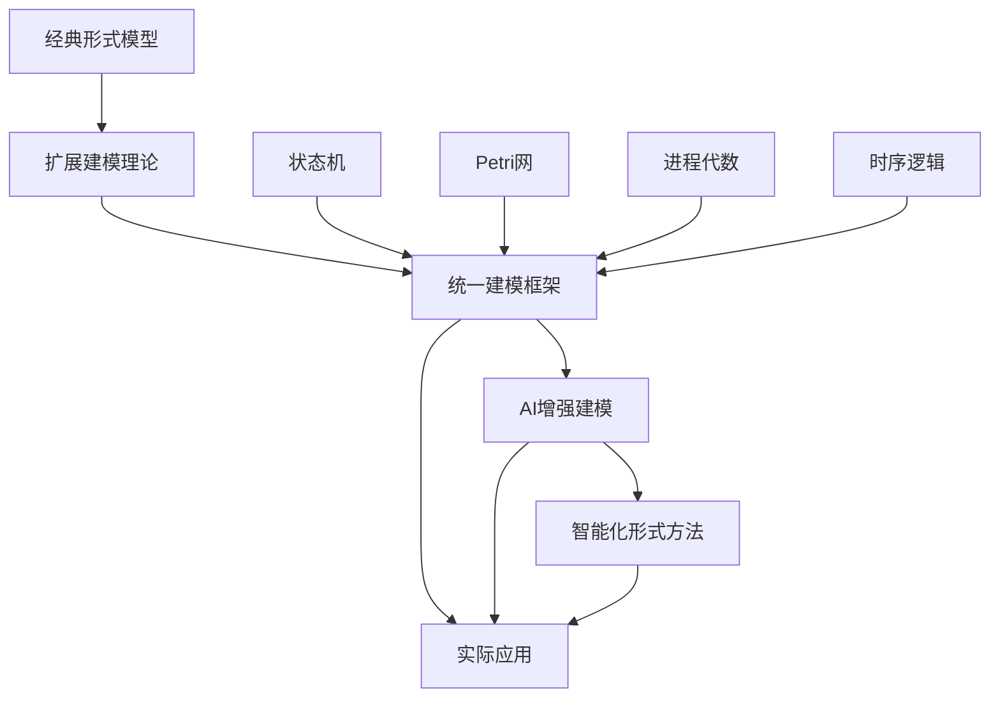

# 形式模型理论体系推进进程

## 当前阶段：统一建模框架构建与AI融合

### 已完成工作

1. ✅ 状态机理论完整体系（经典FSM到扩展状态机）
2. ✅ Petri网理论深度研究（基础Petri网到有色时间Petri网）
3. ✅ 进程代数理论（CCS、CSP、π-演算）
4. ✅ 时序逻辑体系（LTL、CTL、μ-演算）
5. ✅ 统一状态转换系统理论构建

### 进行中工作

1. 🔄 AI与形式模型的深度融合
2. 🔄 混合系统建模理论扩展
3. 🔄 分布式系统形式化建模
4. 🔄 模型验证工具链集成

### 待推进工作

1. ⏳ 实时系统建模框架
2. ⏳ 量子系统形式化建模
3. ⏳ 自适应系统建模理论
4. ⏳ 多范式建模统一框架

## 理论创新突破

### 统一建模框架

**统一状态转换系统 (USTS)**:

```text
USTS = (S, E, R, M, I, F, L)
S: 状态元素集合
E: 事件集合  
R: 关系集合
M: 标记函数
I: 初始状态集合
F: 终止状态集合
L: 关系权重函数
```

### AI增强建模

- **智能模型发现**：从数据自动推断形式模型
- **模型修复建议**：AI辅助的模型错误修复
- **复杂性管理**：AI驱动的模型抽象和简化
- **验证策略优化**：智能选择验证方法和参数

### 跨理论融合

- **状态机 ⊕ Petri网**：统一的状态-事件建模
- **进程代数 ⊕ 时序逻辑**：行为与性质的统一描述
- **形式模型 ⊕ 机器学习**：数据驱动的形式化方法

## 推进计划

### 阶段1：理论统一（当前）

- 完善统一建模框架
- 深化AI与形式模型融合
- 构建跨理论映射机制

### 阶段2：工具实现

- 开发统一建模工具
- 实现AI增强的验证引擎
- 构建可视化建模平台

### 阶段3：应用验证

- 工业系统建模案例
- 复杂系统验证实践
- 性能基准测试

### 阶段4：生态建设

- 建模标准制定
- 工具链标准化
- 社区生态构建

## 技术路线图

### 理论层次演进



### 核心技术栈

- **理论基础**：状态机、Petri网、进程代数、时序逻辑
- **统一框架**：USTS、混合建模、多范式集成
- **AI技术**：符号推理、神经网络、强化学习
- **验证方法**：模型检查、定理证明、仿真验证

## 应用场景

### 1. 软件系统建模

- **并发程序**：多线程系统的形式化建模
- **分布式系统**：微服务架构的形式化描述
- **实时系统**：嵌入式系统的时间约束建模

### 2. 硬件系统建模

- **数字电路**：组合逻辑和时序逻辑建模
- **嵌入式系统**：硬软件协同设计
- **网络设备**：路由器、交换机协议建模

### 3. 业务流程建模

- **工作流系统**：业务流程的形式化描述
- **供应链管理**：复杂业务网络建模
- **金融系统**：交易流程和风险控制建模

## 关键成果指标

### 理论贡献

- [ ] 统一建模框架理论完善
- [ ] AI与形式模型融合方法
- [ ] 跨理论验证技术

### 工具开发

- [ ] 统一建模工具原型
- [ ] AI增强验证引擎
- [ ] 可视化建模平台

### 应用验证

- [ ] 工业级建模案例
- [ ] 复杂系统验证
- [ ] 性能基准建立

## 前沿探索方向

### 量子建模理论

- 量子状态的形式化表示
- 量子计算过程建模
- 量子-经典混合系统

### 生物系统建模

- 细胞网络建模
- 进化过程形式化
- 生物-人工系统融合

### 社会系统建模

- 多智能体系统
- 社交网络动力学
- 经济系统建模

---
*最后更新：2024年12月*:
