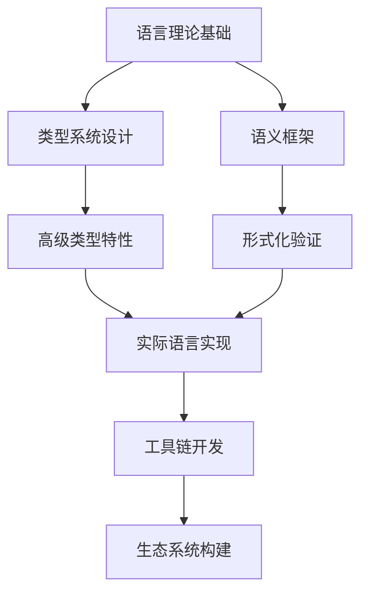

# 编程语言理论体系推进进程

## 当前阶段：深度理论整合与实践验证

### 已完成工作

1. ✅ Rust语言精髓深度分析（全面的所有权系统、并发模型分析）
2. ✅ 函数式编程范式研究（完整的理论框架）
3. ✅ 语言特性对比分析（Rust/Go/WebAssembly等）
4. ✅ 同伦类型理论在编程语言中的应用
5. ✅ 异步编程模型的形式化分析

### 进行中工作

1. 🔄 类型系统统一理论构建
2. 🔄 编程语言设计的形式化方法
3. 🔄 跨语言互操作性理论
4. 🔄 量子编程语言理论研究

### 待推进工作

1. ⏳ 编程语言语义的统一框架
2. ⏳ 领域特定语言设计理论
3. ⏳ 编程语言安全性形式化
4. ⏳ 机器学习驱动的语言优化

## 理论深度分析

### 核心理论体系

- **类型理论**：简单类型、依赖类型、同伦类型
- **语义理论**：操作语义、指称语义、公理语义
- **编译理论**：语法分析、语义分析、优化理论
- **并发理论**：进程代数、actor模型、CSP理论

### 创新研究方向

- **线性类型系统**的资源管理应用
- **仿射类型**在内存安全中的作用
- **时态类型**在实时系统中的应用
- **量子类型系统**的理论基础

## 推进计划

### 阶段1：理论整合（当前）

- 完善类型系统理论
- 深化语义分析框架
- 构建统一的编程范式模型

### 阶段2：实践验证

- 设计实验性编程语言
- 实现类型检查器
- 开发编译器原型

### 阶段3：应用拓展

- 领域特定语言设计
- 编程语言工具链
- 性能优化技术

### 阶段4：前沿探索

- 量子编程语言
- AI辅助语言设计
- 自适应语言系统

## 技术路线图

## 关键成果

- [ ] 统一类型理论框架
- [ ] 编程语言设计方法论
- [ ] 实验性语言原型
- [ ] 形式化验证工具

---
*最后更新：2024年12月*-
