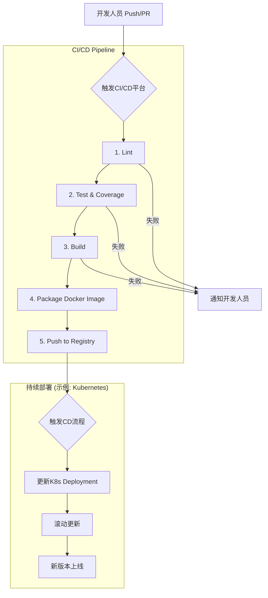

# 1.1.3.1 Go项目的CI/CD与DevOps实践

> 本文属于1.1-Microservice主题，建议配合[主题树与内容索引](../../../../00-主题树与内容索引.md)一同阅读。

## 目录

- [1.1.3.1 Go项目的CI/CD与DevOps实践](#1131-go项目的cicd与devops实践)
  - [目录](#目录)
  - [1.1.3.1.1 引言与定义](#11311-引言与定义)
  - [1.1.3.1.2 CI/CD核心概念](#11312-cicd核心概念)
    - [1.1.3.1.2.1 持续集成 (Continuous Integration)](#113121-持续集成-continuous-integration)
    - [1.1.3.1.2.2 持续交付 (Continuous Delivery)](#113122-持续交付-continuous-delivery)
    - [1.1.3.1.2.3 持续部署 (Continuous Deployment)](#113123-持续部署-continuous-deployment)
  - [1.1.3.1.3 Go项目典型CI/CD流水线](#11313-go项目典型cicd流水线)
    - [1.1.3.1.3.1 阶段一：代码检查 (Lint)](#113131-阶段一代码检查-lint)
    - [1.1.3.1.3.2 阶段二：测试 (Test)](#113132-阶段二测试-test)
    - [1.1.3.1.3.3 阶段三：构建 (Build)](#113133-阶段三构建-build)
    - [1.1.3.1.3.4 阶段四：打包与推送 (Package \& Push)](#113134-阶段四打包与推送-package--push)
    - [1.1.3.1.3.5 阶段五：部署 (Deploy)](#113135-阶段五部署-deploy)
  - [1.1.3.1.4 自动化平台与工具](#11314-自动化平台与工具)
    - [1.1.3.1.4.1 GitHub Actions](#113141-github-actions)
    - [1.1.3.1.4.2 GitLab CI/CD](#113142-gitlab-cicd)
    - [1.1.3.1.4.3 Docker \& Kubernetes](#113143-docker--kubernetes)
  - [1.1.3.1.5 配置示例](#11315-配置示例)
    - [1.1.3.1.5.1 GitHub Actions工作流 (`.github/workflows/ci.yml`)](#113151-github-actions工作流-githubworkflowsciyml)
  - [1.1.3.1.6 行业应用案例](#11316-行业应用案例)
  - [7. Mermaid图表：Go CI/CD流水线](#7-mermaid图表go-cicd流水线)
  - [8. 参考文献](#8-参考文献)

---

## 1.1.3.1.1 引言与定义

**CI/CD** (持续集成/持续交付/持续部署) 是一套在现代软件开发中旨在提高软件交付速度和质量的实践和文化。**DevOps** 则是一个更广泛的概念，强调开发（Dev）和运维（Ops）团队之间的协作、沟通和整合，CI/CD是实现DevOps目标的关键技术支柱。

对于Go项目而言，其快速编译、静态链接和跨平台特性，使其天然地适合高效的CI/CD流程。

## 1.1.3.1.2 CI/CD核心概念

### 1.1.3.1.2.1 持续集成 (Continuous Integration)

开发人员频繁地（通常每天多次）将代码变更合并到主干分支。每次合并都会自动触发构建和自动化测试，从而可以尽早发现集成错误。

### 1.1.3.1.2.2 持续交付 (Continuous Delivery)

在持续集成的基础上，将通过所有测试的代码变更自动部署到一个类生产环境中（如Staging环境）。这确保了软件在任何时候都处于一个可发布的状态。

### 1.1.3.1.2.3 持续部署 (Continuous Deployment)

这是持续交付的延伸，将通过所有自动化测试的代码变更自动部署到**生产环境**。这实现了从代码提交到功能上线的完全自动化。

## 1.1.3.1.3 Go项目典型CI/CD流水线

一个典型的Go项目CI/CD流水线包含以下自动化阶段：

### 1.1.3.1.3.1 阶段一：代码检查 (Lint)

使用`golangci-lint`等工具对代码进行静态分析，确保代码风格统一，并提前发现潜在的错误和坏味道。

### 1.1.3.1.3.2 阶段二：测试 (Test)

运行`go test ./... -race -cover`来执行所有单元测试和集成测试。`-race`标志用于检测竞态条件，`-cover`用于检查测试覆盖率。

### 1.1.3.1.3.3 阶段三：构建 (Build)

使用`go build`将应用编译成一个或多个目标平台（如Linux, Windows）的可执行二进制文件。利用Go的交叉编译能力，可以在单一构建环境中为所有目标平台生成产物。

### 1.1.3.1.3.4 阶段四：打包与推送 (Package & Push)

将上一步生成的二进制文件打包成Docker镜像。采用多阶段构建（Multi-stage build）是最佳实践，可以创建出体积非常小的生产镜像。打包完成后，将镜像推送到Docker Registry（如Docker Hub, Harbor, ECR）。

### 1.1.3.1.3.5 阶段五：部署 (Deploy)

将新的Docker镜像部署到目标环境。对于基于Kubernetes的现代云原生应用，这通常意味着更新Deployment对象的镜像版本，并触发滚动更新（Rolling Update）。

## 1.1.3.1.4 自动化平台与工具

### 1.1.3.1.4.1 GitHub Actions

GitHub Actions是深度集成在GitHub中的CI/CD平台。它通过定义在代码仓库`.github/workflows/`目录下的YAML文件来描述工作流，非常适合开源项目和使用GitHub作为代码托管的团队。

### 1.1.3.1.4.2 GitLab CI/CD

GitLab CI/CD是GitLab内置的强大CI/CD工具。它通过项目根目录下的`.gitlab-ci.yml`文件进行配置，提供了从代码提交到部署监控的端到端解决方案。

### 1.1.3.1.4.3 Docker & Kubernetes

**Docker**是目前应用容器化的事实标准，**Kubernetes**则是容器编排的事实标准。在Go的DevOps实践中，Docker用于打包，Kubernetes用于自动化部署、扩缩容和管理容器化应用。

## 1.1.3.1.5 配置示例

### 1.1.3.1.5.1 GitHub Actions工作流 (`.github/workflows/ci.yml`)

```yaml
name: Go CI

on:
  push:
    branches: [ main ]
  pull_request:
    branches: [ main ]

jobs:
  build:
    runs-on: ubuntu-latest
    steps:
    - uses: actions/checkout@v3

    - name: Set up Go
      uses: actions/setup-go@v3
      with:
        go-version: 1.19

    - name: Lint
      uses: golangci/golangci-lint-action@v3
      with:
        version: v1.50.1

    - name: Test
      run: go test -v -race ./...

    - name: Build
      run: go build -v -o my-app ./...
```

## 1.1.3.1.6 行业应用案例

- **DigitalOcean**: 作为云服务提供商，DigitalOcean在其内部大量使用Go语言开发服务，并借助GitLab CI/CD和Kubernetes构建了成熟的DevOps体系，实现了对底层云服务的快速迭代和可靠交付。
- **Grafana Labs**: 著名的开源监控解决方案Grafana完全使用GitHub Actions进行CI/CD。其工作流覆盖了代码检查、多平台构建、Docker镜像打包和版本发布的全过程，是Go项目CI/CD的最佳实践典范。

## 7. Mermaid图表：Go CI/CD流水线



## 8. 参考文献

- [GitHub Actions Documentation](https://docs.github.com/en/actions)
- [GitLab CI/CD Documentation](https://docs.gitlab.com/ee/ci/)
- [Introduction to DevOps on Kubernetes](https://www.digitalocean.com/community/conceptual_articles/introduction-to-devops-on-kubernetes)
- [Go CI/CD with GitHub Actions](https://blog.logrocket.com/ci-cd-for-golang-with-github-actions/)
