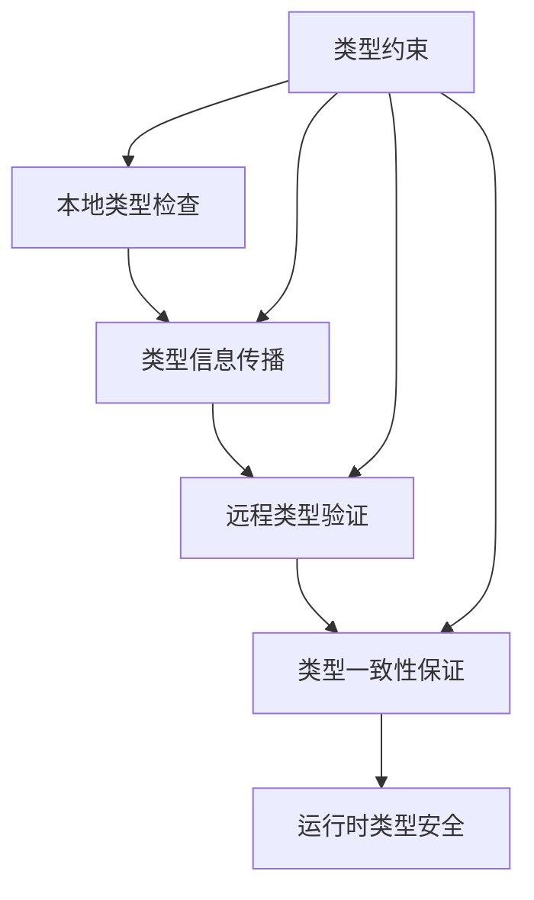

# 分布式类型安全理论深化 (Distributed Type Safety Theory Deepening)

## 概述

本文档深化了类型理论与分布式系统的融合机制，建立了分布式类型安全的理论框架，为构建类型安全的分布式系统提供理论基础。

## 理论基础

### 1. 类型系统扩展

#### 1.1 位置感知类型 (Location-Aware Types)

```rust
// 位置感知类型定义
#[derive(Clone, Debug)]
struct LocationAware<T> {
    value: T,
    location: NodeId,
    timestamp: Timestamp,
}

// 位置约束类型
type LocalOnly<T> = LocationAware<T> where T: Local;
type RemoteAllowed<T> = LocationAware<T> where T: Send + Sync;
```

#### 1.2 一致性类型 (Consistency Types)

```rust
// 强一致性类型
struct StrongConsistency<T> {
    value: T,
    quorum: QuorumSize,
    timeout: Duration,
}

// 最终一致性类型
struct EventualConsistency<T> {
    value: T,
    conflict_resolution: ConflictStrategy,
    merge_function: fn(T, T) -> T,
}

// 因果一致性类型
struct CausalConsistency<T> {
    value: T,
    vector_clock: VectorClock,
    dependencies: Vec<EventId>,
}
```

### 2. 分布式类型安全保证

#### 2.1 类型安全传播



#### 2.2 跨节点类型验证

```rust
// 跨节点类型验证器
trait CrossNodeTypeValidator {
    fn validate_local_type<T>(&self, value: &T) -> ValidationResult;
    fn validate_remote_type<T>(&self, value: &T, node: NodeId) -> ValidationResult;
    fn ensure_type_consistency<T>(&self, nodes: &[NodeId]) -> ConsistencyResult;
}

// 分布式类型注册表
struct DistributedTypeRegistry {
    local_types: HashMap<TypeId, TypeInfo>,
    remote_types: HashMap<NodeId, HashMap<TypeId, TypeInfo>>,
    consistency_rules: Vec<ConsistencyRule>,
}
```

### 3. 类型安全的分布式算法

#### 3.1 类型安全的共识算法

```rust
// 类型安全的Raft实现
struct TypeSafeRaft<T> {
    state: RaftState<T>,
    type_constraints: TypeConstraints<T>,
    safety_properties: SafetyProperties<T>,
}

impl<T> TypeSafeRaft<T> {
    fn propose(&mut self, value: T) -> Result<(), TypeError> {
        // 类型安全检查
        self.validate_proposal_type(&value)?;
        
        // 执行共识算法
        self.raft.propose(value)
    }
    
    fn validate_proposal_type(&self, value: &T) -> Result<(), TypeError> {
        // 实现类型验证逻辑
        self.type_constraints.validate(value)
    }
}
```

#### 3.2 类型安全的状态复制

```rust
// 类型安全的状态复制器
struct TypeSafeStateReplicator<T> {
    local_state: T,
    replica_states: HashMap<NodeId, T>,
    type_schema: TypeSchema<T>,
}

impl<T> TypeSafeStateReplicator<T> {
    fn replicate_to(&mut self, target: NodeId, state: T) -> Result<(), ReplicationError> {
        // 验证目标节点的类型兼容性
        self.validate_target_compatibility(target, &state)?;
        
        // 执行状态复制
        self.replica_states.insert(target, state);
        Ok(())
    }
    
    fn validate_target_compatibility(&self, target: NodeId, state: &T) -> Result<(), TypeError> {
        // 实现类型兼容性检查
        self.type_schema.validate_compatibility(target, state)
    }
}
```

### 4. 运行时类型安全保证

#### 4.1 动态类型检查

```rust
// 运行时类型检查器
struct RuntimeTypeChecker {
    type_registry: TypeRegistry,
    check_cache: LruCache<TypeCheckKey, bool>,
}

impl RuntimeTypeChecker {
    fn check_at_runtime<T>(&mut self, value: &T, expected_type: TypeId) -> bool {
        let cache_key = TypeCheckKey::new(value, expected_type);
        
        if let Some(&cached_result) = self.check_cache.get(&cache_key) {
            return cached_result;
        }
        
        let result = self.perform_type_check(value, expected_type);
        self.check_cache.put(cache_key, result);
        result
    }
    
    fn perform_type_check<T>(&self, value: &T, expected_type: TypeId) -> bool {
        // 实现运行时类型检查逻辑
        self.type_registry.check_type(value, expected_type)
    }
}
```

#### 4.2 类型安全异常处理

```rust
// 类型安全异常
#[derive(Debug, thiserror::Error)]
enum DistributedTypeError {
    #[error("Type mismatch: expected {expected}, got {actual}")]
    TypeMismatch { expected: TypeId, actual: TypeId },
    
    #[error("Location constraint violation: {message}")]
    LocationViolation { message: String },
    
    #[error("Consistency violation: {message}")]
    ConsistencyViolation { message: String },
    
    #[error("Cross-node type incompatibility: {message}")]
    CrossNodeIncompatibility { message: String },
}

// 类型安全异常处理器
trait TypeSafeExceptionHandler {
    fn handle_type_error(&self, error: &DistributedTypeError) -> RecoveryAction;
    fn can_recover_from(&self, error: &DistributedTypeError) -> bool;
    fn suggest_fix(&self, error: &DistributedTypeError) -> Option<FixSuggestion>;
}
```

### 5. 性能优化与权衡

#### 5.1 类型检查优化

```rust
// 分层类型检查策略
enum TypeCheckStrategy {
    // 编译时检查，运行时跳过
    CompileTimeOnly,
    // 关键路径检查，非关键路径跳过
    CriticalPathOnly,
    // 采样检查，按比例执行
    Sampling { ratio: f64 },
    // 自适应检查，根据性能指标调整
    Adaptive { performance_threshold: f64 },
}

// 类型检查性能监控
struct TypeCheckPerformanceMonitor {
    check_times: Vec<Duration>,
    overhead_ratio: f64,
    performance_impact: PerformanceImpact,
}

impl TypeCheckPerformanceMonitor {
    fn should_optimize(&self) -> bool {
        self.overhead_ratio > 0.1 || self.performance_impact.is_significant()
    }
    
    fn suggest_optimization(&self) -> OptimizationStrategy {
        // 基于性能指标建议优化策略
        if self.overhead_ratio > 0.2 {
            OptimizationStrategy::ReduceCheckFrequency
        } else if self.performance_impact.is_critical() {
            OptimizationStrategy::SkipNonCriticalChecks
        } else {
            OptimizationStrategy::MaintainCurrentLevel
        }
    }
}
```

#### 5.2 类型信息压缩

```rust
// 类型信息压缩器
struct TypeInfoCompressor {
    compression_algorithms: Vec<Box<dyn CompressionAlgorithm>>,
    compression_ratio: f64,
}

impl TypeInfoCompressor {
    fn compress_type_info(&self, type_info: &TypeInfo) -> CompressedTypeInfo {
        // 选择最优压缩算法
        let best_algorithm = self.select_best_algorithm(type_info);
        best_algorithm.compress(type_info)
    }
    
    fn select_best_algorithm(&self, type_info: &TypeInfo) -> &dyn CompressionAlgorithm {
        // 基于类型信息特征选择最优算法
        self.compression_algorithms
            .iter()
            .max_by_key(|alg| alg.estimate_compression_ratio(type_info))
            .unwrap()
    }
}
```

## 应用场景

### 1. 微服务架构

- **服务间类型安全通信**：确保微服务间传递的数据类型安全
- **API契约类型验证**：验证API调用的类型正确性
- **分布式事务类型安全**：保证分布式事务的类型一致性

### 2. 分布式数据库

- **跨节点数据类型一致性**：确保不同节点上的数据类型一致
- **分布式查询类型安全**：验证分布式查询的类型正确性
- **数据迁移类型验证**：验证数据迁移过程中的类型安全

### 3. 边缘计算

- **边缘节点类型同步**：同步边缘节点的类型信息
- **离线类型验证**：在离线状态下进行类型验证
- **增量类型更新**：增量更新类型信息以减少网络开销

## 未来发展方向

### 1. 量子类型系统

- **量子态类型**：表示量子计算中的量子态
- **量子门类型**：表示量子门操作的类型
- **量子纠缠类型**：表示量子纠缠关系的类型

### 2. AI增强类型推理

- **智能类型推断**：使用AI技术推断类型信息
- **类型模式学习**：学习常见的类型模式
- **类型错误预测**：预测可能的类型错误

### 3. 自适应类型系统

- **运行时类型调整**：根据运行时信息调整类型系统
- **性能感知类型检查**：根据性能要求调整类型检查强度
- **用户偏好学习**：学习用户的类型系统使用偏好

## 总结

分布式类型安全理论为构建类型安全的分布式系统提供了坚实的理论基础。通过位置感知类型、一致性类型、类型安全传播等机制，我们可以在分布式环境中保持类型安全，同时通过性能优化和权衡机制，在安全性和性能之间找到平衡点。

该理论为微服务架构、分布式数据库、边缘计算等应用场景提供了重要的理论支撑，为分布式系统的可靠性和安全性提供了新的保障。
