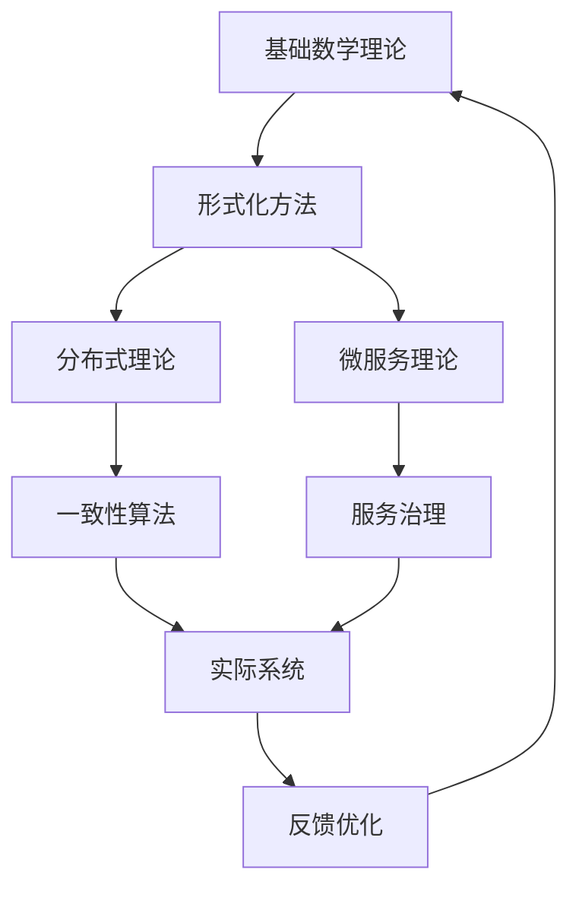

# 分布式与微服务推进进程

## 当前阶段：统一形式理论构建与深度融合

### 已完成工作

1. ✅ 分布式系统理论体系（完整的理论基础）
2. ✅ 统一形式理论综合（69个深度理论文档）
3. ✅ 高级控制理论扩展（时态逻辑控制深化）
4. ✅ 类型理论深化（线性、仿射、时态类型统一）
5. ✅ Petri网控制论分布式系统整合

### 进行中工作

1. 🔄 理论到实践的映射机制
2. 🔄 分布式算法的形式化验证
3. 🔄 微服务架构的数学建模
4. 🔄 可观测性理论体系构建

### 待推进工作

1. ⏳ 分布式系统验证工具链
2. ⏳ 微服务治理自动化
3. ⏳ 性能预测模型
4. ⏳ 智能运维系统

## 理论创新成果

### 统一形式理论框架

- **类型理论统一**：线性 ⊕ 仿射 ⊕ 时态类型系统
- **控制理论扩展**：时态逻辑控制 + 分布式协调
- **Petri网深化**：与控制论、分布式系统的理论融合
- **量子计算整合**：量子类型理论在分布式系统中的应用

### 形式化建模突破

```text
分布式系统 = (Nodes, Messages, Protocols, Constraints)
微服务架构 = (Services, Interfaces, Dependencies, Policies)
一致性模型 = (States, Transitions, Invariants, Guarantees)
```

### 验证理论体系

- **模型检查扩展**：分布式状态空间验证
- **定理证明深化**：分布式不变量自动证明
- **反例生成**：智能化的分布式错误场景生成

## 推进计划

### 阶段1：理论深化（当前）

- 完善统一形式理论框架
- 深化分布式算法形式化
- 构建微服务治理理论

### 阶段2：工具化实现

- 分布式系统建模工具
- 微服务架构分析引擎
- 自动化验证平台

### 阶段3：实践验证

- 真实系统案例研究
- 性能基准测试
- 工业级应用验证

### 阶段4：生态构建

- 标准化推进
- 社区工具链
- 培训与推广

## 技术架构演进

### 理论层次结构



### 核心技术栈

- **理论基础**：集合论、图论、时态逻辑
- **形式方法**：模型检查、定理证明、类型理论
- **分布式算法**：Raft、PBFT、Gossip协议
- **微服务技术**：Service Mesh、API Gateway、Event Sourcing

## 研究重点

### 1. 一致性理论深化

- **强一致性**：分布式事务的形式化模型
- **最终一致性**：收敛性质的数学证明
- **因果一致性**：偏序关系的形式化描述

### 2. 容错机制建模

- **拜占庭容错**：恶意节点行为的形式化
- **故障检测**：检测算法的正确性证明
- **恢复策略**：恢复过程的形式化验证

### 3. 性能预测模型

- **延迟模型**：网络延迟的概率分布
- **吞吐量模型**：系统容量的数学建模
- **资源利用**：资源分配的优化理论

## 关键里程碑

- [x] 完成统一形式理论框架（69个文档）
- [x] 建立分布式系统数学模型
- [ ] 实现分布式验证工具链
- [ ] 构建微服务治理平台
- [ ] 完成工业级案例验证

## 前沿探索

### 量子分布式系统

- 量子纠缠在分布式一致性中的应用
- 量子算法的分布式实现
- 量子密码学在微服务安全中的应用

### AI驱动的系统优化

- 机器学习在负载预测中的应用
- 智能化的故障诊断与恢复
- 自适应的系统配置优化

---
*最后更新：2024年12月*-
