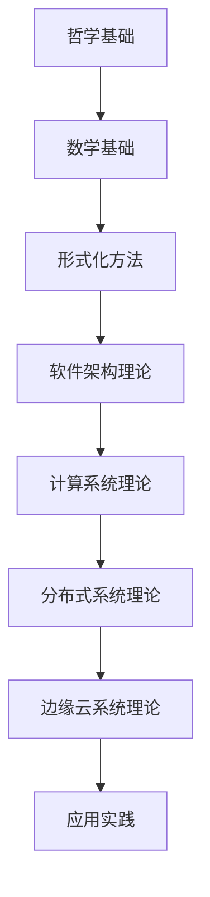
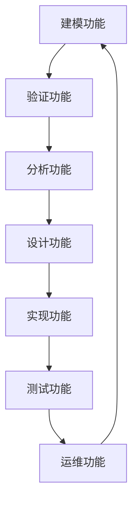

# 知识图谱系统

## 概述

知识图谱系统是FormalUnified理论体系的核心知识组织工具，通过构建系统化的知识图谱，实现理论知识的可视化、关联化和智能化管理。该系统将各个理论领域的知识进行有机整合，形成统一的知识网络。

## 系统架构

### 1. 知识表示层

#### 1.1 实体定义
- **理论实体**: 各个理论体系的核心概念
- **概念实体**: 理论中的基本概念和术语
- **方法实体**: 理论中的方法和工具
- **应用实体**: 理论的应用场景和案例

#### 1.2 关系定义
- **继承关系**: 理论间的继承和发展关系
- **依赖关系**: 理论间的依赖和支撑关系
- **映射关系**: 跨理论的概念映射关系
- **应用关系**: 理论与应用场景的关系

#### 1.3 属性定义
- **基本属性**: 实体的基本信息和特征
- **关系属性**: 关系的强度和方向
- **时间属性**: 知识的时间维度和版本信息
- **空间属性**: 知识的空间分布和应用范围

### 2. 知识组织层

#### 2.1 层次组织

#### 2.2 领域组织

#### 2.3 功能组织

### 3. 知识关联层

#### 3.1 语义关联
- **概念相似性**: 基于语义的概念相似性计算
- **关系推理**: 基于逻辑的关系推理机制
- **知识融合**: 多源知识的融合和整合
- **冲突解决**: 知识冲突的检测和解决

#### 3.2 结构关联
- **层次关联**: 基于层次结构的关联关系
- **网络关联**: 基于网络拓扑的关联关系
- **路径关联**: 基于路径的关联关系
- **聚类关联**: 基于聚类的关联关系

#### 3.3 动态关联
- **演化关联**: 知识演化的关联关系
- **时序关联**: 基于时间的关联关系
- **因果关联**: 基于因果的关联关系
- **影响关联**: 基于影响的关联关系

## 核心功能

### 1. 知识构建

#### 1.1 自动构建
- **文本挖掘**: 从文本中自动提取知识
- **关系抽取**: 自动抽取实体间关系
- **属性识别**: 自动识别实体属性
- **质量评估**: 自动评估知识质量

#### 1.2 半自动构建
- **人工标注**: 人工标注关键知识
- **机器学习**: 基于机器学习的知识构建
- **众包构建**: 基于众包的知识构建
- **专家验证**: 专家验证构建结果

#### 1.3 手动构建
- **专家构建**: 专家手动构建知识
- **结构化输入**: 结构化知识输入
- **可视化编辑**: 可视化知识编辑
- **版本管理**: 知识版本管理

### 2. 知识查询

#### 2.1 语义查询
- **自然语言查询**: 支持自然语言查询
- **语义匹配**: 基于语义的匹配查询
- **模糊查询**: 支持模糊和近似查询
- **多语言查询**: 支持多语言查询

#### 2.2 结构化查询
- **图查询**: 基于图结构的查询
- **路径查询**: 基于路径的查询
- **模式查询**: 基于模式的查询
- **约束查询**: 基于约束的查询

#### 2.3 智能查询
- **推荐查询**: 智能推荐相关查询
- **自动补全**: 查询自动补全
- **查询优化**: 查询性能优化
- **结果排序**: 智能结果排序

### 3. 知识推理

#### 3.1 逻辑推理
- **规则推理**: 基于规则的推理
- **逻辑推理**: 基于逻辑的推理
- **因果推理**: 基于因果的推理
- **时序推理**: 基于时序的推理

#### 3.2 统计推理
- **概率推理**: 基于概率的推理
- **贝叶斯推理**: 基于贝叶斯的推理
- **统计学习**: 基于统计学习的推理
- **机器学习**: 基于机器学习的推理

#### 3.3 混合推理
- **符号推理**: 符号与统计结合的推理
- **神经推理**: 神经网络推理
- **图推理**: 基于图的推理
- **多模态推理**: 多模态数据推理

### 4. 知识可视化

#### 4.1 结构可视化
- **层次可视化**: 层次结构的可视化
- **网络可视化**: 网络结构的可视化
- **关系可视化**: 关系结构的可视化
- **聚类可视化**: 聚类结果的可视化

#### 4.2 动态可视化
- **演化可视化**: 知识演化的可视化
- **时序可视化**: 时序数据的可视化
- **交互可视化**: 交互式可视化
- **实时可视化**: 实时数据的可视化

#### 4.3 多维可视化
- **3D可视化**: 三维可视化
- **多维可视化**: 多维数据的可视化
- **沉浸式可视化**: 沉浸式可视化
- **移动可视化**: 移动端可视化

## 应用场景

### 1. 学习支持

#### 1.1 个性化学习
- **学习路径规划**: 基于知识图谱的学习路径规划
- **内容推荐**: 基于用户兴趣的内容推荐
- **难度适配**: 基于用户水平的难度适配
- **进度跟踪**: 学习进度的跟踪和分析

#### 1.2 协作学习
- **知识共享**: 学习者间的知识共享
- **协作讨论**: 基于知识图谱的协作讨论
- **专家指导**: 专家基于知识图谱的指导
- **学习社区**: 基于知识图谱的学习社区

#### 1.3 智能辅导
- **智能问答**: 基于知识图谱的智能问答
- **错误诊断**: 学习错误的智能诊断
- **建议生成**: 学习建议的智能生成
- **评估反馈**: 学习效果的评估和反馈

### 2. 研究支持

#### 2.1 文献分析
- **文献检索**: 基于知识图谱的文献检索
- **关系分析**: 文献间关系的分析
- **趋势分析**: 研究趋势的分析
- **影响分析**: 研究影响的分析

#### 2.2 理论分析
- **理论梳理**: 基于知识图谱的理论梳理
- **关系分析**: 理论间关系的分析
- **发展分析**: 理论发展的分析
- **创新分析**: 理论创新的分析

#### 2.3 方法分析
- **方法比较**: 不同方法的比较分析
- **适用性分析**: 方法适用性的分析
- **效果分析**: 方法效果的分析
- **改进分析**: 方法改进的分析

### 3. 实践应用

#### 3.1 系统设计
- **架构设计**: 基于知识图谱的架构设计
- **组件设计**: 基于知识图谱的组件设计
- **接口设计**: 基于知识图谱的接口设计
- **模式选择**: 基于知识图谱的模式选择

#### 3.2 问题解决
- **问题分析**: 基于知识图谱的问题分析
- **方案设计**: 基于知识图谱的方案设计
- **决策支持**: 基于知识图谱的决策支持
- **效果评估**: 基于知识图谱的效果评估

#### 3.3 质量保证
- **设计验证**: 基于知识图谱的设计验证
- **实现验证**: 基于知识图谱的实现验证
- **测试支持**: 基于知识图谱的测试支持
- **维护支持**: 基于知识图谱的维护支持

## 技术实现

### 1. 数据存储

#### 1.1 图数据库
- **Neo4j**: 图数据库存储
- **ArangoDB**: 多模型数据库
- **OrientDB**: 对象图数据库
- **Amazon Neptune**: 云图数据库

#### 1.2 关系数据库
- **PostgreSQL**: 关系数据库存储
- **MySQL**: 关系数据库存储
- **Oracle**: 企业级数据库
- **SQL Server**: 微软数据库

#### 1.3 文档数据库
- **MongoDB**: 文档数据库存储
- **Elasticsearch**: 搜索引擎存储
- **Solr**: 搜索引擎存储
- **CouchDB**: 文档数据库

### 2. 计算引擎

#### 2.1 图计算引擎
- **Apache Giraph**: 图计算引擎
- **GraphX**: Spark图计算
- **GraphScope**: 阿里图计算
- **TigerGraph**: 图数据库引擎

#### 2.2 机器学习引擎
- **TensorFlow**: 深度学习框架
- **PyTorch**: 深度学习框架
- **Scikit-learn**: 机器学习库
- **Apache Spark**: 大数据计算

#### 2.3 推理引擎
- **Prolog**: 逻辑编程语言
- **Datalog**: 声明式查询语言
- **OWL**: 本体描述语言
- **RDF**: 资源描述框架

### 3. 可视化工具

#### 3.1 Web可视化
- **D3.js**: 数据驱动文档
- **Three.js**: 3D可视化
- **Vis.js**: 网络可视化
- **Cytoscape.js**: 图可视化

#### 3.2 桌面可视化
- **Gephi**: 网络分析软件
- **Cytoscape**: 生物网络分析
- **Pajek**: 网络分析软件
- **NetworkX**: Python图库

#### 3.3 移动可视化
- **React Native**: 移动应用开发
- **Flutter**: 跨平台开发
- **Ionic**: 混合应用开发
- **Cordova**: 移动应用框架

## 质量保证

### 1. 数据质量

#### 1.1 准确性
- **数据验证**: 数据准确性验证
- **一致性检查**: 数据一致性检查
- **完整性检查**: 数据完整性检查
- **时效性检查**: 数据时效性检查

#### 1.2 可靠性
- **数据备份**: 数据备份和恢复
- **容错机制**: 容错和故障恢复
- **监控告警**: 数据质量监控
- **审计追踪**: 数据变更审计

#### 1.3 可用性
- **访问控制**: 数据访问控制
- **权限管理**: 用户权限管理
- **性能优化**: 查询性能优化
- **扩展性**: 系统扩展性

### 2. 系统质量

#### 2.1 功能性
- **功能完整性**: 功能完整性验证
- **功能正确性**: 功能正确性验证
- **功能一致性**: 功能一致性验证
- **功能适应性**: 功能适应性验证

#### 2.2 性能性
- **响应时间**: 系统响应时间
- **吞吐量**: 系统吞吐量
- **并发性**: 系统并发处理能力
- **可扩展性**: 系统可扩展性

#### 2.3 可靠性
- **可用性**: 系统可用性
- **稳定性**: 系统稳定性
- **容错性**: 系统容错性
- **安全性**: 系统安全性

## 发展趋势

### 1. 智能化发展

#### 1.1 自动构建
- **深度学习**: 基于深度学习的自动构建
- **强化学习**: 基于强化学习的自动构建
- **迁移学习**: 基于迁移学习的自动构建
- **联邦学习**: 基于联邦学习的自动构建

#### 1.2 智能推理
- **神经推理**: 基于神经网络的推理
- **图神经网络**: 基于图神经网络的推理
- **注意力机制**: 基于注意力机制的推理
- **多模态推理**: 多模态数据推理

#### 1.3 智能交互
- **自然语言交互**: 自然语言交互
- **语音交互**: 语音交互
- **视觉交互**: 视觉交互
- **多模态交互**: 多模态交互

### 2. 规模化发展

#### 2.1 大数据支持
- **分布式存储**: 分布式数据存储
- **分布式计算**: 分布式数据计算
- **流式处理**: 流式数据处理
- **实时计算**: 实时数据计算

#### 2.2 云计算支持
- **云存储**: 云端数据存储
- **云计算**: 云端数据计算
- **云服务**: 云端知识服务
- **云平台**: 云端知识平台

#### 2.3 边缘计算支持
- **边缘存储**: 边缘数据存储
- **边缘计算**: 边缘数据计算
- **边缘服务**: 边缘知识服务
- **边缘平台**: 边缘知识平台

### 3. 生态化发展

#### 3.1 开放生态
- **开放标准**: 开放知识标准
- **开放接口**: 开放知识接口
- **开放平台**: 开放知识平台
- **开放社区**: 开放知识社区

#### 3.2 协作生态
- **协作机制**: 知识协作机制
- **贡献激励**: 知识贡献激励
- **质量保证**: 知识质量保证
- **价值实现**: 知识价值实现

#### 3.3 创新生态
- **创新环境**: 知识创新环境
- **创新机制**: 知识创新机制
- **创新成果**: 知识创新成果
- **创新应用**: 知识创新应用

---

## 总结

知识图谱系统为FormalUnified理论体系提供了：

1. **系统化**: 系统化的知识组织和表示
2. **关联化**: 知识间的关联和关系管理
3. **智能化**: 智能化的知识查询和推理
4. **可视化**: 直观的知识可视化展示
5. **实用化**: 实用的知识应用和服务

通过知识图谱系统，FormalUnified理论体系实现了知识的系统化管理和智能化应用，为理论学习和实践应用提供了强大的支持。
