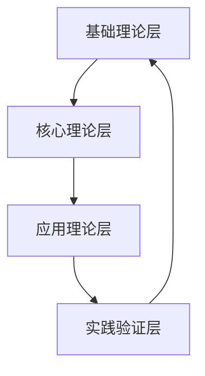

# 统一知识框架

## 概述

统一知识框架是FormalUnified理论体系的核心基础，旨在建立一套完整、一致、可验证的知识体系，将各个理论领域有机整合，形成统一的理论架构。

## 框架结构

### 1. 基础理论层

#### 1.1 数学基础
- **集合论**: 提供基础的数据结构理论
- **图论**: 支持关系建模和网络分析
- **逻辑学**: 形式化推理和验证基础
- **代数理论**: 抽象结构和运算理论

#### 1.2 形式化方法
- **类型理论**: 静态分析和类型安全
- **模型检查**: 状态空间验证
- **定理证明**: 形式化证明系统
- **抽象解释**: 程序分析理论

### 2. 核心理论层

#### 2.1 软件架构理论
- **组件理论**: 模块化设计理论
- **接口理论**: 系统交互理论
- **统一模块化系统理论**: 组件与接口的统一理论

#### 2.2 计算系统理论
- **经典计算理论**: 传统计算模型
- **量子计算理论**: 量子计算基础
- **统一计算系统理论**: 经典与量子的统一

#### 2.3 分布式系统理论
- **分布式系统理论**: 分布式计算基础
- **区块链理论**: 去中心化系统理论
- **统一分布式共识系统理论**: 分布式与区块链的统一

#### 2.4 边缘云系统理论
- **边缘计算理论**: 边缘计算基础
- **云计算理论**: 云计算基础
- **统一边缘云系统理论**: 边缘与云计算的统一

### 3. 应用理论层

#### 3.1 工程实践理论
- **软件工程理论**: 软件开发方法论
- **系统设计理论**: 系统架构设计
- **质量保证理论**: 软件质量保证

#### 3.2 新兴技术理论
- **量子计算理论体系**: 量子计算深化
- **生物计算理论体系**: 生物计算基础
- **神经计算理论体系**: 神经网络计算
- **混合计算理论体系**: 多种计算模式融合

## 知识关联机制

### 1. 层次关联

### 2. 领域关联

### 3. 概念映射

#### 3.1 跨理论概念映射
- **组件 ↔ 节点**: 软件组件与分布式节点的映射
- **接口 ↔ 协议**: 组件接口与网络协议的映射
- **状态 ↔ 数据**: 系统状态与数据状态的映射
- **行为 ↔ 算法**: 组件行为与分布式算法的映射

#### 3.2 理论间关系映射
- **统一模块化系统 ↔ 统一计算系统**: 模块化与计算的结合
- **统一计算系统 ↔ 统一分布式系统**: 计算与分布的结合
- **统一分布式系统 ↔ 统一边缘云系统**: 分布式与边缘云的结合

## 验证机制

### 1. 一致性验证

#### 1.1 概念一致性
- 验证跨理论概念定义的一致性
- 确保概念映射的正确性
- 检查理论间术语的统一性

#### 1.2 逻辑一致性
- 验证理论间逻辑关系的一致性
- 确保推理过程的正确性
- 检查结论的相容性

### 2. 完整性验证

#### 2.1 覆盖完整性
- 验证知识框架的覆盖范围
- 确保理论体系的完整性
- 检查知识点的完备性

#### 2.2 结构完整性
- 验证框架结构的完整性
- 确保层次关系的完整性
- 检查关联关系的完整性

### 3. 正确性验证

#### 3.1 理论正确性
- 验证理论内容的正确性
- 确保数学推导的正确性
- 检查形式化定义的准确性

#### 3.2 应用正确性
- 验证理论应用的正确性
- 确保实践验证的正确性
- 检查案例分析的准确性

## 发展机制

### 1. 理论演进

#### 1.1 理论深化
- 深化现有理论内容
- 扩展理论应用范围
- 完善理论验证方法

#### 1.2 理论创新
- 提出新的理论概念
- 建立新的理论关系
- 发展新的验证方法

### 2. 框架扩展

#### 2.1 领域扩展
- 扩展到新的应用领域
- 整合新的技术理论
- 建立新的理论分支

#### 2.2 方法扩展
- 发展新的分析方法
- 建立新的验证工具
- 完善新的应用方法

### 3. 实践验证

#### 3.1 案例验证
- 通过实际案例验证理论
- 收集实践反馈信息
- 优化理论应用方法

#### 3.2 工具验证
- 开发理论验证工具
- 建立自动化验证系统
- 完善验证流程

## 应用指导

### 1. 理论应用

#### 1.1 系统设计
- 指导系统架构设计
- 提供设计模式参考
- 支持设计决策制定

#### 1.2 问题解决
- 提供问题分析方法
- 指导解决方案设计
- 支持决策过程优化

### 2. 实践指导

#### 2.1 开发实践
- 指导软件开发过程
- 提供最佳实践参考
- 支持质量保证活动

#### 2.2 运维实践
- 指导系统运维活动
- 提供监控分析方法
- 支持故障诊断处理

## 未来展望

### 1. 理论发展

- **智能化**: 发展智能化的理论分析方法
- **自动化**: 建立自动化的理论验证系统
- **标准化**: 推进理论应用的标准化进程

### 2. 应用拓展

- **跨领域**: 扩展到更多应用领域
- **国际化**: 推进理论的国际化应用
- **产业化**: 促进理论的产业化应用

### 3. 生态建设

- **社区建设**: 建立理论应用社区
- **工具生态**: 完善理论应用工具生态
- **标准体系**: 建立理论应用标准体系

---

## 总结

统一知识框架为FormalUnified理论体系提供了：

1. **系统性**: 建立了完整的理论体系结构
2. **一致性**: 确保了理论间的一致性和协调性
3. **可验证性**: 提供了完整的验证机制和方法
4. **可扩展性**: 支持理论的持续发展和扩展
5. **实用性**: 为实际应用提供了有效的指导

通过统一知识框架，FormalUnified理论体系实现了从分散理论到统一体系的转变，为软件工程和系统架构设计提供了坚实的理论基础。
