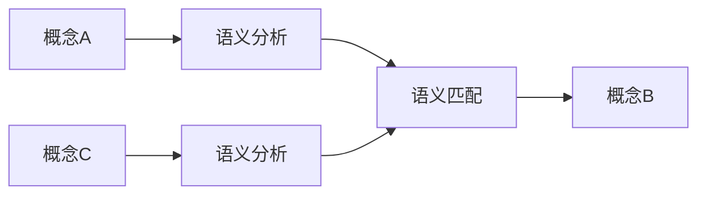
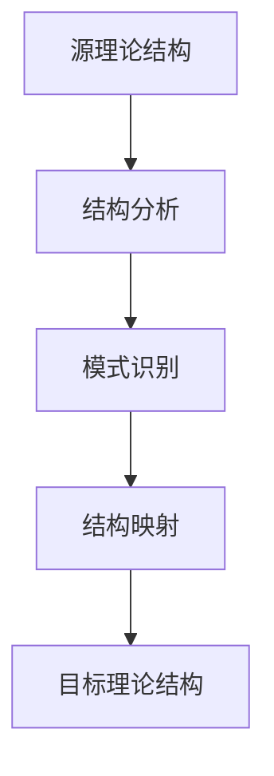

# 跨理论概念映射

## 概述

跨理论概念映射是FormalUnified理论统一与整合的核心机制，通过建立不同理论体系间的概念映射关系，实现理论间的有机整合和协同发展。该机制确保各个理论体系在保持独立性的同时，能够实现概念的统一理解和应用。

## 映射原理

### 1. 映射基础

#### 1.1 语义相似性
- **概念语义**: 基于概念的内在含义进行映射
- **功能语义**: 基于概念的功能作用进行映射
- **结构语义**: 基于概念的结构特征进行映射
- **关系语义**: 基于概念的关系模式进行映射

#### 1.2 抽象层次
- **具体映射**: 具体概念间的直接映射
- **抽象映射**: 抽象概念间的间接映射
- **层次映射**: 不同抽象层次间的映射
- **泛化映射**: 从具体到抽象的泛化映射

#### 1.3 映射类型
- **一对一映射**: 概念间的一对一对应关系
- **一对多映射**: 一个概念对应多个概念
- **多对一映射**: 多个概念对应一个概念
- **多对多映射**: 多个概念间的复杂对应关系

### 2. 映射方法

#### 2.1 语义映射


#### 2.2 结构映射


#### 2.3 功能映射


## 核心映射关系

### 1. 软件架构 ↔ 分布式系统

#### 1.1 组件 ↔ 节点映射
```text
软件组件
├── 组件接口 ↔ 节点通信协议
├── 组件状态 ↔ 节点状态
├── 组件行为 ↔ 节点行为
└── 组件依赖 ↔ 节点依赖

映射关系:
- 组件生命周期 ↔ 节点生命周期
- 组件配置 ↔ 节点配置
- 组件监控 ↔ 节点监控
- 组件故障 ↔ 节点故障
```

#### 1.2 接口 ↔ 协议映射
```text
组件接口
├── 接口定义 ↔ 协议规范
├── 接口实现 ↔ 协议实现
├── 接口调用 ↔ 协议通信
└── 接口版本 ↔ 协议版本

映射关系:
- 接口兼容性 ↔ 协议兼容性
- 接口性能 ↔ 协议性能
- 接口安全 ↔ 协议安全
- 接口扩展 ↔ 协议扩展
```

#### 1.3 状态 ↔ 数据映射
```text
组件状态
├── 状态定义 ↔ 数据结构
├── 状态转换 ↔ 数据转换
├── 状态同步 ↔ 数据同步
└── 状态持久化 ↔ 数据持久化

映射关系:
- 状态一致性 ↔ 数据一致性
- 状态恢复 ↔ 数据恢复
- 状态迁移 ↔ 数据迁移
- 状态监控 ↔ 数据监控
```

### 2. 计算系统 ↔ 边缘云系统

#### 2.1 计算资源 ↔ 云资源映射
```text
计算资源
├── CPU ↔ 云CPU
├── 内存 ↔ 云内存
├── 存储 ↔ 云存储
└── 网络 ↔ 云网络

映射关系:
- 资源分配 ↔ 云资源分配
- 资源调度 ↔ 云资源调度
- 资源监控 ↔ 云资源监控
- 资源扩展 ↔ 云资源扩展
```

#### 2.2 计算任务 ↔ 云任务映射
```text
计算任务
├── 任务定义 ↔ 云任务定义
├── 任务调度 ↔ 云任务调度
├── 任务执行 ↔ 云任务执行
└── 任务监控 ↔ 云任务监控

映射关系:
- 任务优先级 ↔ 云任务优先级
- 任务依赖 ↔ 云任务依赖
- 任务失败 ↔ 云任务失败
- 任务恢复 ↔ 云任务恢复
```

#### 2.3 计算模型 ↔ 云模型映射
```text
计算模型
├── 串行计算 ↔ 云串行计算
├── 并行计算 ↔ 云并行计算
├── 分布式计算 ↔ 云分布式计算
└── 量子计算 ↔ 云量子计算

映射关系:
- 计算复杂度 ↔ 云计算复杂度
- 计算效率 ↔ 云计算效率
- 计算成本 ↔ 云计算成本
- 计算可靠性 ↔ 云计算可靠性
```

### 3. 分布式系统 ↔ 边缘云系统

#### 3.1 节点 ↔ 边缘节点映射
```text
分布式节点
├── 节点功能 ↔ 边缘节点功能
├── 节点通信 ↔ 边缘节点通信
├── 节点协调 ↔ 边缘节点协调
└── 节点故障 ↔ 边缘节点故障

映射关系:
- 节点发现 ↔ 边缘节点发现
- 节点注册 ↔ 边缘节点注册
- 节点监控 ↔ 边缘节点监控
- 节点恢复 ↔ 边缘节点恢复
```

#### 3.2 共识算法 ↔ 边缘共识映射
```text
分布式共识
├── 共识协议 ↔ 边缘共识协议
├── 共识过程 ↔ 边缘共识过程
├── 共识结果 ↔ 边缘共识结果
└── 共识故障 ↔ 边缘共识故障

映射关系:
- 共识效率 ↔ 边缘共识效率
- 共识安全性 ↔ 边缘共识安全性
- 共识可扩展性 ↔ 边缘共识可扩展性
- 共识容错性 ↔ 边缘共识容错性
```

#### 3.3 数据一致性 ↔ 边缘数据一致性映射
```text
分布式一致性
├── 强一致性 ↔ 边缘强一致性
├── 最终一致性 ↔ 边缘最终一致性
├── 因果一致性 ↔ 边缘因果一致性
└── 会话一致性 ↔ 边缘会话一致性

映射关系:
- 一致性模型 ↔ 边缘一致性模型
- 一致性算法 ↔ 边缘一致性算法
- 一致性验证 ↔ 边缘一致性验证
- 一致性优化 ↔ 边缘一致性优化
```

## 映射验证机制

### 1. 语义验证

#### 1.1 概念一致性验证
- **定义一致性**: 验证映射概念的定义是否一致
- **语义一致性**: 验证映射概念的语义是否一致
- **用法一致性**: 验证映射概念的用法是否一致
- **上下文一致性**: 验证映射概念的上下文是否一致

#### 1.2 关系一致性验证
- **关系类型一致性**: 验证映射关系的类型是否一致
- **关系强度一致性**: 验证映射关系的强度是否一致
- **关系方向一致性**: 验证映射关系的方向是否一致
- **关系约束一致性**: 验证映射关系的约束是否一致

### 2. 结构验证

#### 2.1 层次结构验证
- **层次深度一致性**: 验证映射概念的层次深度是否一致
- **层次关系一致性**: 验证映射概念的层次关系是否一致
- **层次约束一致性**: 验证映射概念的层次约束是否一致
- **层次演化一致性**: 验证映射概念的层次演化是否一致

#### 2.2 网络结构验证
- **网络拓扑一致性**: 验证映射概念的网络拓扑是否一致
- **网络连接一致性**: 验证映射概念的网络连接是否一致
- **网络路径一致性**: 验证映射概念的网络路径是否一致
- **网络性能一致性**: 验证映射概念的网络性能是否一致

### 3. 功能验证

#### 3.1 功能等价性验证
- **功能定义等价性**: 验证映射概念的功能定义是否等价
- **功能实现等价性**: 验证映射概念的功能实现是否等价
- **功能性能等价性**: 验证映射概念的功能性能是否等价
- **功能可靠性等价性**: 验证映射概念的功能可靠性是否等价

#### 3.2 功能兼容性验证
- **功能接口兼容性**: 验证映射概念的功能接口是否兼容
- **功能参数兼容性**: 验证映射概念的功能参数是否兼容
- **功能返回值兼容性**: 验证映射概念的功能返回值是否兼容
- **功能异常兼容性**: 验证映射概念的功能异常是否兼容

## 映射应用

### 1. 理论整合应用

#### 1.1 概念统一
- **术语统一**: 通过映射实现术语的统一
- **定义统一**: 通过映射实现定义的统一
- **标准统一**: 通过映射实现标准的统一
- **规范统一**: 通过映射实现规范的统一

#### 1.2 方法整合
- **方法映射**: 将不同理论的方法进行映射
- **方法融合**: 将映射的方法进行融合
- **方法优化**: 对融合的方法进行优化
- **方法验证**: 对优化的方法进行验证

#### 1.3 工具整合
- **工具映射**: 将不同理论的工具进行映射
- **工具集成**: 将映射的工具进行集成
- **工具优化**: 对集成的工具进行优化
- **工具验证**: 对优化的工具进行验证

### 2. 实践应用

#### 2.1 系统设计应用
- **架构映射**: 将理论架构映射到实际系统
- **组件映射**: 将理论组件映射到实际组件
- **接口映射**: 将理论接口映射到实际接口
- **协议映射**: 将理论协议映射到实际协议

#### 2.2 问题解决应用
- **问题映射**: 将实际问题映射到理论问题
- **方法映射**: 将理论方法映射到实际方法
- **工具映射**: 将理论工具映射到实际工具
- **验证映射**: 将理论验证映射到实际验证

#### 2.3 质量保证应用
- **标准映射**: 将理论标准映射到实际标准
- **规范映射**: 将理论规范映射到实际规范
- **检查映射**: 将理论检查映射到实际检查
- **评估映射**: 将理论评估映射到实际评估

## 映射管理

### 1. 映射维护

#### 1.1 映射更新
- **新增映射**: 添加新的概念映射关系
- **修改映射**: 修改现有的概念映射关系
- **删除映射**: 删除过时的概念映射关系
- **版本管理**: 管理映射关系的版本

#### 1.2 映射验证
- **自动验证**: 自动验证映射关系的正确性
- **人工验证**: 人工验证映射关系的正确性
- **专家验证**: 专家验证映射关系的正确性
- **用户验证**: 用户验证映射关系的正确性

#### 1.3 映射优化
- **性能优化**: 优化映射关系的性能
- **准确性优化**: 优化映射关系的准确性
- **完整性优化**: 优化映射关系的完整性
- **一致性优化**: 优化映射关系的一致性

### 2. 映射工具

#### 2.1 映射构建工具
- **自动映射**: 自动构建概念映射关系
- **半自动映射**: 半自动构建概念映射关系
- **手动映射**: 手动构建概念映射关系
- **协作映射**: 协作构建概念映射关系

#### 2.2 映射查询工具
- **语义查询**: 基于语义的映射查询
- **结构查询**: 基于结构的映射查询
- **功能查询**: 基于功能的映射查询
- **关系查询**: 基于关系的映射查询

#### 2.3 映射可视化工具
- **映射图可视化**: 可视化映射关系图
- **映射路径可视化**: 可视化映射路径
- **映射网络可视化**: 可视化映射网络
- **映射演化可视化**: 可视化映射演化

## 发展趋势

### 1. 智能化发展

#### 1.1 自动映射
- **机器学习映射**: 基于机器学习的自动映射
- **深度学习映射**: 基于深度学习的自动映射
- **强化学习映射**: 基于强化学习的自动映射
- **联邦学习映射**: 基于联邦学习的自动映射

#### 1.2 智能验证
- **智能一致性检查**: 智能检查映射一致性
- **智能冲突检测**: 智能检测映射冲突
- **智能优化建议**: 智能提供优化建议
- **智能质量评估**: 智能评估映射质量

#### 1.3 智能应用
- **智能推荐**: 智能推荐相关映射
- **智能搜索**: 智能搜索映射关系
- **智能分析**: 智能分析映射模式
- **智能预测**: 智能预测映射趋势

### 2. 标准化发展

#### 2.1 映射标准
- **映射格式标准**: 标准化映射格式
- **映射语言标准**: 标准化映射语言
- **映射协议标准**: 标准化映射协议
- **映射接口标准**: 标准化映射接口

#### 2.2 验证标准
- **验证方法标准**: 标准化验证方法
- **验证流程标准**: 标准化验证流程
- **验证工具标准**: 标准化验证工具
- **验证报告标准**: 标准化验证报告

#### 2.3 应用标准
- **应用接口标准**: 标准化应用接口
- **应用流程标准**: 标准化应用流程
- **应用工具标准**: 标准化应用工具
- **应用评估标准**: 标准化应用评估

### 3. 生态化发展

#### 3.1 开放生态
- **开放映射**: 开放映射关系数据
- **开放工具**: 开放映射工具
- **开放接口**: 开放映射接口
- **开放平台**: 开放映射平台

#### 3.2 协作生态
- **协作映射**: 协作构建映射关系
- **协作验证**: 协作验证映射关系
- **协作应用**: 协作应用映射关系
- **协作维护**: 协作维护映射关系

#### 3.3 创新生态
- **创新映射**: 创新映射方法和技术
- **创新应用**: 创新映射应用场景
- **创新工具**: 创新映射工具和平台
- **创新服务**: 创新映射服务模式

---

## 总结

跨理论概念映射为FormalUnified理论体系提供了：

1. **统一性**: 实现了不同理论间概念的统一理解
2. **关联性**: 建立了理论间概念的关联关系
3. **可验证性**: 提供了映射关系的验证机制
4. **可应用性**: 支持映射关系的实际应用
5. **可扩展性**: 支持映射关系的持续扩展

通过跨理论概念映射，FormalUnified理论体系实现了从分散理论到统一体系的转变，为理论整合和实践应用提供了重要的基础支撑。 