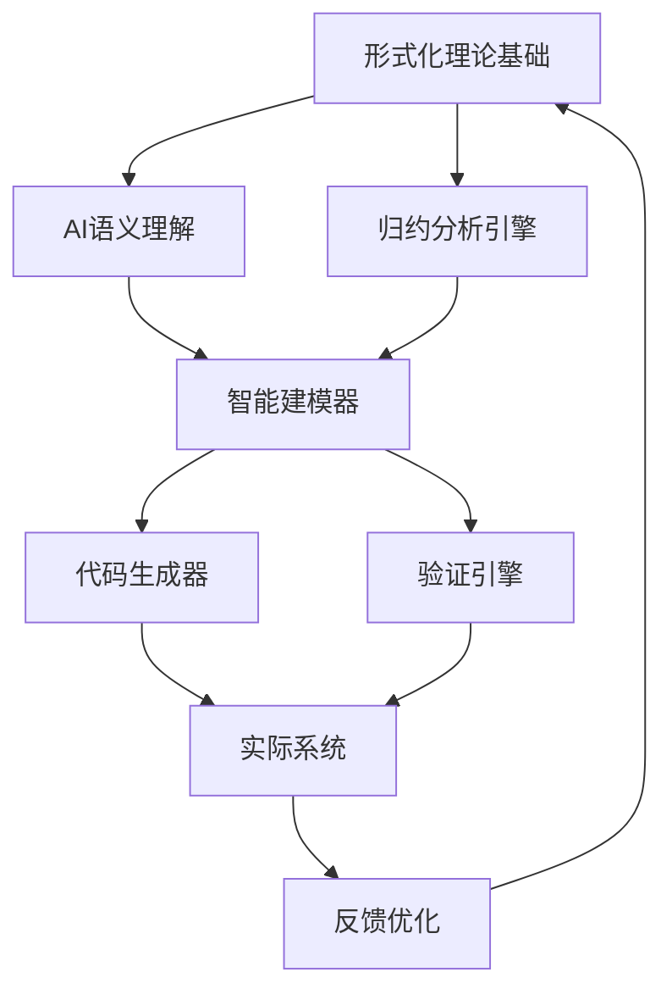

# AI建模引擎 (AI Modeling Engine)

## 概述

AI建模引擎是形式化架构理论项目的核心组成部分，致力于将形式化理论与AI智能相结合，构建智能化的软件建模、分析和验证平台。

## 项目结构

### 可行性归约分析 (可行性归约分析/)

**54个深度理论文档**，全面分析了AI建模引擎的理论可行性：

#### 核心理论基础

- [00-可行性归约分析总论](可行性归约分析/00-可行性归约分析总论.md) - 整体理论框架
- [01-形式语法归约](可行性归约分析/01-形式语法归约.md) - 语法理论基础
- [02-AI语义推理可行性](可行性归约分析/02-AI语义推理可行性.md) - AI推理能力分析

#### 形式化方法与AI融合

- [07-形式模型归约与AI验证](可行性归约分析/07-形式模型归约与AI验证.md)
- [10-形式化方法在AI原生软件工程中的应用](可行性归约分析/10-形式化方法在AI原生软件工程中的应用.md)
- [20-形式化架构理论的统一框架](可行性归约分析/20-形式化架构理论的统一框架.md)

### 理论归约分析 (理论归约分析/)

**37个系统性理论文档**，构建了从哲学基础到具体实现的完整归约体系：

#### 核心归约理论

- [01-形式化理论归约](理论归约分析/01-形式化理论归约.md) - 理论基础归约
- [02-Rust设计归约](理论归约分析/02-Rust设计归约.md) - Rust语言设计归约
- [03-Golang设计归约](理论归约分析/03-Golang设计归约.md) - Go语言设计归约
- [04-系统架构归约](理论归约分析/04-系统架构归约.md) - 系统架构归约

#### 综合分析

- [05-理论归约综合报告](理论归约分析/05-理论归约综合报告.md) - 完整归约体系总结

## 理论创新

### 1. 形式化与AI的深度融合

- **归约理论**：建立了从抽象理论到具体实现的系统性归约方法
- **语义推理**：将AI的语义理解能力与形式化方法相结合
- **验证机制**：构建了AI辅助的形式化验证框架

### 2. 多层次理论整合

- **哲学层**：本体论、认识论基础
- **数学层**：集合论、逻辑学、图论
- **计算层**：自动机理论、计算理论
- **工程层**：软件架构、编程语言设计

### 3. 递归推理框架

- **向下推理**：从理论到实现的演绎过程
- **向上推理**：从实现到理论的归纳验证
- **双向验证**：确保理论与实践的一致性

## 技术架构

## 应用场景

### 1. 智能软件设计

- 基于需求自动生成架构设计
- AI辅助的设计模式选择
- 智能化的组件组合

### 2. 形式化验证

- 自动化的模型检查
- AI增强的定理证明
- 智能反例生成

### 3. 代码自动生成

- 从形式规范到代码实现
- 多语言目标代码生成
- 优化代码结构生成

## 发展路线图

### 阶段1：理论完善（已完成91%）

- ✅ 完成理论归约分析体系
- ✅ 建立AI与形式化融合框架
- 🔄 完善验证机制理论

### 阶段2：原型实现（进行中）

- 🔄 核心引擎原型开发
- ⏳ 基础工具链实现
- ⏳ 用户接口设计

### 阶段3：系统集成

- ⏳ 完整系统集成
- ⏳ 性能优化
- ⏳ 生态系统构建

### 阶段4：产业应用

- ⏳ 企业级应用
- ⏳ 标准化推进
- ⏳ 社区生态建设

## 核心优势

1. **理论深度**：基于严格的数学和逻辑基础
2. **系统完整**：涵盖从理论到实践的完整链条
3. **AI增强**：充分利用AI的智能化能力
4. **实践导向**：面向真实的软件工程需求

## 相关资源

- [形式化架构理论统一计划](../形式化架构理论统一计划-v69.md)
- [FormalUnified统一知识体系](../FormalUnified/)
- [Analysis分析文档](../Analysis/)

---

> AI建模引擎代表了形式化方法与人工智能融合的前沿探索，致力于推动软件工程的智能化发展。
