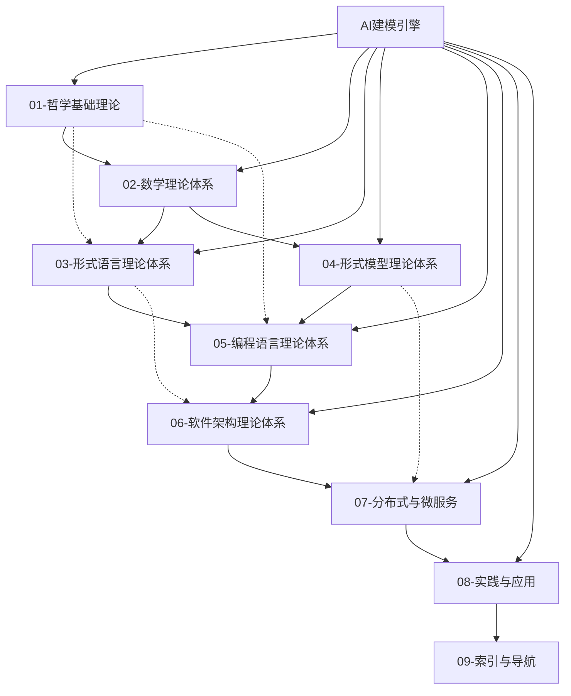

# 形式化架构理论整合框架 (Formal Architecture Theory Integration Framework)

## 概述

本框架将FormalUnified知识体系中的九大理论体系进行深度整合，构建统一的形式化架构理论体系，实现从哲学基础到实践应用的完整链条。

## 理论体系架构

### 1. 层次化理论结构



### 2. 理论融合维度

#### 2.1 垂直整合（理论深度）

- **哲学层**：本体论 → 认识论 → 科学哲学
- **数学层**：集合论 → 范畴论 → 图论 → 代数学
- **形式化层**：自动机理论 → 模型理论 → 验证理论
- **工程层**：编程语言 → 软件架构 → 分布式系统

#### 2.2 横向整合（应用广度）

- **语言理论**：语法 ↔ 语义 ↔ 类型系统
- **模型理论**：状态机 ↔ Petri网 ↔ 进程代数
- **架构理论**：组件 ↔ 接口 ↔ 模式
- **系统理论**：分布式 ↔ 并发 ↔ 一致性

#### 2.3 跨域整合（理论融合）

- **类型理论 × 分布式系统** = 分布式类型安全
- **Petri网 × 微服务架构** = 服务编排建模
- **时态逻辑 × 系统验证** = 实时系统验证
- **量子计算 × 编程语言** = 量子编程语言设计

## 核心整合机制

### 3.1 形式化映射关系

#### 基础映射

```text
哲学概念 ↦ 数学结构 ↦ 形式模型 ↦ 实现代码

存在(Entity) ↦ 集合(Set) ↦ 状态(State) ↦ 对象(Object)
关系(Relation) ↦ 函数(Function) ↦ 转换(Transition) ↦ 方法(Method)
属性(Property) ↦ 谓词(Predicate) ↦ 不变量(Invariant) ↦ 约束(Constraint)
```

#### 类型系统映射

```text
简单类型(Simple) ↦ 基础数据类型
依赖类型(Dependent) ↦ 参数化类型
线性类型(Linear) ↦ 资源管理类型
时态类型(Temporal) ↦ 状态变化类型
量子类型(Quantum) ↦ 概率叠加类型
```

### 3.2 语义对应关系

#### 操作语义 ↔ 指称语义 ↔ 公理语义

- **操作语义**：计算步骤的形式化描述
- **指称语义**：程序含义的数学对象映射
- **公理语义**：程序性质的逻辑断言

#### 静态分析 ↔ 动态验证 ↔ 混合方法

- **静态分析**：编译时的性质检查
- **动态验证**：运行时的行为监控
- **混合方法**：静态+动态的综合验证

### 3.3 跨理论验证框架

#### 多层次验证策略

- **语法验证**：形式语法正确性
- **语义验证**：程序行为一致性
- **类型验证**：类型系统安全性
- **架构验证**：架构约束满足性
- **系统验证**：分布式性质保证

#### 验证工具整合

- **静态分析工具**：代码质量检查
- **模型检查器**：状态空间验证
- **定理证明器**：数学性质证明
- **测试框架**：动态行为验证
- **监控系统**：运行时状态监控

## 发展路线图

### 阶段1：理论整合完善（当前）

- ✅ 完成九大理论体系基础构建
- ✅ 建立跨体系映射关系
- 🔄 深化理论融合机制
- ⏳ 完善整合验证方法

### 阶段2：工具链实现

- ⏳ 开发统一建模工具
- ⏳ 实现跨理论验证引擎
- ⏳ 构建智能化分析平台
- ⏳ 建立自动化代码生成器

### 阶段3：实践验证

- ⏳ 真实项目案例研究
- ⏳ 工业级应用验证
- ⏳ 性能基准测试
- ⏳ 用户体验优化

### 阶段4：生态建设

- ⏳ 标准化推进
- ⏳ 社区工具链建设
- ⏳ 教育培训体系
- ⏳ 产业应用推广

## 预期成果

### 理论贡献

1. **统一理论框架**：建立完整的形式化架构理论体系
2. **跨域融合方法**：创新的理论整合机制
3. **验证理论体系**：多层次的系统验证方法

### 技术创新

1. **AI增强的形式化工具**：智能化的建模和验证
2. **统一开发环境**：集成多种理论工具
3. **自动化代码生成**：从规范到实现的自动转换

### 实践价值

1. **软件质量提升**：更可靠、更安全的软件系统
2. **开发效率改进**：自动化的设计和验证流程
3. **教育培训优化**：系统化的理论学习路径

## 相关文档

### 深化版框架

- **[理论整合框架深化版](理论整合框架深化版.md)** - 深化跨理论体系融合机制和验证方法
- **[跨理论体系融合深度分析](../07-分布式与微服务/Theory/跨理论体系融合深度分析.md)** - 分布式系统与微服务架构的跨理论融合分析

### 实践映射

- **[理论到实践映射框架](../08-实践与应用/TheoryToPractice/理论到实践映射框架.md)** - 理论到实践的完整映射机制

### 核心理论

- **[AI建模引擎](../08-实践与应用/AI-Modeling-Engine/)** - 91个文档构建的完整AI建模引擎
- **[统一知识体系](../)** - 9大理论体系的完整知识结构

---

> 该整合框架代表了形式化架构理论研究的新高度，为软件工程的理论化和智能化发展奠定了坚实基础。
