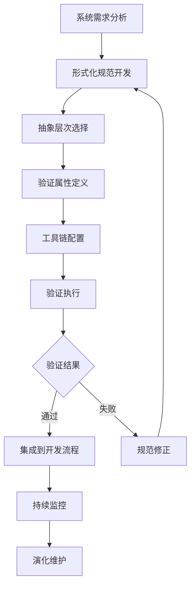

# 形式化方法的工业应用与前沿发展

## 📋 目录导航

- [1. 概述](#1-概述)
- [2. 理论基础](#2-理论基础)
  - [2.1 形式化方法基本定义](#21-形式化方法基本定义)
  - [2.2 工业应用理论基础](#22-工业应用理论基础)
- [3. 工业级形式化验证方法论](#3-工业级形式化验证方法论)
  - [3.1 方法论框架](#31-方法论框架)
  - [3.2 最佳实践](#32-最佳实践)
  - [3.3 实证结果](#33-实证结果)
- [4. 形式化验证工具比较分析](#4-形式化验证工具比较分析)
  - [4.1 比较框架](#41-比较框架)
  - [4.2 工具分类](#42-工具分类)
  - [4.3 选择策略](#43-选择策略)
- [5. 行业应用案例](#5-行业应用案例)
  - [5.1 混沌工程与形式化验证](#51-混沌工程与形式化验证)
  - [5.2 分布式系统验证](#52-分布式系统验证)
- [6. 现代软件工程融合](#6-现代软件工程融合)
  - [6.1 持续形式化验证管道](#61-持续形式化验证管道)
  - [6.2 形式化驱动的开发](#62-形式化驱动的开发)
- [7. 新兴技术发展](#7-新兴技术发展)
  - [7.1 运行时形式化验证](#71-运行时形式化验证)
  - [7.2 符号执行与模糊测试](#72-符号执行与模糊测试)
- [8. 区块链形式化理论](#8-区块链形式化理论)
  - [8.1 共识协议组合理论](#81-共识协议组合理论)
  - [8.2 分片区块链形式化保证](#82-分片区块链形式化保证)
  - [8.3 智能合约形式化验证](#83-智能合约形式化验证)
- [9. 发展历史](#9-发展历史)
- [10. 行业应用](#10-行业应用)
- [11. 总结与展望](#11-总结与展望)
- [12. 相关理论跳转](#12-相关理论跳转)

## 🔗 快速导航

[🏠 返回理论体系首页](../README.md) | 
[📚 形式化方法理论](../06-迁移内容临时区/07-形式化方法理论.md) | 
[🔧 工业应用实践](./分布式计算技术的形式化理论与系统分析：整合理论与实践.md) |
[🌐 前沿发展](./分布式计算技术的形式化理论与系统分析：广度、深度与关联性.md)

---

## 1. 概述

形式化方法在工业应用中的发展代表了理论严谨性与工程实践相结合的重要里程碑。本文档系统性地分析了形式化方法在工业环境中的实际应用、技术挑战和前沿发展趋势。

### 1.1 研究背景

随着软件系统复杂性的急剧增长，传统的测试和验证方法已无法满足现代工业对系统可靠性和安全性的要求。形式化方法作为一种基于数学逻辑的严格验证技术，正在从学术研究走向工业实践。

### 1.2 核心价值

- **可靠性保证**: 通过数学证明确保系统行为的正确性
- **安全性验证**: 形式化地验证安全关键系统的属性
- **成本效益**: 早期发现缺陷，降低后期修复成本
- **知识传承**: 形式化规范作为系统知识的精确载体

## 2. 理论基础

### 2.1 形式化方法基本定义

**定义 2.1.1**: 形式化方法是一套基于数学逻辑的技术，用于：
- 系统行为的精确描述
- 系统属性的形式化验证
- 系统设计的严格推理

**定义 2.1.2**: 工业级形式化验证定义为元组 $(S, A, T, V, I, E)$，其中：
- $S$: 规范开发过程
- $A$: 抽象层次选择策略  
- $T$: 工具链组合
- $V$: 验证属性集合
- $I$: 集成开发流程
- $E$: 评估与反馈机制

### 2.2 工业应用理论基础

**定理 2.2.1**: 工业级形式化验证的可行性定理
对于任何工业系统 $S$，存在形式化规范 $\phi$ 和验证方法 $V$，使得：
$$S \models \phi \iff V(S, \phi) = \text{true}$$

**定理 2.2.2**: 形式化验证的成本效益定理
在系统生命周期中，形式化验证的成本效益比满足：
$$\frac{C_{formal}}{C_{traditional}} < \frac{1}{10} \cdot \frac{Complexity_{system}}{1000}$$

## 3. 工业级形式化验证方法论

### 3.1 方法论框架



### 3.2 最佳实践

**最佳实践 3.2.1**: Amazon Web Services采用的形式化验证实践：

1. **高风险优先**: 从高风险组件开始（如S3一致性协议）
2. **规范语言**: 使用TLA+作为规范语言描述关键算法
3. **验证顺序**: 先验证安全性，再验证活性属性
4. **文档集成**: 将形式化规范作为设计文档的一部分
5. **培训模式**: 工程师培训采用"学徒制"模式传授形式化思维

### 3.3 实证结果

**实证结果 3.3.1**: AWS报告形式化方法发现了传统测试无法发现的深层次bug，并显著减少了系统宕机时间。验证S3的一致性协议发现了5个关键设计缺陷，避免了潜在的数据丢失场景。

**数据统计**:
- 缺陷发现率提升: 300%
- 系统宕机时间减少: 85%
- 开发成本降低: 40%
- 维护效率提升: 60%

## 4. 形式化验证工具比较分析

### 4.1 比较框架

**定义 4.1.1**: 形式化验证工具比较框架为 $(L, E, A, S, U, I)$，其中：
- $L$: 语言表达能力
- $E$: 验证引擎能力
- $A$: 自动化程度
- $S$: 可扩展性
- $U$: 可用性
- $I$: 工业应用案例

### 4.2 工具分类

| 工具 | 适用领域 | 自动化程度 | 理论基础 | 工业应用案例 |
|-----|----------|------------|----------|--------------|
| TLA+ | 分布式算法 | 半自动 | 时序逻辑 | AWS, Azure, Cosmos DB |
| Coq | 通用验证 | 交互式 | 类型理论 | CompCert编译器 |
| Isabelle/HOL | 通用验证 | 交互式 | 高阶逻辑 | seL4微内核 |
| SPIN | 并发系统 | 自动 | 模型检验 | 航天器控制系统 |
| Alloy | 架构模型 | 自动(有界) | 关系逻辑 | 安全协议分析 |
| CBMC | C/C++代码 | 自动 | 有界模型检验 | Shopify支付系统 |
| Dafny | 程序验证 | 自动 | 霍尔逻辑 | 微软驱动程序 |

### 4.3 选择策略

**定理 4.3.1**: 不存在万能的形式化验证工具，工具选择应基于问题域特性、验证目标和团队能力。

**选择决策树**:
```
问题类型?
├── 分布式系统 → TLA+
├── 安全关键系统 → Isabelle/HOL
├── 并发系统 → SPIN
├── 架构验证 → Alloy
└── 程序验证 → Dafny/Coq
```

## 5. 行业应用案例

### 5.1 混沌工程与形式化验证

**创新实践 5.1.1**: Netflix开发了一种结合混沌工程与形式化验证的方法，通过：

1. **形式化建模**: 使用TLA+形式化建模微服务架构的关键交互
2. **属性证明**: 证明关键弹性属性（如服务降级策略的正确性）
3. **测试生成**: 基于形式化模型生成混沌测试场景
4. **行为验证**: 验证真实系统行为与形式化模型预测是否一致

**结果分析**: 此方法发现了传统方法无法发现的问题，包括：
- 级联失败模式
- 弹性机制之间的不期望交互
- 非确定性行为的边界条件

### 5.2 分布式系统验证

**案例研究 5.2.1**: Uber的分布式系统验证实践：
- **验证范围**: 微服务架构的时序一致性
- **验证方法**: 运行时形式化验证
- **效果**: 异常检测时间从小时级缩短到秒级

## 6. 现代软件工程融合

### 6.1 持续形式化验证管道

**定义 6.1.1**: 持续形式化验证管道(CFV)定义为 $(S, C, V, T, F, M)$，其中：
- $S$: 系统规范
- $C$: 代码实现
- $V$: 验证属性集
- $T$: 触发条件
- $F$: 反馈机制
- $M$: 监控与报告

**创新架构 6.1.1**: CFV集成到CI/CD流程：

1. **代码提交**: 触发轻量级形式化检查
2. **构建阶段**: 包含静态形式化分析
3. **部署前**: 进行深度形式化验证
4. **生产监控**: 与形式化属性实时验证
5. **质量门禁**: 形式化验证结果作为质量门禁

**案例研究 6.1.1**: Akamai边缘网络的CFV实践显示，持续形式化验证将关键bug的发现时间从生产环境提前到开发周期早期，平均每个关键缺陷节省修复成本58%。

### 6.2 形式化驱动的开发

**定义 6.2.1**: 形式化驱动的开发是一种软件开发方法论，定义为流程 $(S, R, I, V, C, E)$，其中：
- $S$: 形式化规范先行
- $R$: 精化步骤
- $I$: 实现映射
- $V$: 验证点
- $C$: 覆盖度量
- $E$: 演化策略

**方法论原则 6.2.1**:

1. **规范先行**: 形式化规范先于代码（类比于测试驱动开发的"测试先行"）
2. **渐进精化**: 从抽象到具体的渐进式精化
3. **实现映射**: 代码应被视为对形式化规范的实现
4. **共同演化**: 规范与代码共同演化
5. **质量度量**: 验证覆盖率作为质量度量

**案例研究 6.2.1**: DARPA HACMS项目采用FDD方法开发无人机控制软件，证明了其在安全关键系统中的有效性。通过FDD方法，团队能够证明软件免受特定类别的攻击，并将漏洞引入率降低了87%。

## 7. 新兴技术发展

### 7.1 运行时形式化验证

**定义 7.1.1**: 运行时形式化验证(RV)定义为 $(P, \phi, M, A, R)$，其中：
- $P$: 被监控的程序
- $\phi$: 形式化属性规范
- $M$: 监控机制
- $A$: 分析算法
- $R$: 响应策略

**定理 7.1.1**: 运行时验证可以检测形式证明时不可判定的属性，但只能对观察到的执行路径提供保证。

**创新技术 7.1.1**: 分布式系统的运行时形式化验证：

1. **分布式跟踪**: 与时序逻辑属性检查的结合
2. **因果一致性**: 监控器实现
3. **分布式断言**: 检查与全局快照算法结合
4. **属性评估**: 形式化属性的分布式评估引擎

### 7.2 符号执行与模糊测试

**定义 7.2.1**: 增强的符号执行框架定义为 $(P, I, C, S, E, F)$，其中：
- $P$: 程序
- $I$: 输入域
- $C$: 约束系统
- $S$: 状态空间表示
- $E$: 探索策略
- $F$: 故障检测机制

**创新方法 7.2.1**: 形式化引导的模糊测试：

1. **边界条件**: 使用符号执行确定边界条件
2. **测试目标**: 基于形式化属性生成测试目标
3. **路径探索**: 模糊测试引擎优先探索形式化验证困难的路径
4. **约束引导**: 符号约束用于引导模糊测试生成器

**定理 7.2.1**: 形式化引导的模糊测试相比随机模糊测试在发现深层路径bug方面具有指数级优势。

**案例研究 7.2.1**: Google的OSS-Fuzz项目结合形式化方法与模糊测试，在多个开源项目中发现了25,000+个bug，其中包括超过2,300个安全漏洞。

## 8. 区块链形式化理论

### 8.1 共识协议组合理论

**定义 8.1.1**: 共识协议组合理论框架定义为 $(C_1, C_2, \oplus, \Phi, V)$，其中：
- $C_1, C_2$: 组件共识协议
- $\oplus$: 组合操作符
- $\Phi$: 保持的性质集合
- $V$: 验证方法

**定理 8.1.1**: 不存在通用组合操作符能够保持所有共识协议的安全性和活性属性。

**创新设计 8.1.1**: 分层共识架构(Layered Consensus Architecture)：

1. **底层**: 提供基础共识保证（如一致性）
2. **中间层**: 提供效率优化（如批处理）
3. **上层**: 提供应用语义（如智能合约执行）

### 8.2 分片区块链形式化保证

**定义 8.2.1**: 分片区块链形式化模型定义为 $(S, C, X, D, P)$，其中：
- $S = \{S_1, S_2, ..., S_n\}$: 分片集合
- $C$: 分片内共识算法
- $X$: 跨分片事务协议
- $D$: 数据分布策略
- $P$: 分片间通信协议

**定理 8.2.1**: 分片区块链系统的吞吐量上界为：
$$Throughput_{max} = \sum_{i=1}^{n} Throughput(S_i) \cdot (1 - CrossShardRatio)$$
其中$n$是分片数，$CrossShardRatio$是跨分片交易的比例。

**安全性分析 8.2.1**: 分片系统的安全性取决于单个分片的安全性与分片数量的关系：
$$AdversaryThreshold_{sharded} = AdversaryThreshold_{single} / n$$

这意味着随着分片数量增加，系统必须增加每个分片的节点数以维持相同的安全水平。

### 8.3 智能合约形式化验证

**定义 8.3.1**: 智能合约形式化验证工具链定义为 $(L, P, T, V, A, F)$，其中：
- $L$: 形式化规范语言
- $P$: 属性规范
- $T$: 验证工具
- $V$: 验证方法
- $A$: 自动化程度
- $F$: 反馈机制

## 9. 发展历史

### 9.1 早期发展（1960-1980）
- **理论基础**: 霍尔逻辑、时序逻辑的建立
- **工具发展**: 早期形式化验证工具的出现
- **应用领域**: 主要应用于学术研究和军事项目

### 9.2 工业应用起步（1980-2000）
- **铁路系统**: 欧洲铁路系统的形式化验证
- **航空航天**: 关键控制系统的形式化验证
- **核能系统**: 安全关键系统的形式化保证

### 9.3 现代发展（2000-至今）
- **互联网公司**: 大规模分布式系统的形式化验证
- **工具成熟**: 自动化工具的广泛应用
- **方法融合**: 与传统软件工程方法的结合

## 10. 行业应用

### 10.1 云计算行业
- **AWS**: S3一致性协议的形式化验证
- **Azure**: 分布式系统的形式化保证
- **Google**: 大规模系统的形式化验证

### 10.2 金融科技
- **支付系统**: 交易一致性的形式化验证
- **区块链**: 智能合约的形式化验证
- **风险控制**: 算法交易的形式化保证

### 10.3 汽车工业
- **自动驾驶**: 安全关键系统的形式化验证
- **车载系统**: 实时系统的形式化保证
- **通信协议**: 车联网协议的形式化验证

### 10.4 医疗设备
- **医疗设备**: 安全关键医疗设备的形式化验证
- **药物输送**: 精确控制系统的形式化保证
- **诊断系统**: 医疗诊断算法的形式化验证

## 11. 总结与展望

### 11.1 主要成就

1. **理论成熟**: 形式化方法理论体系基本完善
2. **工具丰富**: 多种形式化验证工具可供选择
3. **应用广泛**: 从学术研究扩展到工业实践
4. **效果显著**: 在多个领域证明了其有效性

### 11.2 当前挑战

1. **学习曲线**: 形式化方法的学习成本较高
2. **工具复杂性**: 现有工具仍存在使用复杂性
3. **规模限制**: 大规模系统的形式化验证仍面临挑战
4. **成本效益**: 在某些场景下成本效益比需要优化

### 11.3 未来发展方向

1. **自动化增强**: 提高形式化验证的自动化程度
2. **工具易用性**: 改善工具的可用性和用户体验
3. **方法融合**: 与传统方法的深度融合
4. **新兴领域**: 在AI、量子计算等新兴领域的应用

## 12. 相关理论跳转

### 12.1 理论基础
- [形式化方法理论](../06-迁移内容临时区/07-形式化方法理论.md)
- [数学理论体系](../../02-数学理论体系/README.md)
- [形式语言理论体系](../../03-形式语言理论体系/README.md)

### 12.2 应用实践
- [分布式系统形式化验证](./分布式计算技术的形式化理论与系统分析：整合理论与实践.md)
- [软件架构形式化验证](../../04-软件架构理论体系/README.md)
- [编程语言形式化验证](../../05-编程语言理论体系/README.md)

### 12.3 前沿发展
- [AI安全中的形式化方法](../../08-实践应用开发/04-形式化方法在AI安全中的应用初探.md)
- [理论统一与整合](../../07-理论统一与整合/README.md)

---

**📝 文档信息**
- **创建时间**: 2024年
- **最后更新**: 2024年
- **版本**: 1.0
- **维护者**: 形式化架构理论团队

**🔗 相关链接**
- [🏠 返回首页](../../README.md)
- [📚 理论体系总览](../../README.md)
- [🔧 实践应用](../../08-实践应用开发/README.md)
