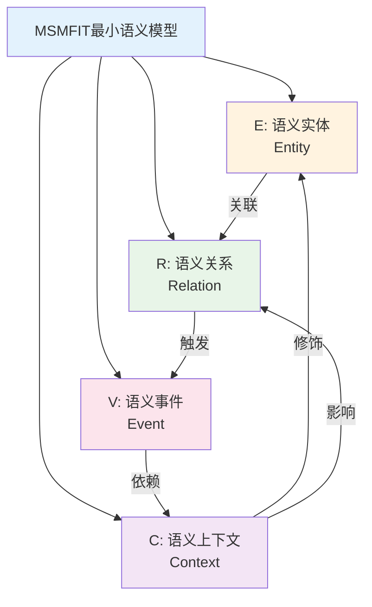
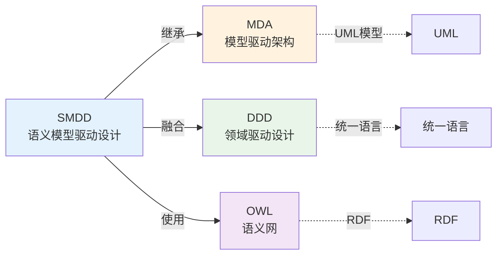
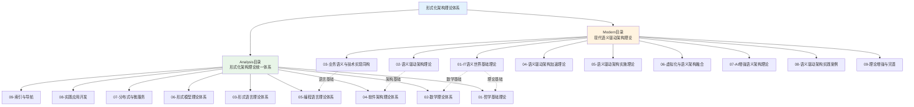
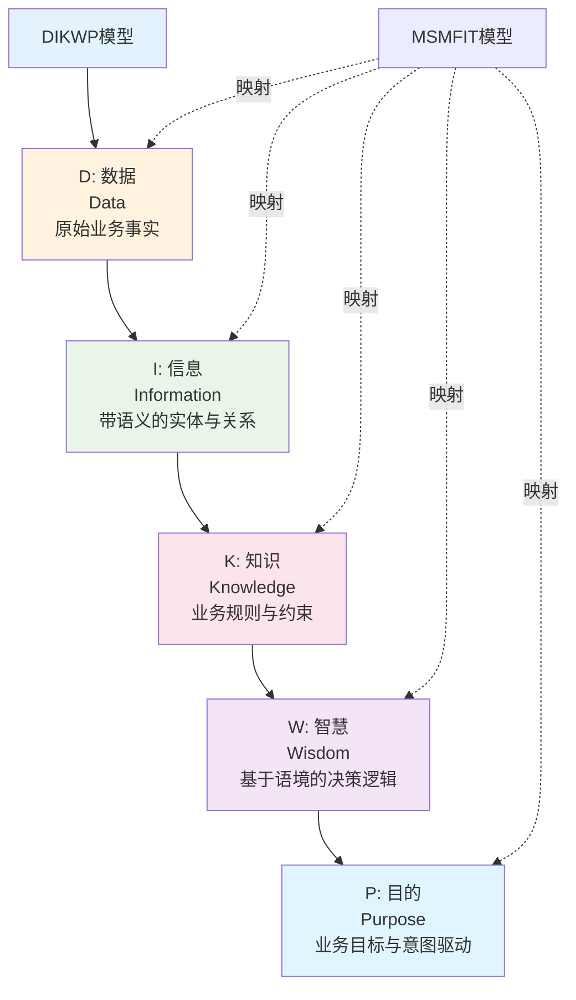
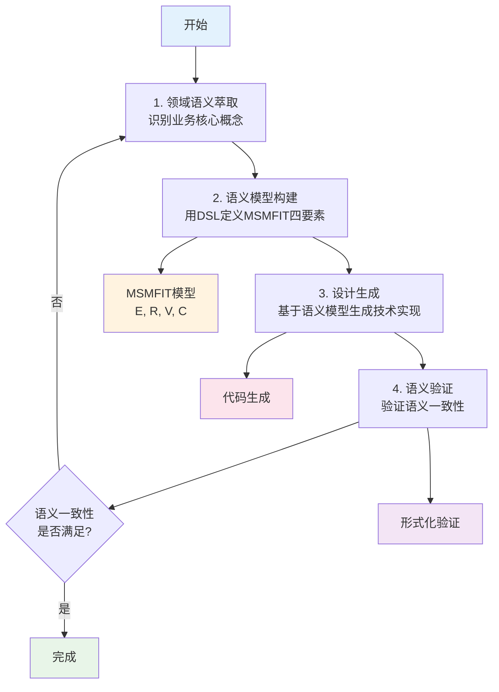
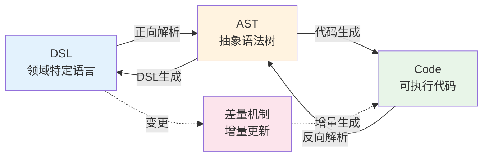
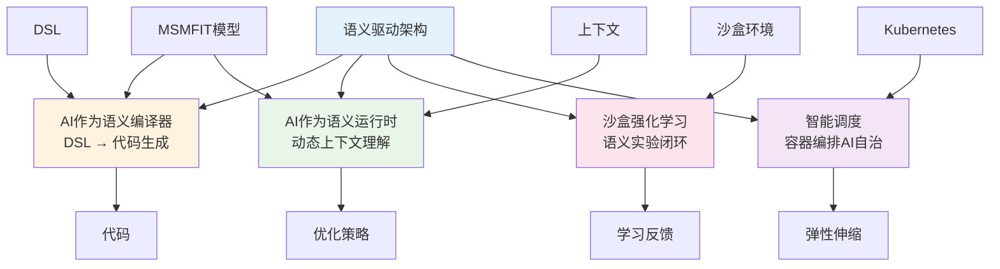
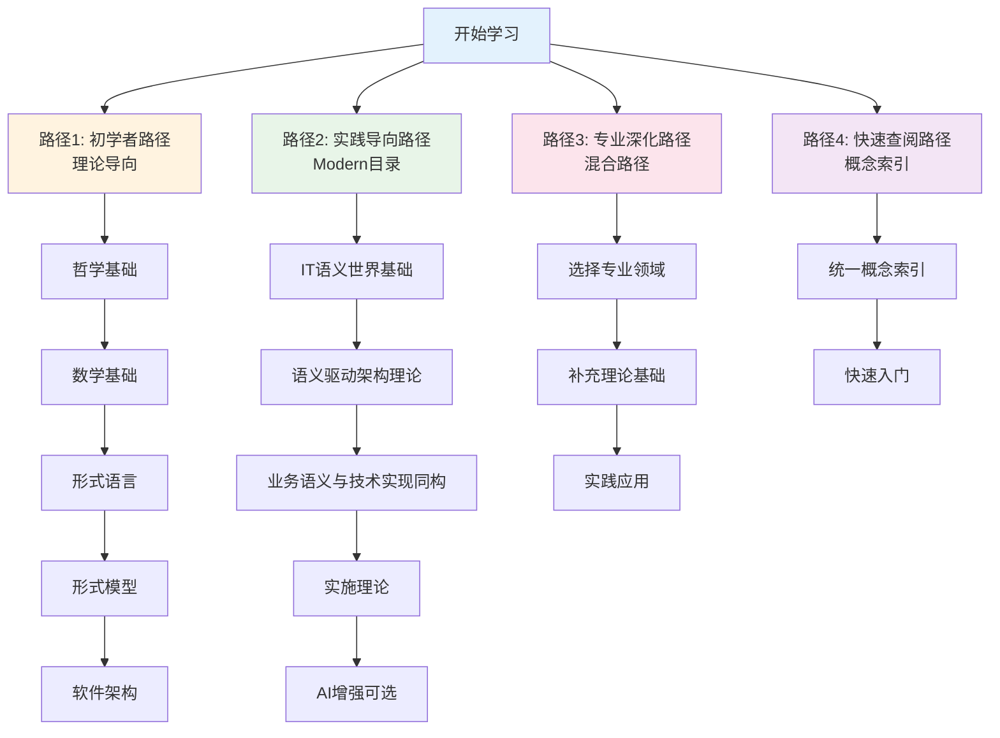
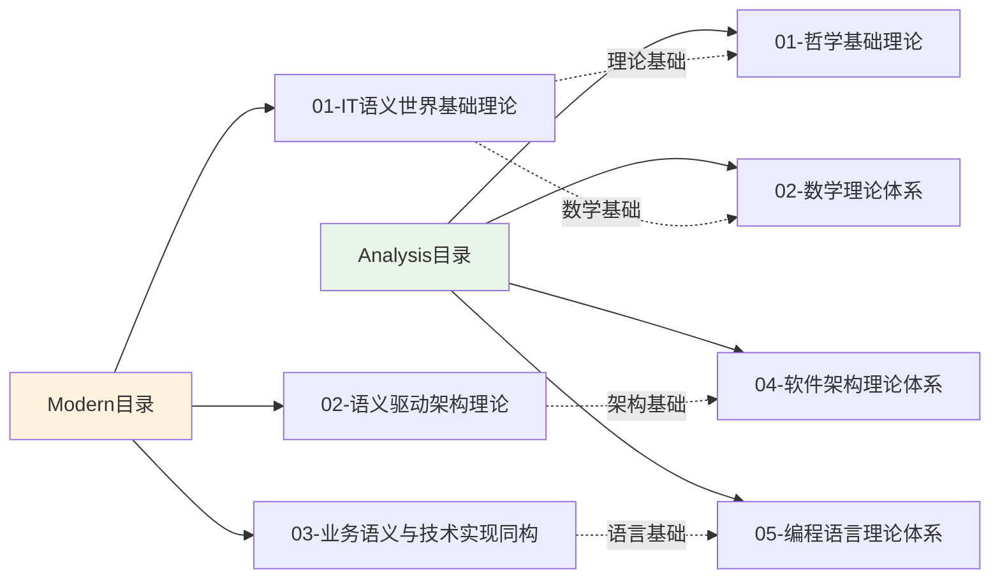

# 概念关系图

> **项目定位**：知识梳理与理论构建项目（非编程项目）
> **最后更新**：2025-02-02
> **用途**：可视化展示核心概念之间的关系和理论体系结构

## 一、MSMFIT四要素关系图

## 二、SMDD与相关理论对比图

## 三、理论体系层次结构图

## 四、DIKWP五层模型关系图

## 五、语义驱动架构设计流程

## 六、可逆计算转换流程

## 七、AI增强语义架构架构图

## 八、学习路径图

## 九、理论映射关系图

---

**文档版本**：v1.0
**最后更新**：2025-02-02
**维护状态**：✅ 持续更新中

**相关文档**：

- [统一概念索引](../00-统一概念索引.md)
- [学习路径推荐](./00-学习路径推荐.md)
- [概念索引与快速导航](./00-概念索引与快速导航.md)
