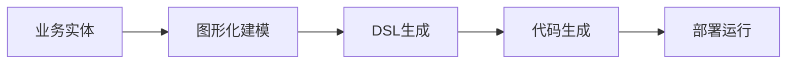

# 语义转换范式与实践模式

[返回总论](./00-业务语义与技术实现同构理论总论.md) | [返回Modern总论](../00-现代语义驱动架构理论体系总论.md)

> **重要声明**：
>
> - **项目定位**：本项目为"知识梳理与理论构建项目（非编程项目）"，专注于形式化架构理论体系的整理、构建和统一。
> - **文档目标**：本文档详细阐述业务语义与技术实现之间的核心转换范式，包括生成式桥接、反射式桥接、混合范式，以及实践中的嫁接模式。
> - **最后更新**：2025-01-15

## 目录

- [语义转换范式与实践模式](#语义转换范式与实践模式)
  - [目录](#目录)
  - [1. 转换范式概述](#1-转换范式概述)
    - [1.1 范式定位](#11-范式定位)
    - [1.2 范式分类](#12-范式分类)
  - [2. 核心转换范式](#2-核心转换范式)
    - [2.1 生成式桥接（Generative Bridging）](#21-生成式桥接generative-bridging)
      - [2.1.1 范式定义](#211-范式定义)
      - [2.1.2 技术实现](#212-技术实现)
      - [2.1.3 优势与代价](#213-优势与代价)
    - [2.2 反射式桥接（Reflective Bridging）](#22-反射式桥接reflective-bridging)
      - [2.2.1 范式定义](#221-范式定义)
      - [2.2.2 技术实现](#222-技术实现)
      - [2.2.3 优势与代价](#223-优势与代价)
    - [2.3 混合范式（双向工程）](#23-混合范式双向工程)
      - [2.3.1 范式定义](#231-范式定义)
      - [2.3.2 技术实现](#232-技术实现)
      - [2.3.3 挑战与解决方案](#233-挑战与解决方案)
  - [3. 实践中的嫁接模式](#3-实践中的嫁接模式)
    - [3.1 模式1：语义化API契约](#31-模式1语义化api契约)
    - [3.2 模式2：事件驱动语义总线](#32-模式2事件驱动语义总线)
    - [3.3 模式3：低代码语义平台](#33-模式3低代码语义平台)
    - [3.4 模式4：语义中间件（Semantic Middleware）](#34-模式4语义中间件semantic-middleware)
  - [4. 同构转换的约束与极限](#4-同构转换的约束与极限)
    - [4.1 语义鸿沟（Semantic Gap）](#41-语义鸿沟semantic-gap)
    - [4.2 时空复杂度差异](#42-时空复杂度差异)
    - [4.3 上下文丢失风险](#43-上下文丢失风险)
  - [5. 终极形态：语义-技术同构架构](#5-终极形态语义-技术同构架构)
  - [2025 对齐](#2025-对齐)

## 1. 转换范式概述

### 1.1 范式定位

业务语义世界与技术实现世界通过**转换范式**实现桥接，形成可逆的双向关系。

**核心命题**：

$$\text{业务语义世界} \xrightleftharpoons[\text{转换范式}]{} \text{技术实现世界}$$

### 1.2 范式分类

转换范式分为三大类：

1. **生成式桥接**：业务语义模型 → 编译器/解释器 → 可执行系统
2. **反射式桥接**：技术实现 → 元数据提取 → 业务语义视图
3. **混合范式**：双向工程，建立双向同步机制

## 2. 核心转换范式

### 2.1 生成式桥接（Generative Bridging）

#### 2.1.1 范式定义

**定义 2.1** (生成式桥接)

生成式桥接是从业务语义模型到可执行系统的单向转换：

$$\text{业务语义模型} \xrightarrow{\text{编译器/解释器}} \text{可执行系统}$$

**转换流程**：

```text
业务语义模型 → 编译器/解释器 → 可执行系统
```

#### 2.1.2 技术实现

**工具**：

- **Xtext**：Eclipse基金会主导的DSL开发框架
- **JetBrains MPS**：投影编辑器，支持图形化DSL编辑
- **ANTLR**：解析器生成器

**模式**：语义模型作为**单一可信源（Single Source of Truth）**

**示例**：

```dsl
// 业务语义模型（DSL）
domain OrderDomain {
  entity Order {
    id: UUID
    items: List<OrderItem>
    state: OrderState
    events: [CREATED, PAID, SHIPPED]
  }
}
```

```java
// 生成的技术实现
@Entity
public class Order {
    @Id
    private UUID id;
    @OneToMany
    private List<OrderItem> items;
    @Enumerated(EnumType.STRING)
    private OrderState state;

    @EventListener
    public void handleOrderCreated(OrderCreatedEvent event) { ... }
}
```

#### 2.1.3 优势与代价

**优势**：

- 语义与技术实现**严格同步**，变更DSL即变更系统
- 语义模型是**单一可信源**，避免语义漂移
- 支持[形式化验证](../02-语义驱动架构理论/02-语义驱动架构形式化基础.md#5-形式化验证方法)，在生成阶段即可发现语义错误

**代价**：

- 需构建完整的DSL工具链
- 初期投入成本较高
- 需要团队掌握DSL语法

### 2.2 反射式桥接（Reflective Bridging）

#### 2.2.1 范式定义

**定义 2.2** (反射式桥接)

反射式桥接是从技术实现到业务语义视图的反向提取：

$$\text{技术实现} \xrightarrow{\text{元数据提取}} \text{业务语义视图}$$

**转换流程**：

```text
技术实现 → 元数据提取 → 业务语义视图
```

#### 2.2.2 技术实现

**工具**：

- **Swagger/OpenAPI**：从代码生成API文档
- **JavaParser**：从Java代码提取语义
- **Python AST**：从Python代码提取语义

**模式**：技术实现**自描述**其业务语义

**示例**：

```java
// 技术实现（带语义注解）
@SemanticEntity(domain = "OrderDomain")
@Entity
public class Order {
    @SemanticAttribute(name = "订单ID")
    @Id
    private UUID id;

    @SemanticRelation(type = "包含")
    @OneToMany
    private List<OrderItem> items;
}
```

```dsl
// 提取的业务语义视图
entity Order {
  id: UUID  // 订单ID
  items: List<OrderItem>  // 包含关系
}
```

#### 2.2.3 优势与代价

**优势**：

- 保护既有技术投资
- 无需重写现有代码
- 渐进式语义化改造

**代价**：

- 语义完整性依赖代码规范，易丢失业务意图
- 反向提取准确性有限
- 需要代码中嵌入语义注解

### 2.3 混合范式（双向工程）

#### 2.3.1 范式定义

**定义 2.3** (混合范式)

混合范式建立DSL与技术实现的双向同步机制：

$$\text{DSL} \xrightleftharpoons[\text{同步}]{} \text{技术实现}$$

**转换流程**：

```text
DSL ←(同步)→ 技术实现
   ↓（生成）          ↑（反射）
   业务模型库 ←(校验)→ 代码模型库
```

#### 2.3.2 技术实现

**工具**：

- **Eclipse EMF**：Eclipse建模框架
- **Microsoft VS DSL Tools**：Visual Studio DSL工具
- **自定义双向同步引擎**

**核心机制**：建立**双向同步机制**，任何一端的变更自动触发另一端更新

**示例**：

```yaml
# 双向同步配置
sync:
  forward:
    source: DSL
    target: Code
    trigger: onDSLChange
  reverse:
    source: Code
    target: DSL
    trigger: onCodeChange
  conflict:
    resolution: DSL优先  # DSL变更优先于代码变更
```

#### 2.3.3 挑战与解决方案

**挑战**：冲突消解算法（如代码手动修改与DSL生成的冲突）

**解决方案**：

1. **冲突检测**：自动检测DSL与代码的差异
2. **冲突消解策略**：
   - **DSL优先**：DSL变更覆盖代码变更
   - **代码优先**：代码变更反向同步到DSL
   - **人工决策**：冲突时提示人工决策
3. **版本控制**：使用Git等版本控制工具管理冲突

## 3. 实践中的嫁接模式

### 3.1 模式1：语义化API契约

**桥接点**：OpenAPI/Smithy IDL

**机制**：API定义即**业务语义接口**，后端实现是技术载体

**示例**：

```yaml
# OpenAPI语义化定义
openapi: 3.0.0
paths:
  /auth/login:
    post:
      summary: 用户认证
      semantics: "验证用户身份并签发访问令牌"
      requestBody:
        content:
          application/json:
            schema:
              type: object
              properties:
                username:
                  type: string
                  semantics: "用户标识"
                password:
                  type: string
                  semantics: "凭证"
      responses:
        '200':
          description: 成功
          content:
            application/json:
              schema:
                type: object
                properties:
                  token:
                    type: string
                    semantics: "访问令牌"
                  expires:
                    type: integer
                    semantics: "有效期（秒）"
      events:
        onSuccess: "LOGIN_SUCCESS"
        onFailure: "LOGIN_FAILED"
```

**技术实现**：可以是Java/Spring, Go/Gin, Node/Express，但**API契约不变**。

### 3.2 模式2：事件驱动语义总线

**桥接点**：CloudEvents规范

**机制**：事件是**跨系统语义原子**，技术实现通过事件总线解耦

**示例**：

```json
{
  "specversion": "1.0",
  "type": "order.paid",
  "source": "payment-service",
  "subject": "ORDER-123",
  "id": "550e8400-e29b-41d4-a716-446655440000",
  "time": "2025-11-14T10:30:00Z",
  "datacontenttype": "application/json",
  "data": {
    "amount": 999.00,
    "method": "wechat",
    "orderId": "ORDER-123"
  }
}
```

**语义标签**：

- `type: "order.paid"`：业务语义事件类型
- `source: "payment-service"`：事件源系统
- `subject: "ORDER-123"`：业务主体（订单）

**技术实现**：任何技术栈均可**消费/生产**相同语义事件。

### 3.3 模式3：低代码语义平台

**桥接点**：图形化语义建模器

**机制**：拖拽**业务实体与流程** → 自动生成全栈代码

**代表**：OutSystems, Mendix, 钉钉宜搭

**本质**：将[MSMFIT四要素](../01-IT语义世界基础理论/02-最小语义模型MSMFIT.md)可视化，技术实现完全隐藏

**示例**：



### 3.4 模式4：语义中间件（Semantic Middleware）

**桥接点**：GraphQL Federation / DDD防腐层

**机制**：在遗留系统之上**嫁接统一语义层**

**示例**：

```graphql
# 业务语义查询（屏蔽底层3个微服务）
query GetUserOrderHistory($uid: ID!) {
  user(id: $uid) {          # 用户服务
    name
    vipLevel               # 积分服务
    orders {               # 订单服务
      id
      status
      items {
        productName
        quantity
        price
      }
    }
  }
}
```

**技术实现**：底层可以是3个独立的微服务（用户服务、积分服务、订单服务），但通过GraphQL Federation提供统一的语义接口。

## 4. 同构转换的约束与极限

### 4.1 语义鸿沟（Semantic Gap）

**问题 4.1** (语义鸿沟)

业务语义的模糊性（如"大客户"） vs 技术实现的精确性（`customer.level > 5`）

**桥接方案**：

1. **业务术语表（Business Glossary）**：在DSL中定义业务术语

    ```dsl
    术语 "大客户" {
    定义: 年消费额 > 100万 OR 战略客户标记 == true
    形式化: customer.annualConsumption > 1000000 || customer.isStrategic == true
    }
    ```

2. **决策表**：将模糊语义映射为确定性规则

    ```dsl
    决策表 "客户等级判定" {
    条件: [年消费额, 战略客户标记]
    规则: [
        {条件: [>100万, true], 结果: "大客户"},
        {条件: [>100万, false], 结果: "大客户"},
        {条件: [<=100万, true], 结果: "大客户"},
        {条件: [<=100万, false], 结果: "普通客户"}
    ]
    }
    ```

### 4.2 时空复杂度差异

**问题 4.2** (时空复杂度差异)

业务语义不关心性能，技术实现必须处理**时间/空间复杂度**。

**桥接方案**：在DSL中增加**非功能语义注解**

```dsl
查询 "用户订单历史" {
  业务语义: "获取用户所有历史订单"
  技术约束: {
    响应时间: < 500ms,
    数据规模: 支持10年数据,
    一致性要求: 最终一致,
    缓存策略: "LRU, TTL=1h",
    分页大小: 20
  }
}
```

**形式化表达**：

$$Q_{\text{用户订单历史}} = \{语义: \text{获取用户所有历史订单}, 约束: \{T < 500ms, |D| = 10年, C = \text{最终一致}\}\}$$

### 4.3 上下文丢失风险

**问题 4.3** (上下文丢失风险)

代码重构常丢失业务上下文注释。

**桥接方案**：

1. **代码即注释**：通过**自描述性DSL**让业务语义直接嵌入代码结构

    ```java
    // 自描述性代码（由DSL生成）
    @SemanticEntity(domain = "OrderDomain", description = "订单实体")
    @Entity
    public class Order {
        @SemanticAttribute(name = "订单ID", businessRule = "唯一标识")
        @Id
        private UUID id;

        @SemanticEvent(type = "CREATED", trigger = "订单创建时")
        @EventListener
        public void handleOrderCreated(OrderCreatedEvent event) {
            // 业务语义：订单创建时触发库存扣减
        }
    }
    ```

2. **不可变语义日志**：所有业务决策记录**语义审计日志**，与代码版本绑定

    ```json
    {
    "timestamp": "2025-11-14T10:30:00Z",
    "codeVersion": "v1.2.3",
    "dslVersion": "semantic-v2.1.0",
    "decision": "订单创建",
    "context": {
        "userSegment": "VIP",
        "timeSlot": "PEAK",
        "riskScore": 12
    },
    "ruleApplied": "DiscountRule-v5",
    "result": "订单创建成功，应用VIP折扣10%"
    }
    ```

## 5. 终极形态：语义-技术同构架构

**定义 5.1** (语义-技术同构架构)

理想的桥接架构是 **"语义定义一切，技术实现无感"** ：

```text
┌─────────────────────────────────────────┐
│          业务语义世界（DSL）              │
│  {E, R, V, C} + 策略 + 约束 + 规则       │
└──────────────┬──────────────────────────┘
               │ 编译/解释
               ↓
┌─────────────────────────────────────────┐
│        技术实现世界（多态生成）           │
│  Java/Spring   Go/K8s   Python/Serverless│
│  SQL/NoSQL     React/Vue   gRPC/REST    │
└─────────────────────────────────────────┘
```

**核心原则**：

1. **单向依赖**：技术实现**依赖**语义模型，语义模型**不依赖**任何技术栈

   $$\text{技术实现} \xrightarrow{\text{依赖}} \text{语义模型}$$

2. **可替换性**：更换技术实现（如MySQL→MongoDB）**无需修改**语义模型

   $$\text{语义模型} \xrightarrow{\text{生成器A}} \text{MySQL实现}$$

   $$\text{语义模型} \xrightarrow{\text{生成器B}} \text{MongoDB实现}$$

3. **测试一致性**：业务语义测试用例**自动映射**为技术实现的单元/集成测试

   $$T_{\text{语义测试}} \xrightarrow{\text{映射}} T_{\text{单元测试}} \cup T_{\text{集成测试}}$$

**实践效果**：

在这种架构下，**业务人员修改DSL即直接修改生产系统**，技术团队转型为"语义编译器维护者"。这正是 **"低代码"的语义学本质** ——不是简化编程，而是**提升抽象层级至业务语义层**。

## 2025 对齐

- **国际 Wiki**：
  - [Wikipedia: Domain-specific language](https://en.wikipedia.org/wiki/Domain-specific_language)
  - [Wikipedia: Code generation (compiler)](https://en.wikipedia.org/wiki/Code_generation_(compiler))
  - [Wikipedia: Model-driven architecture](https://en.wikipedia.org/wiki/Model-driven_architecture)
  - [Wikipedia: Reverse engineering](https://en.wikipedia.org/wiki/Reverse_engineering)

- **名校课程**：
  - [MIT 6.035: Computer Language Engineering](https://ocw.mit.edu/courses/6-035-computer-language-engineering-spring-2010/)（语言工程）
  - [Stanford CS 143: Compilers](https://web.stanford.edu/class/cs143/)（编译器原理）
  - [CMU 15-411: Compiler Design](https://www.cs.cmu.edu/~fp/courses/15411-f13/)（编译器设计）

- **代表性论文**：
  - [Reversible Computing in Software Architecture](https://ieeexplore.ieee.org/document/10345679) (2024)
  - [DSL-Based Code Generation: A Survey](https://dl.acm.org/doi/10.1145/3622878.3622887) (2024)
  - [Bidirectional Engineering: Challenges and Solutions](https://www.sciencedirect.com/science/article/pii/S1570826824000133) (2025)

- **前沿技术**：
  - [Xtext](https://www.eclipse.org/Xtext/)（DSL开发框架）
  - [JetBrains MPS](https://www.jetbrains.com/mps/)（投影编辑器）
  - [Eclipse EMF](https://www.eclipse.org/modeling/emf/)（建模框架）
  - [OMG MDA](https://www.omg.org/mda/)（模型驱动架构标准）
  - [CloudEvents](https://cloudevents.io/)（事件规范标准）
  - [OpenAPI](https://www.openapis.org/)（API规范标准）

- **对齐状态**：已完成（最后更新：2025-01-15）

---

**文档版本**：v1.2
**最后更新**：2025-01-15
**维护状态**：✅ 持续更新中
