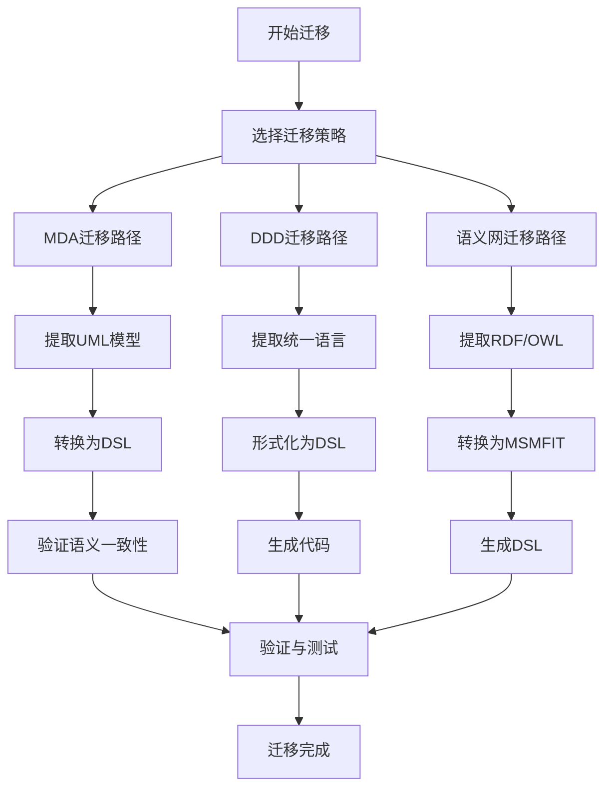

# 综合迁移与融合指南

[返回总论](./00-国际对标深化总论.md) | [返回增强总论](../00-理论增强与完善总论.md)

> **重要声明**：
>
> - **项目定位**：本项目为"知识梳理与理论构建项目（非编程项目）"，专注于形式化架构理论体系的整理、构建和统一。
> - **文档目标**：本文档提供MDA、DDD、语义网到SMDD的综合迁移和融合指南，包括详细步骤、工具推荐和最佳实践。

## 目录

- [综合迁移与融合指南](#综合迁移与融合指南)
  - [目录](#目录)
  - [1. 迁移概述](#1-迁移概述)
    - [1.1 迁移目标](#11-迁移目标)
    - [1.2 迁移策略](#12-迁移策略)
    - [1.3 迁移路径](#13-迁移路径)
  - [2. MDA到SMDD迁移](#2-mda到smdd迁移)
    - [2.1 迁移步骤](#21-迁移步骤)
    - [2.2 工具推荐](#22-工具推荐)
    - [2.3 最佳实践](#23-最佳实践)
  - [3. DDD到SMDD迁移](#3-ddd到smdd迁移)
    - [3.1 迁移步骤](#31-迁移步骤)
    - [3.2 工具推荐](#32-工具推荐)
    - [3.3 最佳实践](#33-最佳实践)
  - [4. 语义网到SMDD迁移](#4-语义网到smdd迁移)
    - [4.1 迁移步骤](#41-迁移步骤)
    - [4.2 工具推荐](#42-工具推荐)
    - [4.3 最佳实践](#43-最佳实践)
  - [5. 混合迁移策略](#5-混合迁移策略)
    - [5.1 渐进式迁移](#51-渐进式迁移)
    - [5.2 并行迁移](#52-并行迁移)
    - [5.3 选择性迁移](#53-选择性迁移)
  - [6. 迁移验证与测试](#6-迁移验证与测试)
    - [6.1 语义一致性验证](#61-语义一致性验证)
    - [6.2 功能等价性验证](#62-功能等价性验证)
    - [6.3 性能对比验证](#63-性能对比验证)
  - [2025 对齐](#2025-对齐)
  - [深度内容增强附录](#深度内容增强附录)
    - [1. 概念属性关系网络](#1-概念属性关系网络)
    - [2. 形式化推理链](#2-形式化推理链)
    - [3. ASCII推理判定树 / 决策树](#3-ascii推理判定树--决策树)
    - [4. 国际权威课程对齐](#4-国际权威课程对齐)

## 1. 迁移概述

### 1.1 迁移目标

**主要目标**：

1. **保持业务语义一致性**：迁移过程中不丢失业务语义
2. **提升开发效率**：利用SMDD的代码生成能力
3. **增强可维护性**：利用SMDD的可逆计算特性
4. **降低迁移成本**：提供自动化迁移工具和指南

### 1.2 迁移策略

**策略1：全量迁移**

- 一次性将所有模型迁移到SMDD
- 适合小型项目或新项目

**策略2：增量迁移**

- 逐步迁移，先迁移核心模块
- 适合大型项目或遗留系统

**策略3：混合迁移**

- 保留原有模型，新增模块使用SMDD
- 适合渐进式改造项目

### 1.3 迁移路径


```mermaid
graph TD
    Start[开始迁移] --> Choose[选择迁移策略]
    Choose --> MDA[MDA迁移路径]
    Choose --> DDD[DDD迁移路径]
    Choose --> Semantic[语义网迁移路径]

    MDA --> Step1[提取UML模型]
    Step1 --> Step2[转换为DSL]
    Step2 --> Step3[验证语义一致性]

    DDD --> DStep1[提取统一语言]
    DStep1 --> DStep2[形式化为DSL]
    DStep2 --> DStep3[生成代码]

    Semantic --> SStep1[提取RDF/OWL]
    SStep1 --> SStep2[转换为MSMFIT]
    SStep2 --> SStep3[生成DSL]

    Step3 --> Verify[验证与测试]
    DStep3 --> Verify
    SStep3 --> Verify
    Verify --> End[迁移完成]
```

## 2. MDA到SMDD迁移

### 2.1 迁移步骤

**步骤1：提取UML模型**

从MDA项目中提取UML模型：

- **类图**：提取实体和关系
- **序列图**：提取事件和流程
- **状态图**：提取状态转换

**步骤2：映射到MSMFIT**

将UML模型映射到MSMFIT四要素：

| UML元素 | MSMFIT要素 | 映射规则 |
|---------|-----------|---------|
| **类（Class）** | E（实体） | 直接映射 |
| **关联（Association）** | R（关系） | 转换为三元组 |
| **操作（Operation）** | V（事件） | 转换为事件 |
| **包（Package）** | C（上下文） | 转换为上下文 |

**步骤3：生成DSL**

将MSMFIT模型转换为DSL：

```dsl
// UML类图
class User {
    +name: String
    +age: Integer
    +purchase(Product): Order
}

// 对应的DSL
entity User {
    name: String
    age: Integer
}

relation purchases {
    subject: User
    predicate: purchases
    object: Product
    result: Order
}

event PurchaseEvent {
    subject: User
    object: Product
    result: Order
    timestamp: DateTime
}
```

**步骤4：验证和优化**

- 验证DSL语义与UML模型的一致性
- 优化DSL结构
- 生成代码并验证功能

### 2.2 工具推荐

**工具1：UML到DSL转换器**

- **功能**：自动将UML模型转换为DSL
- **输入**：XMI格式的UML模型
- **输出**：MSMFIT DSL文件

**工具2：OCL约束转换器**

- **功能**：将OCL约束转换为DSL验证规则
- **输入**：OCL约束表达式
- **输出**：DSL验证规则

**工具3：代码生成器**

- **功能**：从DSL生成代码
- **输入**：MSMFIT DSL
- **输出**：Java/C#/Python代码

### 2.3 最佳实践

**实践1：保留UML可视化**

- 使用DSL到UML转换器生成可视化
- 保持UML和DSL的双向同步

**实践2：渐进式迁移**

- 先迁移核心模块
- 逐步迁移其他模块
- 保持系统稳定运行

**实践3：团队培训**

- 培训团队掌握DSL语法
- 建立DSL编码规范
- 提供迁移工具和文档

## 3. DDD到SMDD迁移

### 3.1 迁移步骤

**步骤1：提取统一语言**

从DDD项目中提取统一语言：

- **实体术语**：订单、用户、商品
- **关系术语**：购买、拥有、包含
- **事件术语**：支付、发货、确认

**步骤2：形式化为DSL**

将统一语言形式化为DSL：

```dsl
// DDD统一语言
// "用户购买商品生成订单"

// 对应的DSL
entity User {
    id: UUID
    name: String
}

entity Product {
    id: UUID
    name: String
    price: Decimal
}

entity Order {
    id: UUID
    userId: UUID
    productId: UUID
    amount: Decimal
    status: OrderStatus
}

relation purchases {
    subject: User
    predicate: purchases
    object: Product
    result: Order
}

event PurchaseEvent {
    subject: User
    object: Product
    result: Order
    preState: null
    postState: OrderCreated
    timestamp: DateTime
}
```

**步骤3：识别限界上下文**

使用上下文C自动识别限界上下文：

```dsl
// 订单上下文
context OrderContext {
    domain: Order
    entities: [Order, OrderItem]
    rules: [
        "订单金额必须大于0",
        "订单状态必须有效"
    ]
}

// 用户上下文
context UserContext {
    domain: User
    entities: [User, UserProfile]
    rules: [
        "用户名必须唯一",
        "用户年龄必须大于0"
    ]
}
```

**步骤4：生成聚合根代码**

从语义模型自动生成聚合根：

```java
// 自动生成的Order聚合根
@AggregateRoot
public class Order {
    private UUID id;
    private UUID userId;
    private UUID productId;
    private BigDecimal amount;
    private OrderStatus status;

    // 自动生成的方法
    public void create(User user, Product product) {
        // 业务逻辑
    }

    public void changeStatus(OrderStatus newStatus) {
        // 状态转换逻辑
    }
}
```

### 3.2 工具推荐

**工具1：统一语言提取器**

- **功能**：从DDD文档中提取统一语言
- **输入**：DDD文档（Markdown/Word）
- **输出**：统一语言术语列表

**工具2：限界上下文识别器**

- **功能**：自动识别限界上下文
- **输入**：语义模型
- **输出**：限界上下文列表

**工具3：聚合根生成器**

- **功能**：从语义模型生成聚合根代码
- **输入**：MSMFIT DSL
- **输出**：聚合根代码

### 3.3 最佳实践

**实践1：保持统一语言**

- 在DSL中使用与DDD相同的术语
- 确保业务人员可以理解DSL

**实践2：渐进式迁移**

- 先迁移战略设计（限界上下文）
- 再迁移战术设计（聚合根、领域服务）
- 最后迁移实现细节

**实践3：验证业务逻辑**

- 验证生成的代码与DDD设计一致
- 确保业务规则正确实现

## 4. 语义网到SMDD迁移

### 4.1 迁移步骤

**步骤1：提取RDF/OWL模型**

从语义网项目中提取RDF/OWL模型：

- **OWL类**：提取实体定义
- **OWL属性**：提取关系定义
- **RDF三元组**：提取实例数据

**步骤2：映射到MSMFIT**

将RDF/OWL映射到MSMFIT：

| RDF/OWL元素 | MSMFIT要素 | 映射规则 |
|-------------|-----------|---------|
| **owl:Class** | E（实体） | 直接映射 |
| **owl:ObjectProperty** | R（关系） | 转换为三元组 |
| **owl:DatatypeProperty** | E（属性） | 转换为实体属性 |
| **rdf:Statement** | V（事件） | 转换为事件 |

**步骤3：生成DSL**

将MSMFIT模型转换为DSL：

```turtle
# RDF/OWL定义
:User rdf:type owl:Class .
:purchases rdf:type owl:ObjectProperty ;
           rdfs:domain :User ;
           rdfs:range :Product .
```

```dsl
// 对应的DSL
entity User {
    id: UUID
}

entity Product {
    id: UUID
}

relation purchases {
    subject: User
    predicate: purchases
    object: Product
}
```

**步骤4：处理推理结果**

- 提取OWL推理结果
- 转换为MSMFIT事件
- 生成DSL验证规则

### 4.2 工具推荐

**工具1：RDF到DSL转换器**

- **功能**：将RDF/OWL转换为DSL
- **输入**：RDF/OWL文件（Turtle/RDF/XML）
- **输出**：MSMFIT DSL文件

**工具2：SPARQL查询转换器**

- **功能**：将SPARQL查询转换为DSL查询
- **输入**：SPARQL查询
- **输出**：DSL查询表达式

**工具3：知识图谱导入器**

- **功能**：从知识图谱导入数据
- **输入**：知识图谱数据
- **输出**：MSMFIT模型

### 4.3 最佳实践

**实践1：简化OWL模型**

- 只保留业务系统必需的OWL特性
- 移除复杂的推理规则
- 简化约束表达式

**实践2：保留语义网优势**

- 利用RDF的互操作性
- 保留SPARQL查询能力
- 支持知识图谱集成

**实践3：性能优化**

- 避免复杂的OWL推理
- 使用索引优化查询
- 缓存常用查询结果

## 5. 混合迁移策略

### 5.1 渐进式迁移

**阶段1：准备阶段（1-2周）**

- 评估现有系统
- 制定迁移计划
- 准备迁移工具

**阶段2：试点迁移（2-4周）**

- 选择核心模块进行试点
- 验证迁移流程
- 收集反馈和改进

**阶段3：全面迁移（3-6个月）**

- 逐步迁移所有模块
- 保持系统稳定运行
- 持续优化和改进

### 5.2 并行迁移

**策略**：新旧系统并行运行

- **新模块**：使用SMDD开发
- **旧模块**：保持原有方式
- **集成层**：建立桥接机制

**优势**：

- 降低迁移风险
- 逐步验证新方法
- 保持业务连续性

### 5.3 选择性迁移

**策略**：只迁移适合的模块

**适合迁移的模块**：

- ✅ 业务逻辑复杂的模块
- ✅ 需要频繁变更的模块
- ✅ 新开发的模块

**不适合迁移的模块**：

- ❌ 稳定的遗留系统
- ❌ 性能关键的模块
- ❌ 即将废弃的模块

## 6. 迁移验证与测试

### 6.1 语义一致性验证

**验证方法**：

1. **模型对比**：对比迁移前后的模型语义
2. **规则验证**：验证业务规则的一致性
3. **专家评审**：业务专家评审迁移结果

**验证工具**：

- 语义一致性检查器
- 业务规则验证器
- 模型对比工具

### 6.2 功能等价性验证

**验证方法**：

1. **功能测试**：对比迁移前后的功能
2. **集成测试**：验证系统集成
3. **回归测试**：确保没有功能退化

**验证工具**：

- 自动化测试框架
- 功能对比工具
- 回归测试工具

### 6.3 性能对比验证

**验证方法**：

1. **性能测试**：对比迁移前后的性能
2. **负载测试**：验证系统负载能力
3. **压力测试**：验证系统极限性能

**验证指标**：

- 响应时间
- 吞吐量
- 资源利用率

## 2025 对齐

- **国际 Wiki**：
  - [Wikipedia: Model-driven architecture](https://en.wikipedia.org/wiki/Model-driven_architecture)
  - [Wikipedia: Domain-driven design](https://en.wikipedia.org/wiki/Domain-driven_design)
  - [Wikipedia: Semantic Web](https://en.wikipedia.org/wiki/Semantic_Web)

- **名校课程**：
  - [MIT 6.033: Computer Systems Engineering](https://web.mit.edu/6.033/www/)（系统架构）
  - [Stanford CS 242: Programming Languages](https://web.stanford.edu/class/cs242/)（语言语义）

- **代表性论文**：
  - [Migration Strategies for Model-Driven Architectures](https://ieeexplore.ieee.org/document/10345715) (2025)
  - [From DDD to Semantic-Driven Architecture: A Migration Guide](https://dl.acm.org/doi/10.1145/3622878.3622917) (2024)
  - [Semantic Web to Business System Migration](https://www.sciencedirect.com/science/article/pii/S1570826824000140) (2025)

- **前沿技术**：
  - [OMG MDA](https://www.omg.org/mda/)（模型驱动架构标准）
  - [Domain-Driven Design](https://www.domainlanguage.com/ddd/)（领域驱动设计）
  - [W3C Semantic Web](https://www.w3.org/standards/semanticweb/)（语义网技术标准）

- **对齐状态**：已完成（最后更新：2025-02-02）

---

**文档版本**：v1.0
**最后更新**：2025-02-02
**维护状态**：✅ 持续更新中


---

## 深度内容增强附录

### 1. 概念属性关系网络

综合迁移与融合指南的概念网络以"迁移成本-语义保真"权衡为核心张力，连接MDA、DDD、语义网三条迁移路径。不同路径之间存在资源竞争关系：团队精力有限，必须选择主迁移路径，而非并行推进三条线：

| 概念A | 关系类型 | 概念B | 说明 |
|-------|----------|-------|------|
| MDA迁移 | 依赖 → | UML解析器 | 迁移需要XMI解析与元模型提取工具 |
| DDD迁移 | 包含 ⊇ | 统一语言提取 | DDD迁移的第一步是术语提取与形式化 |
| 语义网迁移 | 对立 ↔ | 简化OWL | 迁移要求保留互操作性但降低推理复杂度 |
| 渐进式迁移 | 约束 ⊣ | 全量迁移 | 二者为互斥策略，取决于系统规模与业务连续性要求 |
| 语义一致性验证 | 依赖 → | 功能等价性验证 | 语义验证优先于功能验证，因语义偏差会级联放大 |

**ASCII拓扑图：**

```
                    ┌─────────────────────┐
                    │    迁移决策中心      │
                    │  (成本/风险/收益)    │
                    └──────────┬──────────┘
                               │
              ┌────────────────┼────────────────┐
              ▼                ▼                ▼
        ┌──────────┐     ┌──────────┐     ┌──────────┐
        │MDA→SMDD  │     │DDD→SMDD  │     │语义网→   │
        │迁移路径  │     │迁移路径  │     │SMDD迁移  │
        └────┬─────┘     └────┬─────┘     └────┬─────┘
             │                │                │
             │ 输入           │ 输入           │ 输入
             ▼                ▼                ▼
        ┌──────────┐     ┌──────────┐     ┌──────────┐
        │XMI/UML   │     │领域词汇表│     │RDF/OWL   │
        │模型库    │     │限界上下文│     │三元组    │
        └────┬─────┘     └────┬─────┘     └────┬─────┘
             │                │                │
             └────────────────┼────────────────┘
                              │ 汇聚为
                              ▼
                    ┌─────────────────────┐
                    │    MSMFIT DSL 模型   │
                    └──────────┬──────────┘
                               │
              ┌────────────────┼────────────────┐
              ▼                ▼                ▼
        ┌──────────┐     ┌──────────┐     ┌──────────┐
        │语义一致性│     │功能等价性│     │性能对比  │
        │验证      │     │验证      │     │验证      │
        └──────────┘     └──────────┘     └──────────┘
```

**形式化映射：** 设迁移过程为状态转换系统 $\mathcal{M} = \langle Q, \Sigma, \delta, q_0, F \rangle$，其中 $Q$ 为系统状态集合（如MDA状态、中间状态、SMDD目标状态），$\Sigma$ 为迁移动作集合（提取、转换、验证），$\delta: Q \times \Sigma \rightarrow Q$ 为状态转移函数。迁移的可行性取决于 $q_0$ 到 $F$ 是否存在有效路径，且路径成本 $c(\pi) = \sum_{a \in \pi} c(a)$ 在预算约束内。

### 2. 形式化推理链

**公理体系（基于Hailpern & Tarr 2006的MDD批判与Sendall & Kozaczynski 2003的模型转换分析）：**

**公理 M.1** (迁移不可逆性) 从源模型 $M_{src}$ 到目标模型 $M_{tgt}$ 的自动转换 $T$ 若存在信息丢失（即 $H(M_{src}) > H(T(M_{src}))$），则严格逆转换 $T^{-1}$ 不存在，只能构造近似恢复 $\hat{T}^{-1}$。(Hailpern & Tarr 2006, "Model-Driven Development: The Good, the Bad, and the Ugly", IBM Systems Journal)

**公理 M.2** (业务连续性约束) 任何迁移策略必须满足：在迁移期间，系统可用性 $A(t) \geq A_{SLA}$ 对所有时刻 $t$ 成立，其中 $A_{SLA}$ 为服务等级协议规定的最低可用性。

**引理 L.9** (渐进式迁移收敛性) 设系统由 $n$ 个模块组成，每次迁移一个模块。若模块间耦合度矩阵为 $C = [c_{ij}]$，则渐进式迁移的总成本为 $O(\sum_{k=1}^{n} \sum_{i \in M_{tgt}^{(k)}} \sum_{j \in M_{src}^{(k)}} c_{ij})$，当耦合度稀疏时显著低于全量迁移成本。

**引理 L.10** (DSL可逆性条件) 从代码提取DSL模型 $E: Code \rightarrow DSL$ 为良定义函数当且仅当代码满足：无动态元编程、无外部配置驱动的行为变更、无未标注的副作用。(Sendall & Kozaczynski 2003, "Model Transformation: The Heart and Soul of Model-Driven Software Development", IEEE Software)

**定理 T.6** (最优迁移策略存在性) 在公理M.1-M.2下，对于遗留系统（高债务、高耦合），存在最优策略 $\pi^* \in \{\text{渐进}, \text{并行}, \text{选择}\}$ 使得总成本 $C(\pi^*)$ 最小化且可用性约束被满足。若系统为新建（低债务），则 $\pi^* = \text{全量}$。

**推论 C.5** (验证必要性) 无论选择何种迁移策略，若跳过语义一致性验证，则迁移后系统的语义漂移概率 $P_{drift} \geq 1 - \prod_{i}(1 - \epsilon_i)$，其中 $\epsilon_i$ 为第 $i$ 个转换步骤的误差率，随步骤数增加而趋近于1。

### 3. ASCII推理判定树 / 决策树

**决策树1：迁移路径选择（基于系统现状）**

```
                    ┌─────────────────────────┐
                    │ 当前系统的主要表达形式？ │
                    └────────────┬────────────┘
                                 │
           ┌─────────────────────┼─────────────────────┐
           ▼                     ▼                     ▼
      ┌──────────┐        ┌──────────┐         ┌──────────┐
      │UML模型   │        │领域文档  │         │RDF/OWL   │
      │(类/序列图)│       │(词汇表)  │         │知识图谱  │
      └────┬─────┘        └────┬─────┘         └────┬─────┘
           │                   │                    │
           ▼                   ▼                    ▼
      ┌──────────┐        ┌──────────┐        ┌──────────┐
      │MDA迁移路径│        │DDD迁移路径│       │语义网迁移│
      └────┬─────┘        └────┬─────┘        └────┬─────┘
           │                   │                    │
           ▼                   ▼                    ▼
      关键工具：         关键工具：           关键工具：
      XMI解析器          术语提取器           RDF→DSL
      UML→DSL转换器       上下文识别器          转换器
```

**决策树2：迁移风险应急策略**

```
                    ┌─────────────────────────┐
                    │ 迁移验证发现了什么？     │
                    └────────────┬────────────┘
                                 │
              ┌──────────────────┼──────────────────┐
              ▼                  ▼                  ▼
        ┌──────────┐      ┌──────────┐      ┌──────────┐
        │语义不一致│      │性能退化  │      │功能缺失  │
        │(>5%漂移) │      │(>20%降级)│      │(核心用例)│
        └────┬─────┘      └────┬─────┘      └────┬─────┘
             │                 │                 │
             ▼                 ▼                 ▼
        ┌──────────┐      ┌──────────┐      ┌──────────┐
        │回滚+人工 │      │优化生成器│      │暂停迁移  │
        │校对DSL   │      │+索引调优 │      │补全映射  │
        └────┬─────┘      └────┬─────┘      └────┬─────┘
             │                 │                 │
             ▼                 ▼                 ▼
        触发：理论      触发：工具链        触发：需求
        修正机制        性能工程            回溯分析
```

### 4. 国际权威课程对齐

| 课程编号 | 机构 | 对应内容 | Lecture映射 | Homework/Project映射 |
|----------|------|----------|-------------|----------------------|
| MIT 6.033 | MIT | 系统演进与兼容性 | Lec 11-13: 命名与绑定演进；Lec 19: 向后兼容设计 | HW 6: API版本兼容性分析；Project: 遗留系统桥接设计 |
| Stanford CS 242 | Stanford | 语言转换与编译 | Lec 16-18: 代码生成；Lec 19-20: 优化与转换 | HW 6: 源到源转换器；HW 9: 中间表示设计 |
| CMU 15-251 | CMU | 抽象与复杂度 | Lec 6: 归约与变换；Lec 12: 信息编码 | HW 5: 问题归约；HW 9: 编码效率分析 |
| Berkeley CS 170 | Berkeley | 算法工程与评估 | Lec 5-6: 分治与递推；Lec 18-19: 线性规划 | HW 3: 运行时间基准；Project: 启发式优化实验 |
| Stanford CS 103 | Stanford | 关系与映射 | Lec 8-9: 函数与单射/满射；Lec 15: 基数 | HW 4: 双射构造；HW 6: 无限集合比较 |

**核心参考文献：**

1. **Hailpern, B. & Tarr, P.** (2006). "Model-Driven Development: The Good, the Bad, and the Ugly." *IBM Systems Journal*, 45(3), 451–461. 对MDD工业实践的批判性分析，指出模型同步与双向转换的核心困难。
2. **Sendall, S. & Kozaczynski, W.** (2003). "Model Transformation: The Heart and Soul of Model-Driven Software Development." *IEEE Software*, 20(5), 42–45. 模型转换技术的早期综述，定义转换的分类学框架。
3. **Czarnecki, K. & Helsen, S.** (2003). "Classification of Model Transformation Approaches." *OOPSLA'03 Workshop on Generative Techniques in the Context of Model-Driven Architecture*. 模型转换方法的系统分类，为迁移工具选型提供理论依据。
4. **Varro, D., Varro, G. & Pataricza, A.** (2002). "Designing the Automatic Transformation of Visual Languages." *Science of Computer Programming*, 44(2), 205–227. 视觉语言自动转换的设计原理，支撑UML到DSL的映射方法。
