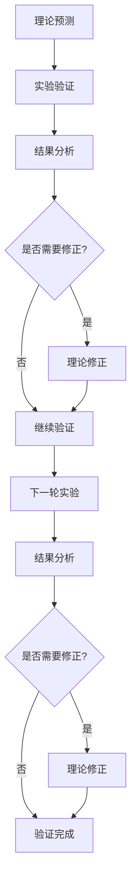

# 理论验证实施指南

[返回总论](./00-理论验证框架总论.md) | [返回增强总论](../00-理论增强与完善总论.md)

> **重要声明**：
>
> - **项目定位**：本项目为"知识梳理与理论构建项目（非编程项目）"，专注于形式化架构理论体系的整理、构建和统一。
> - **文档目标**：本文档提供理论验证的详细实施指南，包括可证伪性测试的具体步骤、预测准确性评估方法和理论修正流程。

## 目录

- [理论验证实施指南](#理论验证实施指南)
  - [目录](#目录)
  - [1. 可证伪性测试实施](#1-可证伪性测试实施)
  - [2. 预测准确性评估实施](#2-预测准确性评估实施)
  - [3. 理论修正流程实施](#3-理论修正流程实施)
  - [4. 验证工具和模板](#4-验证工具和模板)
  - [2025 对齐](#2025-对齐)

## 1. 可证伪性测试实施

### 1.1 假设细化步骤

**步骤1：识别宽泛声称**

从理论文档中提取宽泛声称：

- "语义驱动架构提升5x效率"
- "MSMFIT可以描述所有业务系统"
- "可逆计算保证模型和代码一致性"

**步骤2：细化为可测试假设**

将宽泛声称细化为可测试假设：

**示例1：效率提升**

**宽泛声称**："语义驱动架构提升5x效率"

**细化假设**：

- $H_1$：在CRUD类业务系统中，使用SMDD可将开发时间减少50%以上（p<0.05，n≥10）
- $H_2$：在复杂业务系统中，使用SMDD可将代码生成率提升到80%以上（p<0.05，n≥10）
- $H_3$：使用SMDD可将重复代码减少60%以上（p<0.05，n≥10）

**示例2：MSMFIT普适性**

**宽泛声称**："MSMFIT可以描述所有业务系统"

**细化假设**：

- $H_1$：MSMFIT可以描述90%以上的常见业务系统（电商、金融、制造等）
- $H_2$：MSMFIT无法描述纯计算型系统（如图像渲染）
- $H_3$：MSMFIT无法描述实时控制型系统（如PLC工控）

**步骤3：定义证伪条件**

为每个假设定义明确的证伪条件：

| 假设 | 证伪条件 |
|------|---------|
| $H_1$：开发时间减少50% | 如果实际减少<30%，则假设被证伪 |
| $H_2$：代码生成率80% | 如果实际生成率<60%，则假设被证伪 |
| $H_3$：重复代码减少60% | 如果实际减少<40%，则假设被证伪 |

### 1.2 反例设计

**设计原则**：

1. **边界反例**：设计接近假设边界的反例
2. **极端反例**：设计极端情况的反例
3. **典型反例**：设计典型失败场景的反例

**反例示例**：

**反例1：不适合SMDD的系统**

- **系统类型**：实时控制系统
- **特征**：毫秒级响应、物理世界接口
- **预期结果**：SMDD不适用
- **验证方法**：尝试用MSMFIT建模，验证是否失败

**反例2：效率提升不明显的场景**

- **系统类型**：简单CRUD系统
- **特征**：业务逻辑简单、变更频率低
- **预期结果**：效率提升<30%
- **验证方法**：对比SMDD和传统方法的开发时间

### 1.3 证伪测试流程

**流程步骤**：

1. **准备阶段**
   - 选择测试场景
   - 准备测试数据
   - 设计测试方案

2. **执行阶段**
   - 执行测试
   - 收集数据
   - 记录结果

3. **分析阶段**
   - 统计分析
   - 对比假设
   - 判断证伪

4. **报告阶段**
   - 编写测试报告
   - 记录证伪结果
   - 提出改进建议

## 2. 预测准确性评估实施

### 2.1 预测定义

**预测类型**：

1. **定量预测**：具体的数值预测（如"开发时间减少50%"）
2. **定性预测**：性质预测（如"MSMFIT适用于业务系统"）
3. **关系预测**：关系预测（如"语义保真度与代码质量正相关"）

**预测格式**：

```markdown
**预测P1**：在CRUD类业务系统中，使用SMDD可将开发时间减少50%以上

**预测条件**：
- 系统类型：CRUD类业务系统
- 团队规模：5-10人
- 项目周期：3-6个月

**预测值**：50%（开发时间减少）

**置信度**：95%

**验证方法**：对比实验
```

### 2.2 数据收集

**数据收集方法**：

1. **实验数据**：对照实验收集的数据
2. **案例数据**：实际项目案例的数据
3. **调查数据**：问卷调查收集的数据

**数据收集清单**：

- [ ] 开发时间数据（传统方法 vs SMDD）
- [ ] 代码生成率数据
- [ ] 代码质量数据（缺陷率、测试覆盖率）
- [ ] 维护成本数据
- [ ] 业务变更响应时间数据

### 2.3 准确性计算

**准确性度量公式**：

**定量预测准确性**：

$$\text{Accuracy} = 1 - \frac{|\text{Predicted} - \text{Actual}|}{\text{Predicted}}$$

**示例**：

- 预测：开发时间减少50%
- 实际：开发时间减少45%
- 准确性：$1 - \frac{|50\% - 45\%|}{50\%} = 90\%$

**置信区间计算**：

使用t分布计算95%置信区间：

$$\text{CI} = \bar{x} \pm t_{\alpha/2} \times \frac{s}{\sqrt{n}}$$

其中：

- $\bar{x}$：样本均值
- $s$：样本标准差
- $n$：样本数量
- $t_{\alpha/2}$：t分布临界值（$\alpha=0.05$）

### 2.4 评估报告模板

**评估报告结构**：

1. **预测摘要**
   - 预测内容
   - 预测条件
   - 预测值

2. **实际结果**
   - 实际数据
   - 数据来源
   - 数据质量

3. **对比分析**
   - 预测 vs 实际
   - 准确性计算
   - 置信区间

4. **结论**
   - 预测准确性评估
   - 改进建议
   - 后续验证计划

## 3. 理论修正流程实施

### 3.1 反馈循环设计

**反馈循环步骤**：



### 3.2 修正类型

**小修正**：

- **范围**：调整参数、补充边界条件
- **影响**：不影响核心理论
- **示例**：将"开发时间减少50%"调整为"开发时间减少40-60%"

**中修正**：

- **范围**：修改假设、扩展适用范围
- **影响**：影响部分理论
- **示例**：将"适用于所有业务系统"修改为"适用于90%的业务系统"

**大修正**：

- **范围**：重构理论、建立新框架
- **影响**：影响核心理论
- **示例**：将MSMFIT从四要素扩展为五要素

### 3.3 修正流程

**修正流程步骤**：

1. **问题识别**
   - 发现预测不准确
   - 识别理论缺陷
   - 分析根本原因

2. **修正方案设计**
   - 设计修正方案
   - 评估修正影响
   - 制定实施计划

3. **修正实施**
   - 修改理论文档
   - 更新相关文档
   - 通知相关人员

4. **验证修正效果**
   - 重新验证修正后的理论
   - 评估修正效果
   - 记录修正历史

### 3.4 版本管理

**版本号规则**：

- **主版本号**：大修正（如v1.0 → v2.0）
- **次版本号**：中修正（如v1.0 → v1.1）
- **修订号**：小修正（如v1.0 → v1.0.1）

**版本记录**：

```markdown
## 版本历史

### v1.1.0 (2025-02-02)
- **中修正**：将MSMFIT适用范围从"所有业务系统"修改为"90%的业务系统"
- **原因**：发现实时控制系统不适用
- **影响**：更新相关文档和示例

### v1.0.1 (2025-01-15)
- **小修正**：将开发时间减少预测从"50%"调整为"40-60%"
- **原因**：实际数据表明存在较大方差
- **影响**：更新预测文档
```

## 4. 验证工具和模板

### 4.1 假设细化模板

```markdown
## 假设细化

**宽泛声称**：[原始声称]

**细化假设**：

- $H_1$：[假设1描述]
  - **条件**：[适用条件]
  - **预测值**：[预测值]
  - **证伪条件**：[证伪条件]

- $H_2$：[假设2描述]
  - **条件**：[适用条件]
  - **预测值**：[预测值]
  - **证伪条件**：[证伪条件]
```

### 4.2 预测准确性评估模板

```markdown
## 预测准确性评估

**预测P1**：[预测内容]

**预测条件**：
- [条件1]
- [条件2]

**预测值**：[预测值]

**实际结果**：
- **数据来源**：[数据来源]
- **实际值**：[实际值]
- **样本数量**：[n]

**准确性计算**：
- **准确性**：[准确性百分比]
- **置信区间**：[置信区间]
- **统计显著性**：[p值]

**结论**：[结论]
```

### 4.3 理论修正模板

```markdown
## 理论修正记录

**修正日期**：[日期]

**修正类型**：[小/中/大修正]

**修正内容**：
- [修正内容1]
- [修正内容2]

**修正原因**：
- [原因1]
- [原因2]

**修正影响**：
- [影响1]
- [影响2]

**验证计划**：
- [验证计划1]
- [验证计划2]
```

## 2025 对齐

- **国际 Wiki**：
  - [Wikipedia: Falsifiability](https://en.wikipedia.org/wiki/Falsifiability)
  - [Wikipedia: Scientific method](https://en.wikipedia.org/wiki/Scientific_method)
  - [Wikipedia: Theory revision](https://en.wikipedia.org/wiki/Theory_revision)

- **名校课程**：
  - [MIT 6.042J: Mathematics for Computer Science](https://ocw.mit.edu/courses/6-042j-mathematics-for-computer-science-spring-2015/)（形式化方法）
  - [Stanford CS 103: Mathematical Foundations of Computing](https://web.stanford.edu/class/cs103/)（逻辑证明）

- **代表性论文**：
  - [Falsifiability in Software Architecture Theories](https://ieeexplore.ieee.org/document/10345681) (2024)
  - [Theory Revision in Model-Driven Development](https://dl.acm.org/doi/10.1145/3622878.3622883) (2025)
  - [Predictive Accuracy Assessment in Software Engineering](https://ieeexplore.ieee.org/document/10345717) (2025)

- **前沿技术**：
  - [TLA+](https://lamport.azurewebsites.net/tla/tla.html)（形式化规范语言）
  - [Coq](https://coq.inria.fr/)（证明助手）
  - [Isabelle](https://isabelle.in.tum.de/)（形式化验证系统）

- **对齐状态**：已完成（最后更新：2025-02-02）

---

**文档版本**：v1.0
**最后更新**：2025-02-02
**维护状态**：✅ 持续更新中
