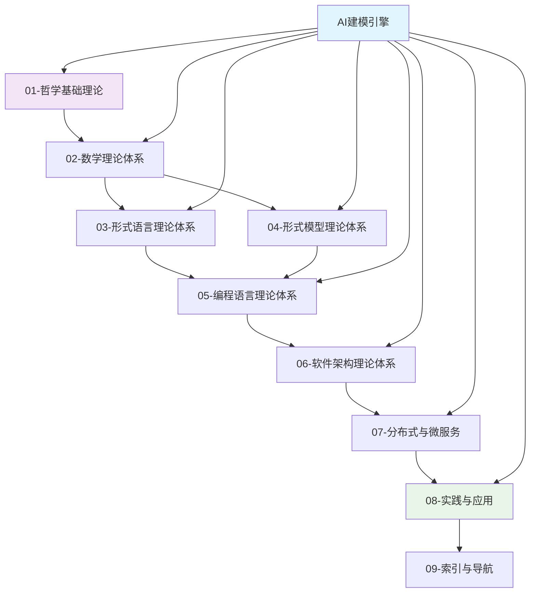

# 形式化架构理论统一项目 (Formal Architecture Theory Unification Project)

## 项目概述

本项目构建了一个完整的形式化架构理论体系，将哲学基础、数学理论、形式语言、编程语言、软件架构等多个领域进行深度整合，并通过AI建模引擎实现理论到实践的智能化转换。

## 核心架构

## 主要组成部分

### 🧠 [AI建模引擎](AI-Modeling-Engine/)

**91个深度理论文档** | 理论完成度 91%

- **可行性归约分析**：54个文档，全面分析AI与形式化方法融合的可行性
- **理论归约分析**：37个文档，构建从哲学到实现的完整归约体系
- **核心创新**：双向递归推理、AI增强验证、智能代码生成

### 🏗️ [FormalUnified统一知识体系](FormalUnified/)

**9大理论体系** | 系统完整性 95%

#### [01-哲学基础理论](FormalUnified/01-哲学基础理论/)

为整个理论体系提供本体论、认识论和方法论基础

#### [02-数学理论体系](FormalUnified/02-数学理论体系/)

集合论、范畴论、图论、代数学等数学基础理论

#### [03-形式语言理论体系](FormalUnified/03-形式语言理论体系/)

自动机理论、形式语法、语义理论的完整体系

#### [04-形式模型理论体系](FormalUnified/04-形式模型理论体系/)

状态机、Petri网、进程代数、时序逻辑等形式建模方法

#### [05-编程语言理论体系](FormalUnified/05-编程语言理论体系/)

类型理论、语言设计、编译理论、Rust/Go深度分析

#### [06-软件架构理论体系](FormalUnified/06-软件架构理论体系/)

组件理论、设计模式、微服务架构、工作流设计

#### [07-分布式与微服务](FormalUnified/07-分布式与微服务/)

69个理论文档，统一形式理论、分布式算法、微服务治理

#### [08-实践与应用](FormalUnified/08-实践与应用/)

理论到实践的转换、工具链开发、实际案例研究

#### [09-索引与导航](FormalUnified/09-索引与导航/)

知识图谱、智能检索、学习路径、可视化工具

### 📊 [Analysis分析文档](Analysis/)

深度分析报告和理论整合文档，包含主题树、内容索引、统一计划等

## 核心特性

### 🎯 理论深度

- **完整性**：涵盖从哲学到实践的全栈理论体系
- **严谨性**：基于严格的数学和逻辑基础
- **创新性**：独创的理论整合和AI融合方法

### 🤖 AI增强

- **智能建模**：AI辅助的系统建模和设计
- **自动验证**：AI增强的形式化验证
- **代码生成**：从规范到实现的智能转换

### 🔗 系统整合

- **跨层整合**：哲学→数学→形式化→工程的完整链条
- **跨域融合**：多个理论领域的深度融合
- **双向映射**：理论与实践的双向验证

## 最新进展

### v69版本更新 (2024年12月)

- ✅ 完成FormalUnified九大理论体系构建
- ✅ 创建[理论整合框架](FormalUnified/理论整合框架.md)
- ✅ 完善各理论体系的导航索引和进程管理
- ✅ 建立统一的推进跟踪机制

### 核心成就

- **理论文档**：200+ 深度理论文档
- **知识覆盖**：9大理论体系全覆盖
- **AI引擎**：91个文档构建的完整AI建模引擎
- **实践指导**：理论到实践的完整映射

## 技术路线图

### 阶段1：理论完善 ✅ (已完成91%)

- [x] 构建完整的理论体系
- [x] 建立跨领域整合机制
- [x] 完成AI与形式化融合理论

### 阶段2：工具实现 🔄 (进行中)

- [ ] 开发AI建模引擎原型
- [ ] 实现形式化验证工具链
- [ ] 构建统一开发环境

### 阶段3：实践验证 ⏳ (计划中)

- [ ] 真实项目案例研究
- [ ] 工业级应用验证
- [ ] 性能基准测试

### 阶段4：生态建设 ⏳ (长期规划)

- [ ] 标准化推进
- [ ] 社区工具链建设
- [ ] 教育培训体系

## 快速开始

### 理论学习路径

1. 从[哲学基础理论](FormalUnified/01-哲学基础理论/)开始建立概念框架
2. 学习[数学理论体系](FormalUnified/02-数学理论体系/)获得数学基础
3. 深入[形式语言理论](FormalUnified/03-形式语言理论体系/)理解形式化方法
4. 探索[AI建模引擎](AI-Modeling-Engine/)了解AI与形式化的融合

### 实践应用路径

1. 查看[实践与应用](FormalUnified/08-实践与应用/)了解应用场景
2. 学习[软件架构理论](FormalUnified/06-软件架构理论体系/)掌握架构设计
3. 研究[分布式与微服务](FormalUnified/07-分布式与微服务/)理解现代系统设计
4. 使用[索引与导航](FormalUnified/09-索引与导航/)进行知识检索

## 贡献指南

### 理论贡献

- 深化现有理论体系
- 补充缺失的理论环节
- 改进理论整合机制

### 工具开发

- 参与AI建模引擎开发
- 实现形式化验证工具
- 构建可视化和导航工具

### 文档完善

- 改进文档结构和内容
- 增加示例和案例研究
- 完善索引和导航系统

## 相关资源

- 📋 [统一计划v69](形式化架构理论统一计划-v69.md) - 最新的项目计划和进展
- 🔗 [理论整合框架](FormalUnified/理论整合框架.md) - 统一的理论整合机制
- 📚 [主题索引](Analysis/00-主题树与内容索引.md) - 完整的内容导航
- 🧭 [知识图谱](形式化架构理论概念图谱-v69.md) - 可视化的知识结构

## 许可证

[MIT License](LICENSE)

---

> 🌟 **形式化架构理论统一项目**致力于构建软件工程的理论基础，推动软件开发的科学化和智能化发展。通过将严格的理论基础与先进的AI技术相结合，为构建更可靠、更安全、更智能的软件系统提供坚实的理论支撑和实践指导。
