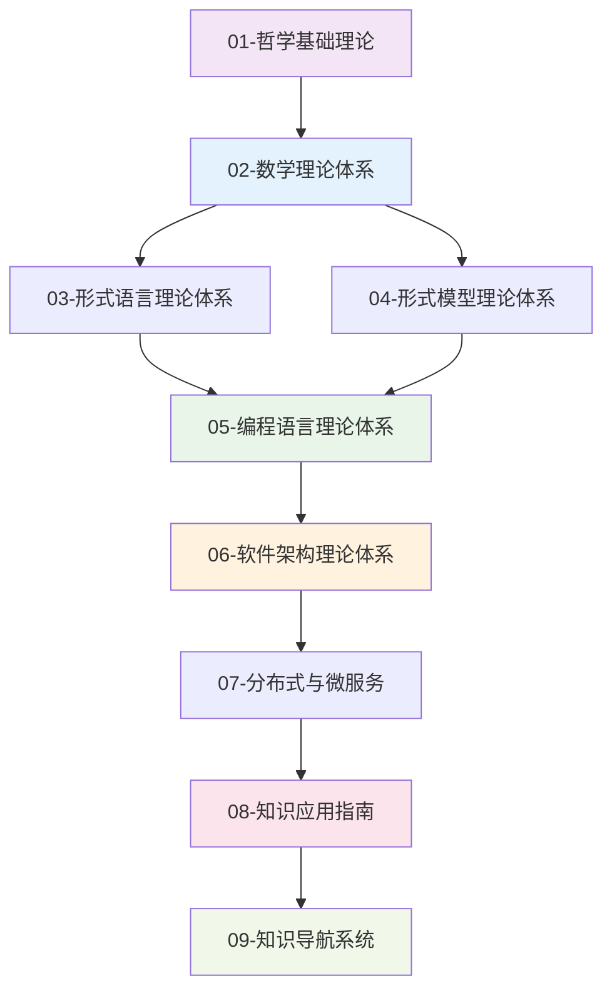

# FormalUnified形式化架构理论统一项目

## 项目重新定位

**项目类型**: 🧠 **知识梳理与理论构建项目** (非编程项目)
**重新定位日期**: 2025年8月12日
**项目状态**: 🔄 **重新定位完成**

FormalUnified项目已从编程项目重新定位为**知识梳理项目**，专注于形式化架构理论体系的整理、构建和统一，为学习者提供系统化的知识获取路径。

## 核心架构

## 主要组成部分

### 📚 [Modern现代语义驱动架构理论体系](Modern/README.md)

**9大理论模块** | 实践导向

专注于现代语义驱动架构理论，包括MSMFIT、SMDD、可逆计算、AI增强语义架构等核心理论。

**快速导航**：

- [学习路径推荐](Modern/00-学习路径推荐.md) - 基于认知学习规律的系统化学习路径
- [概念关系图](Modern/00-概念关系图.md) - 可视化展示核心概念关系和理论体系结构
- [概念索引与快速导航](Modern/00-概念索引与快速导航.md) - Modern目录内的概念导航

### 🔬 [Analysis形式化架构理论统一体系](Analysis/README.md)

**9大理论体系** | 理论导向

专注于形式化架构理论统一体系，包括哲学基础、数学理论、形式语言、形式模型等理论基础。

**快速导航**：

- [主题树与内容索引](Analysis/00-主题树与内容索引.md) - Analysis目录的主题导航
- [2025对齐资源库](Analysis/2025-对齐资源库-最新版.md) - 2025对齐资源统一参考
- [综合梳理与持续推进规划](综合梳理与持续推进规划-2025-02-03.md) - 权威资源对齐、任务规划、可持续推进
- [核心概念反向索引](00-核心概念反向索引.md) - 概念引用反向查找

### 🔗 [统一概念索引](00-统一概念索引.md)

提供跨目录（Modern和Analysis）的统一概念索引和快速导航。

### 📊 [知识图谱](00-知识图谱-核心概念提取.md)

提取项目中的核心概念和关系，为知识图谱构建提供基础数据。

### 🏗️ [FormalUnified统一知识体系](FormalUnified/README.md)

**9大理论体系** | 系统完整性 95%

#### [01-哲学基础理论](FormalUnified/01-哲学基础理论/README.md)

为整个理论体系提供本体论、认识论和方法论基础

#### [02-数学理论体系](FormalUnified/02-数学理论体系/README.md)

集合论、范畴论、图论、代数学等数学基础理论

#### [03-形式语言理论体系](FormalUnified/03-形式语言理论体系/README.md)

自动机理论、形式语法、语义理论的完整体系

#### [04-形式模型理论体系](FormalUnified/04-形式模型理论体系/README.md)

状态机、Petri网、进程代数、时序逻辑等形式建模方法

#### [05-编程语言理论体系](FormalUnified/05-编程语言理论体系/README.md)

类型理论、语言设计、编译理论、Rust/Go深度分析

#### [06-软件架构理论体系](FormalUnified/06-软件架构理论体系/README.md)

组件理论、设计模式、微服务架构、工作流设计

#### [07-分布式与微服务](FormalUnified/07-分布式与微服务/README.md)

69个理论文档，统一形式理论、分布式算法、微服务治理

#### [08-知识应用指南](FormalUnified/08-知识应用指南/README.md)

理论应用方法、学习路径设计、知识迁移策略

#### [09-知识导航系统](FormalUnified/09-知识导航系统/README.md)

知识图谱、概念索引、主题导航、智能检索

### 📊 [Analysis分析文档](Analysis/README.md)

深度分析报告和理论整合文档，包含主题树、内容索引、统一计划等

### 📋 [项目重新定位声明](项目重新定位声明.md)

详细说明项目从编程项目到知识梳理项目的重新定位过程

## 核心特性

### 🎯 知识导向

- **完整性**: 涵盖从哲学到实践的全栈理论体系
- **严谨性**: 基于严格的数学和逻辑基础
- **系统性**: 建立完整的知识体系框架

### 📚 教育价值

- **学习路径**: 为不同背景的学习者提供系统化学习指导
- **理论应用**: 建立从理论到实践的知识桥梁
- **知识整合**: 实现跨学科知识的统一和整合

### 🔬 研究价值

- **理论框架**: 为学术研究提供完整的理论框架
- **跨学科整合**: 推动不同学科间的理论整合
- **创新方法**: 建立新的知识组织和研究方法

## 学习路径

**路径选择建议**：无形式化或数学基础者建议走**初学者路径**（主轨）；已有编程与类型论/工程背景者可走**专业深化路径**或**仅软件架构极短轨**。详见 [Analysis 推荐学习路径](Analysis/00-总览与导航/00-推荐学习路径.md)。

### 🚀 初学者路径

从哲学基础开始，逐步深入各理论体系，适合理论基础知识薄弱的学习者

### 🎯 专业深化路径

针对特定专业领域进行深度学习，适合已有相关背景的专业人士

### 🌟 跨领域整合路径

整合多学科知识，构建统一理论框架，适合希望创新的研究者

## 使用指南

### 1. 选择学习路径

根据您的背景和目标，选择合适的学习路径：

- **初学者**: 从哲学基础开始，逐步深入
- **专业人士**: 直接进入相关专业领域
- **研究者**: 关注跨学科理论整合

### 2. 理论应用

学习如何将理论知识应用到实际问题中：

- 理解理论的核心思想
- 识别问题的理论特征
- 选择合适的理论框架
- 进行理论指导的实践

### 3. 知识整合

学会整合不同领域的理论知识：

- 建立理论间的映射关系
- 识别跨学科的理论联系
- 构建统一的知识框架

## 项目价值

### 🎓 学术价值

- 建立了从哲学基础到实践应用的完整理论链条
- 实现了跨学科理论整合的范例
- 提供了系统化的知识组织方法

### 💼 实用价值

- 为学习者提供清晰的知识路径
- 建立了理论到实践的标准化方法
- 提供了可扩展的知识框架

### 🌟 创新价值

- 首创了形式化架构理论的统一框架
- 实现了知识体系的可视化表示
- 建立了理论驱动的学习方法

## 项目状态

### ✅ 已完成

- 九大理论体系完整建立
- 知识应用指南设计完成
- 学习路径规划完成
- 知识导航系统构建完成
- 2025对齐资源库建立
- 统一概念索引创建
- 学习路径推荐文档创建
- 概念关系图可视化完成
- 国际对标深化完成（迁移与融合指南）
- 实证研究框架模板创建
- 理论验证实施指南创建
- 知识图谱核心概念提取完成

### 🔄 进行中

- 理论内容深度完善
- 跨理论映射关系建立
- 知识图谱RDF/OWL格式完善
- 实证案例收集和分析

### 📋 计划中

- 知识图谱可视化工具开发
- 智能检索系统开发
- 个性化学习路径生成
- 知识更新机制建立
- 实证案例库建设

## 贡献指南

### 知识贡献

- 理论内容的补充和完善
- 概念关系的修正和扩展
- 应用案例的添加和更新

### 方法贡献

- 学习方法的改进和创新
- 知识组织方式的优化
- 导航系统的功能增强

### 工具贡献

- 知识可视化工具开发
- 检索和导航功能实现
- 学习辅助工具创建

## 许可证

本项目采用MIT许可证，详见LICENSE文件。

## 联系方式

- 项目文档: 查看各目录下的README文件
- 学习指南: 参考 `FormalUnified/08-知识应用指南/`
- 知识导航: 使用 `FormalUnified/09-知识导航系统/`

---

**FormalUnified - 形式化架构理论统一项目**
*从哲学基础到实践应用的完整知识体系*
*专注于理论知识的整理、构建和统一*
*2025年8月12日重新定位完成*
