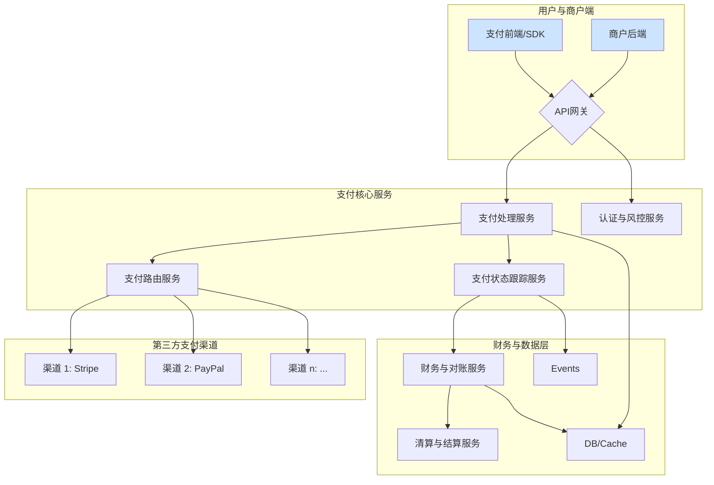
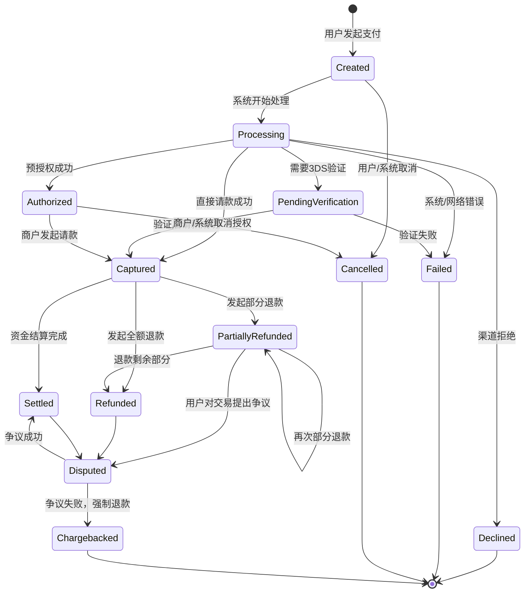

# 2. 支付网关架构与状态机设计

## 2.1. 宏观架构

支付网关系统负责连接商户、用户与多个支付渠道，其核心是提供统一的API接口、智能路由和对账清算服务。一个典型的、基于微服务思想的支付网关宏观架构如下。



此架构将前端接入、核心处理与财务后台清晰分离，为系统的可扩展性和可维护性奠定了基础。

## 2.2. 核心数据模型的形式化规约

系统的行为由其数据模型严格定义。以下 `Rust` 代码结构不仅是实现细节，更是系统行为的形式化规约。

### 2.2.1. 支付方法 (`PaymentMethod`)

此枚举定义了系统支持的支付方式。对于UI/UX设计而言，这直接决定了前端需要渲染哪些支付组件。

```rust
// 规约 2.2.1: 支付方法枚举
enum PaymentMethod {
    Card {
        card_number: String,
        card_exp_month: String,
        card_exp_year: String,
        card_holder_name: String,
    },
    WalletRedirect {
        wallet_type: String,
        return_url: String,
    },
    BankTransfer {
        account_number: String,
        routing_number: String,
        bank_name: String,
    },
    // ... 其他支付方式
}
```

**UI/UX设计蕴含**:

- `Card`: 需要一个包含卡号、有效期、持卡人姓名的表单组件。
- `WalletRedirect`: 需要一个按钮，点击后将用户重定向到第三方钱包页面。
- `BankTransfer`: 需要一个显示银行账户信息的界面。

### 2.2.2. 支付请求与响应

这两个结构体定义了系统API的契约，是前后端通信的基石。

```rust
// 规约 2.2.2.1: 支付请求模型
struct PaymentRequest {
    merchant_id: String,
    amount: u64,
    currency: String,
    payment_method: PaymentMethod,
    // ... 其他元数据
}

// 规约 2.2.2.2: 支付响应模型
struct PaymentResponse {
    payment_id: Uuid,
    status: PaymentStatus, // 关键状态，见 2.3
    amount: u64,
    redirect_url: Option<String>,
    // ... 其他元数据
}
```

## 2.3. 支付生命周期与状态机模型

支付的完整生命周期是系统的核心。我们可以将 `PaymentStatus` 枚举中的状态，以及它们之间可能的转换，建模为一个形式化的有限状态机（Finite State Machine, FSM）。

### 2.3.1. 状态定义

`PaymentStatus` 枚举是状态机中所有可能状态的集合。

```rust
// 规约 2.3.1: 支付状态枚举
enum PaymentStatus {
    Created,             // 已创建
    Processing,          // 处理中
    PendingVerification, // 待验证 (例如 3DS)
    Authorized,          // 已授权
    Captured,            // 已请款/捕获
    Settled,             // 已结算
    Failed,              // 支付失败
    Declined,            // 明确被拒
    Cancelled,           // 已取消 (用户或商户)
    Refunded,            // 已全额退款
    PartiallyRefunded,   // 已部分退款
    Disputed,            // 存在争议
    Chargebacked,        // 已拒付
}
```

### 2.3.2. 状态转换图

基于上述状态，我们可以构建一个状态机图，来可视化支付流程。这对于理解复杂的支付逻辑和设计对应的UI/UX至关重要。



**UI/UX设计蕴含**:

- **同步反馈**: 对于 `Processing` 等中间状态，UI应显示加载指示器（Spinner）或进度条。
- **明确结果**: `Captured` (支付成功), `Failed`, `Declined` (支付失败) 等终态，UI必须给出清晰、无歧义的文本和视觉反馈。
- **后续操作**: 对于 `Authorized`, `Captured` 等状态，商户后台UI应提供如"请款"、"退款"等操作按钮。
- **异常流程**: 对于 `Disputed`, `Chargebacked` 等状态，需要有专门的争议处理界面。
- **历史记录**: 用户的交易历史记录UI，需要能正确显示和筛选所有这些状态。
