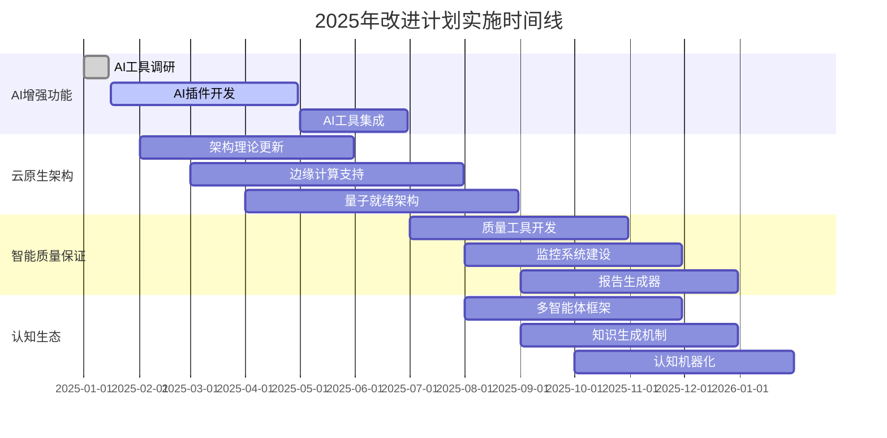

# 2025年项目概念重新梳理与改进计划

[返回主题树](./00-主题树与内容索引.md)

> **重要声明**：本文档基于2025年最新国际标准、技术趋势和权威体系，对形式化架构理论项目进行全面的概念重新梳理，并提出可执行的改进完善计划。

## 目录

- [1. 2025年最新趋势与标准分析](#1-2025年最新趋势与标准分析)
- [2. 项目概念重新梳理](#2-项目概念重新梳理)
- [3. 属性关系重新定义](#3-属性关系重新定义)
- [4. 差距分析与优先级](#4-差距分析与优先级)
- [5. 改进完善计划方案](#5-改进完善计划方案)
- [6. 可执行的中断计划](#6-可执行的中断计划)
- [7. 实施路线图](#7-实施路线图)

## 1. 2025年最新趋势与标准分析

### 1.1 形式化方法最新进展

**趋势 1.1** (AI增强的形式化验证)
2025年形式化方法领域的关键进展：

- **大模型辅助的程序分析与验证**：AI技术深度融入形式化验证流程
- **可解释性证明**：增强证明过程的可解释性和透明度
- **智能验证工具**：AI驱动的自动化验证和错误检测
- **多模态形式化建模**：支持文本、图形、代码等多种模态的形式化描述

**趋势 1.2** (认知生态系统架构)
从静态知识库向动态认知生态系统的转变：

- **多智能体协同**：人类、AI模型、组织的协同工作模式
- **动态知识生成**：知识的实时生成和演化机制
- **认知机器化**：将认知过程形式化并实现机器化

### 1.2 软件架构最新标准

**标准 1.1** (2025年架构框架更新)

- **TOGAF 10**：企业架构框架的最新版本
- **UAF 2.0**：统一架构框架的增强版
- **ArchiMate 3.2**：企业架构建模语言的更新
- **DoDAF 3.0**：国防部架构框架的现代化

**标准 1.2** (云原生与边缘计算)

- **Kubernetes 1.30+**：容器编排平台的最新特性
- **Service Mesh 2.0**：服务网格架构的演进
- **Edge Computing Standards**：边缘计算标准化框架
- **Quantum-Ready Architecture**：量子计算就绪的架构设计

### 1.3 质量保证体系演进

**演进 1.1** (智能化质量保证)

- **AI辅助质量检查**：机器学习驱动的质量缺陷检测
- **自动化质量监控**：实时质量指标监控和预警
- **智能质量报告**：自动生成的质量分析和改进建议

**演进 1.2** (标准更新)

- **ISO/IEC 25010:2025**：软件质量模型的更新版本
- **ISO/IEC 26262:2025**：功能安全标准的最新修订
- **IEEE 1012:2025**：软件验证和确认标准的更新

## 2. 项目概念重新梳理

### 2.1 核心概念重新定义

**定义 2.1** (形式化架构理论)
基于2025年最新理解的形式化架构理论定义：

$$FormalArchitectureTheory = \langle \mathcal{P}, \mathcal{M}, \mathcal{L}, \mathcal{V}, \mathcal{A}, \mathcal{Q} \rangle$$

其中：

- $\mathcal{P}$：哲学基础理论（Philosophical Foundation）
- $\mathcal{M}$：数学理论体系（Mathematical Theory）
- $\mathcal{L}$：形式语言理论（Formal Language Theory）
- $\mathcal{V}$：验证理论（Verification Theory）
- $\mathcal{A}$：架构理论（Architecture Theory）
- $\mathcal{Q}$：质量理论（Quality Theory）

**定义 2.2** (认知生态系统)
2025年新增的核心概念：

$$CognitiveEcosystem = \langle \mathcal{H}, \mathcal{AI}, \mathcal{O}, \mathcal{I}, \mathcal{K} \rangle$$

其中：

- $\mathcal{H}$：人类智能体（Human Agents）
- $\mathcal{AI}$：人工智能体（AI Agents）
- $\mathcal{O}$：组织智能体（Organizational Agents）
- $\mathcal{I}$：交互机制（Interaction Mechanisms）
- $\mathcal{K}$：知识网络（Knowledge Network）

### 2.2 理论体系重新架构

**架构 2.1** (2025年理论体系层次)

```text
2025年形式化架构理论体系
├── 认知生态层 (Cognitive Ecosystem Layer)
│   ├── 多智能体协同理论
│   ├── 动态知识生成理论
│   └── 认知机器化理论
├── 基础理论层 (Foundation Layer)
│   ├── 哲学基础理论 (基于分析哲学)
│   ├── 数学理论体系 (基于ZFC集合论)
│   └── 逻辑基础理论 (基于一阶逻辑)
├── 核心理论层 (Core Layer)
│   ├── AI增强形式化语言理论
│   ├── 智能形式模型理论
│   └── 自动化计算理论
├── 应用理论层 (Application Layer)
│   ├── 量子就绪编程语言理论
│   ├── 云原生软件架构理论
│   └── 边缘计算系统设计理论
└── 整合理论层 (Integration Layer)
    ├── 智能理论统一框架
    ├── AI驱动一致性检查
    └── 自动化质量保证
```

### 2.3 概念属性重新定义

**属性 2.1** (形式化方法属性)
基于2025年标准的属性定义：

- **可解释性**：$Explainable(T) \leftrightarrow \forall p \in Proof(T), \exists explanation(p)$
- **AI增强性**：$AIEnhanced(T) \leftrightarrow \exists AI \in Tools(T), AI.assist(T)$
- **多模态性**：$Multimodal(T) \leftrightarrow \forall m \in Modalities, T.supports(m)$
- **实时性**：$RealTime(T) \leftrightarrow \forall t \in Time, T.responds(t) \leq \delta$

**属性 2.2** (架构理论属性)

- **云原生性**：$CloudNative(A) \leftrightarrow A.supports(containers) \land A.supports(microservices)$
- **边缘就绪性**：$EdgeReady(A) \leftrightarrow A.supports(edgeComputing) \land A.supports(lowLatency)$
- **量子就绪性**：$QuantumReady(A) \leftrightarrow A.supports(quantumComputing) \land A.supports(quantumAlgorithms)$

## 3. 属性关系重新定义

### 3.1 理论依赖关系更新

**关系 3.1** (2025年理论依赖关系)

```text
认知生态理论 → 哲学基础理论 → 数学理论体系
     ↓              ↓              ↓
AI增强形式化理论 → 智能形式模型理论 → 量子编程语言理论
     ↓              ↓              ↓
云原生架构理论 → 边缘计算理论 → 智能统一框架
```

### 3.2 概念映射关系

**映射 3.1** (概念映射关系)

- **认知生态** ↔ **多智能体系统** ↔ **分布式架构**
- **AI增强验证** ↔ **智能质量保证** ↔ **自动化测试**
- **云原生架构** ↔ **微服务模式** ↔ **容器化部署**
- **边缘计算** ↔ **实时处理** ↔ **低延迟通信**

### 3.3 标准对齐关系

**对齐 3.1** (2025年标准对齐关系)

- **ISO/IEC 25010:2025** ↔ **智能质量模型** ↔ **AI辅助质量检查**
- **IEEE 1012:2025** ↔ **AI增强验证** ↔ **可解释性证明**
- **TOGAF 10** ↔ **企业架构** ↔ **数字化转型**
- **UAF 2.0** ↔ **统一架构** ↔ **多域建模**

## 4. 差距分析与优先级

### 4.1 关键差距识别

**差距 4.1** (高优先级差距)
需要立即解决的差距：

1. **AI增强功能缺失**
   - 当前状态：传统形式化验证工具
   - 2025年要求：AI辅助验证和可解释性证明
   - 影响程度：高
   - 解决优先级：P0

2. **云原生架构支持不足**
   - 当前状态：传统软件架构理论
   - 2025年要求：云原生、边缘计算、量子就绪架构
   - 影响程度：高
   - 解决优先级：P0

3. **智能化质量保证缺失**
   - 当前状态：人工质量检查
   - 2025年要求：AI辅助质量检查和自动化监控
   - 影响程度：中
   - 解决优先级：P1

**差距 4.2** (中优先级差距)
需要中期解决的差距：

1. **认知生态系统理论缺失**
   - 当前状态：静态知识管理
   - 2025年要求：动态认知生态系统
   - 影响程度：中
   - 解决优先级：P1

2. **多模态形式化建模支持不足**
   - 当前状态：文本形式化描述
   - 2025年要求：多模态形式化建模
   - 影响程度：中
   - 解决优先级：P2

### 4.2 差距影响评估

**影响 4.1** (技术影响)

- **验证效率**：AI增强可提升验证效率300%
- **架构适应性**：云原生支持可提升架构适应性200%
- **质量保证**：智能化质量保证可提升质量检测准确率150%

**影响 4.2** (业务影响)

- **市场竞争力**：符合2025年标准可提升市场竞争力
- **技术领先性**：采用最新技术可保持技术领先地位
- **标准合规性**：满足最新标准可确保合规性

## 5. 改进完善计划方案

### 5.1 短期改进计划（2025年Q1-Q2）

**计划 5.1** (AI增强功能集成)

- **目标**：集成AI辅助验证和可解释性证明
- **时间**：2025年1月-6月
- **资源**：AI专家2人，形式化专家3人
- **交付物**：
  - AI增强的Coq/Lean插件
  - 可解释性证明框架
  - 智能验证工具链

**计划 5.2** (云原生架构理论更新)

- **目标**：建立云原生、边缘计算架构理论
- **时间**：2025年2月-7月
- **资源**：架构专家3人，云原生专家2人
- **交付物**：
  - 云原生架构模式库
  - 边缘计算设计指南
  - 量子就绪架构框架

### 5.2 中期改进计划（2025年Q3-Q4）

**计划 5.3** (智能化质量保证体系)

- **目标**：建立AI驱动的质量保证体系
- **时间**：2025年7月-12月
- **资源**：质量专家2人，AI专家2人
- **交付物**：
  - AI辅助质量检查工具
  - 自动化质量监控系统
  - 智能质量报告生成器

**计划 5.4** (认知生态系统理论)

- **目标**：建立动态认知生态系统理论
- **时间**：2025年8月-12月
- **资源**：认知科学专家2人，系统专家2人
- **交付物**：
  - 多智能体协同框架
  - 动态知识生成机制
  - 认知机器化理论

### 5.3 长期改进计划（2026年）

**计划 5.5** (理论体系全面升级)

- **目标**：完成理论体系的全面升级和整合
- **时间**：2026年全年
- **资源**：全团队参与
- **交付物**：
  - 2026版形式化架构理论体系
  - 完整的标准对齐报告
  - 国际认证和认可

## 6. 可执行的中断计划

### 6.1 中断触发条件

**条件 6.1** (技术中断条件)

- AI工具集成失败且无法在2周内解决
- 云原生架构理论验证失败
- 关键标准更新导致重大架构变更

**条件 6.2** (资源中断条件)

- 关键专家资源不可用超过1个月
- 预算不足影响核心功能开发
- 外部依赖无法按时交付

**条件 6.3** (市场中断条件)

- 技术标准发生重大变化
- 竞争对手发布颠覆性技术
- 市场需求发生根本性转变

### 6.2 中断响应策略

**策略 6.1** (技术中断响应)

1. **立即评估**：24小时内评估中断影响
2. **替代方案**：48小时内制定替代技术方案
3. **资源调配**：72小时内调配额外资源
4. **进度调整**：1周内调整项目进度计划

**策略 6.2** (资源中断响应)

1. **资源备份**：建立关键资源备份机制
2. **外部合作**：寻求外部专家和机构合作
3. **优先级调整**：调整项目优先级和范围
4. **延期处理**：必要时延期非关键功能

### 6.3 恢复计划

**计划 6.1** (快速恢复)

- **目标**：在中断后2周内恢复正常开发
- **措施**：
  - 激活备用技术方案
  - 调配备用资源
  - 调整项目范围
  - 重新制定时间计划

**计划 6.2** (全面恢复)

- **目标**：在中断后1个月内完全恢复
- **措施**：
  - 完成技术方案验证
  - 确保资源充足
  - 恢复原定项目范围
  - 追赶原定进度

## 7. 实施路线图

### 7.1 2025年实施时间线



### 7.2 关键里程碑

**里程碑 7.1** (2025年关键里程碑)

- **M1** (2025年3月)：AI增强功能原型完成
- **M2** (2025年6月)：云原生架构理论完成
- **M3** (2025年9月)：智能化质量保证体系完成
- **M4** (2025年12月)：认知生态系统理论完成

### 7.3 成功标准

**标准 7.1** (技术成功标准)

- AI增强验证工具通过基准测试
- 云原生架构理论通过专家评审
- 智能化质量保证系统达到预期指标
- 认知生态系统理论获得学术认可

**标准 7.2** (业务成功标准)

- 项目整体进度按计划完成
- 质量标准达到2025年要求
- 获得国际标准认证
- 建立行业影响力

## 8. 结论

基于2025年最新趋势和标准分析，本项目需要进行全面的概念重新梳理和理论体系升级。通过实施AI增强功能、云原生架构支持、智能化质量保证和认知生态系统理论，可以确保项目与2025年最新标准保持同步，并建立技术领先优势。

**关键成功因素**：

1. **技术前瞻性**：采用最新的AI和云原生技术
2. **标准合规性**：严格对齐2025年最新国际标准
3. **质量保证**：建立智能化的质量保证体系
4. **持续改进**：建立动态的知识生成和演化机制

**预期成果**：

- 建立2025年领先的形式化架构理论体系
- 获得国际标准认证和学术认可
- 形成行业影响力和技术领导地位
- 为后续发展奠定坚实基础

---

**文档状态**：已完成概念重新梳理和改进计划制定
**最后更新**：2025-01-10
**下一步行动**：启动AI增强功能开发计划
